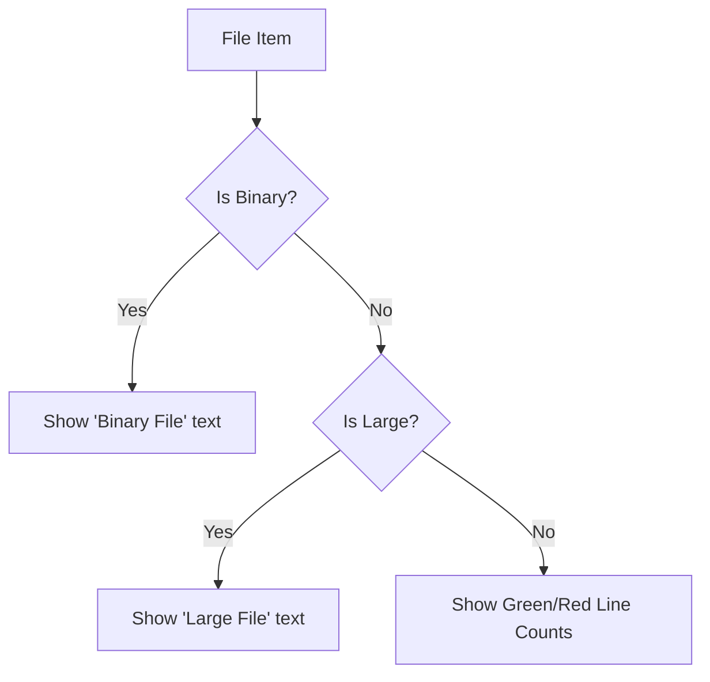
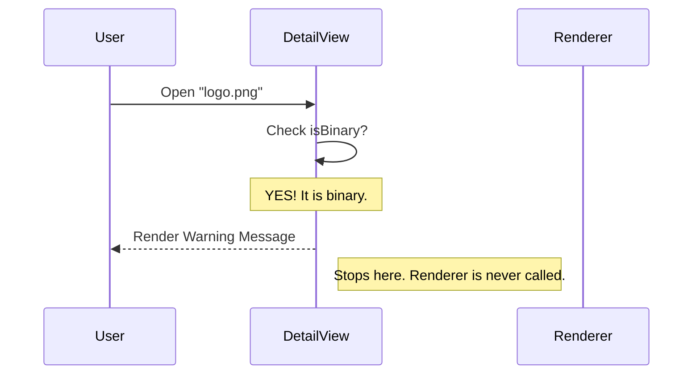

# Chapter 5: File Status Guardrails

In the previous chapter, [Detail View & Hunk Rendering](04_detail_view___hunk_rendering.md), we built a component to visualize code changes.

However, the real world is messy. Not every file is a clean, small text file. We have images (`.png`), compiled executables (`.exe`), massive logs (`error.log`), and brand new files that Git doesn't recognize yet.

If we try to feed these "special" files into our standard text renderer, the application might crash, freeze, or display garbage characters.

## The Problem: "The Truck in the Tunnel"
Imagine you are driving a tall truck. You approach a tunnel. If you drive in without checking the height clearance, you will get stuck.

In our app:
*   **The Tunnel:** The Detail View (expects text).
*   **The Truck:** A Binary file (image/audio).
*   **The Crash:** The terminal trying to print an image as text.

## The Solution: Guardrails

We implement **File Status Guardrails**. These are logical checks that act like traffic signs or barriers.

They appear in two places:
1.  **The Dashboard (List View):** A small warning light letting you know the status.
2.  **The Roadblock (Detail View):** A barrier preventing you from entering the unsafe area.

---

## The Four Guardrails

We track four specific states. These flags are prepared by the [Data Normalization Adapter](02_data_normalization_adapter.md).

| Guardrail | Meaning | The Danger |
| :--- | :--- | :--- |
| **Binary** | Images, audio, compiled code. | Cannot be read as text lines. |
| **Large** | Files over a certain size (e.g., 1MB). | Processing them freezes the UI. |
| **Untracked** | New files not added to Git yet. | Git cannot calculate "diffs" for them yet. |
| **Truncated** | Text files with *too many* changes. | Takes up too much screen space. |

---

## Guardrail 1: The List View (Small Hints)

In the [Paginated File List](03_paginated_file_list.md), we don't block the user. We just give them a hint so they know what to expect.

We handle this in a sub-component called `FileStats`. Instead of showing "+10 lines added", we show the status.

### Visual Flow



### The Code Implementation

Open `DiffFileList.tsx`. Look at how `FileStats` chooses what to render.

```typescript
// DiffFileList.tsx -> FileStats component
function FileStats({ file, isSelected }) {
  // 1. Check for Untracked
  if (file.isUntracked) {
    return <Text dimColor italic>untracked</Text>;
  }

  // 2. Check for Binary
  if (file.isBinary) {
    return <Text dimColor italic>Binary file</Text>;
  }
  
  // ... checks continue below
```

If the file is safe, we fall through to the standard line counters:

```typescript
  // 3. If safe, show standard stats
  return (
    <Text>
      <Text color="diffAddedWord">+{file.linesAdded}</Text>
      <Text color="diffRemovedWord">-{file.linesRemoved}</Text>
    </Text>
  );
}
```

This ensures the user sees "Binary file" in the list instead of confusing numbers.

---

## Guardrail 2: The Detail View (The Bouncer)

In the [Detail View & Hunk Rendering](04_detail_view___hunk_rendering.md), the stakes are higher. We cannot allow a binary file to render. We use an **Early Return** pattern.

Think of this like a Bouncer at a club. If you don't have the right ID, you don't get inside.

### Sequence Diagram



### Implementation Details

In `DiffDetailView.tsx`, these checks happen at the very top of the function.

#### Handling Binary Files
If it's binary, we stop immediately and show a polite message.

```typescript
// DiffDetailView.tsx
if (isBinary) {
  return (
    <Box flexDirection="column">
      <Text bold>{filePath}</Text>
      <Divider />
      <Text dimColor italic>Binary file - cannot display diff</Text>
    </Box>
  );
}
```

#### Handling Untracked Files
Untracked files are unique. They are text, but Git doesn't know their history, so it can't say what "changed." We guide the user on how to fix it.

```typescript
if (isUntracked) {
  return (
    <Box flexDirection="column">
      <Text bold>{filePath}</Text>
      <Text dimColor>New file not yet staged.</Text>
      <Text>Run `git add {filePath}` to see lines.</Text>
    </Box>
  );
}
```

---

## Guardrail 3: Truncation (The Safety Net)

Sometimes a file is valid text, but the change is just too big (e.g., you pasted 5,000 lines of JSON). We *can* render it, but we shouldn't render *all* of it.

Unlike Binary or Large files, this doesn't block the view entirely. It renders the beginning and cuts off the end.

```typescript
// DiffDetailView.tsx (Bottom of the file)

return (
  <Box flexDirection="column">
    {/* 1. Render the valid hunks */}
    {hunks.map(hunk => <StructuredDiff patch={hunk} />)}

    {/* 2. If truncated, add a footer warning */}
    {isTruncated && (
      <Text dimColor italic>
        ... diff truncated (exceeded 400 line limit)
      </Text>
    )}
  </Box>
);
```

This allows the user to see the context of the change without flooding their terminal buffer.

---

## Summary of the Project

Congratulations! You have completed the **Diff** project tutorial. We have built a robust, terminal-based Git viewer from scratch.

Let's review our architecture:

1.  **[Diff Dialog Orchestration](01_diff_dialog_orchestration.md):** The Brain that manages state (List vs. Details) and handles user input.
2.  **[Data Normalization Adapter](02_data_normalization_adapter.md):** The Translator that turns raw Git/History data into a standard format.
3.  **[Paginated File List](03_paginated_file_list.md):** The Menu that handles scrolling through large lists of files.
4.  **[Detail View & Hunk Rendering](04_detail_view___hunk_rendering.md):** The Viewer that visualizes code changes with syntax highlighting.
5.  **File Status Guardrails (This Chapter):** The Safety System that handles edge cases like binary, large, or untracked files.

By separating these concerns, we created an application that is easy to read, easy to maintain, and safe to use even with messy real-world data.

---

Generated by [Code IQ](https://github.com/adityasoni99/Code-IQ)