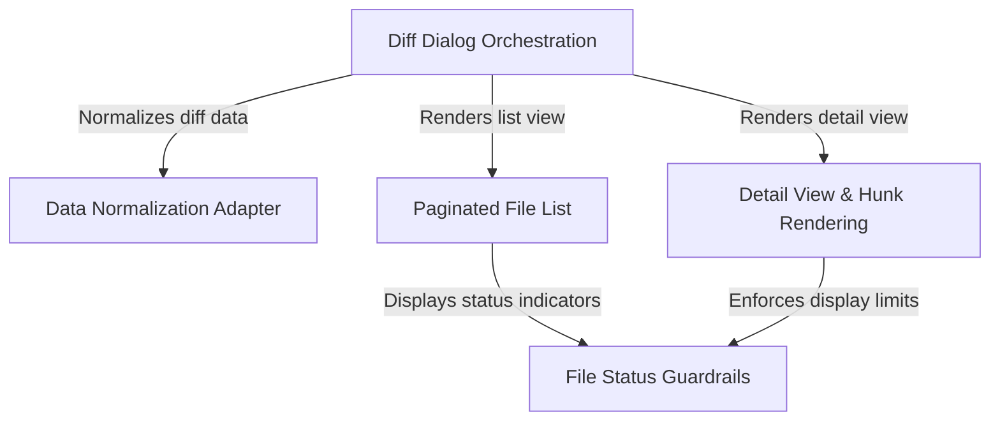

# Tutorial: diff

This project implements an interactive, terminal-based **diff viewer**. It orchestrates a workflow allowing users to browse a **paginated list** of changed files and drill down into a **detailed view** of code changes (hunks). The system creates a unified interface by **normalizing** different data sources and includes *guardrails* to safely handle binary, large, or untracked files without crashing the UI.

## Chapters

1. [Diff Dialog Orchestration](01_diff_dialog_orchestration.md)
2. [Data Normalization Adapter](02_data_normalization_adapter.md)
3. [Paginated File List](03_paginated_file_list.md)
4. [Detail View & Hunk Rendering](04_detail_view___hunk_rendering.md)
5. [File Status Guardrails](05_file_status_guardrails.md)

---

Generated by [Code IQ](https://github.com/adityasoni99/Code-IQ)