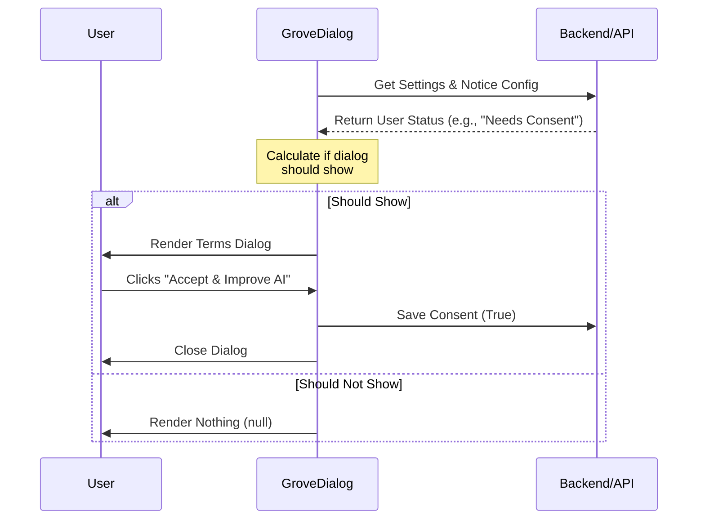

# Chapter 1: Grove Policy Dialog

Welcome to the **Grove** project! In this tutorial series, we are going to explore how we handle complex user consents, terms of service updates, and privacy controls.

We start with the most visible part of the system: the **Grove Policy Dialog**.

## The Problem: The "Bouncer" Problem

Imagine you run a club (your application). One day, the laws change, or you change your house rules. You legally cannot let people into the club until they sign the new agreement.

However, sometimes you want to be nice. You want to tell regular customers: *"Hey, new rules are coming next week. You can sign now, or you can come in today but you'll have to sign later."*

We need a coded solution that acts like a **Bouncer**:
1.  It stops the user flow.
2.  It checks if the user has signed the current papers.
3.  It decides if the user *must* sign now (Mandatory) or if they can wait (Grace Period).
4.  It records their signature.

This is exactly what the **Grove Policy Dialog** does.

## Key Concepts

Before looking at code, let's understand the three pillars of this component.

### 1. The Gatekeeper
The dialog doesn't just show up randomly. When the component mounts, it immediately calls the backend to ask: *"Does this specific user need to see a notice?"* If the answer is "No," the component renders nothing (`null`) and lets the user pass.

### 2. Grace Period vs. Mandatory
*   **Grace Period:** The user sees a "Not now" or "Defer" option. They can skip the legal update for now.
*   **Mandatory (Post-Grace):** The user *cannot* proceed without accepting. There is no "X" button to close the window.

### 3. The Opt-In Decision
We don't just ask for a signature; we also ask for data privacy permissions (e.g., "Help improve Claude"). The dialog handles bundling the **Terms Acceptance** with the **Data Opt-in** preference in a single click.

---

## How to Use It

The `GroveDialog` is designed to be dropped into high-level views, like an Onboarding flow or a Settings modal.

### Basic Usage

Here is how you would use the component in your application layout.

```tsx
import { GroveDialog } from './Grove';

function App() {
  return (
    <GroveDialog 
      location="onboarding"
      showIfAlreadyViewed={false}
      onDone={(decision) => {
        console.log("User finished via:", decision);
      }}
    />
  );
}
```

### Inputs (Props)
*   `location`: Tells the analytics system where this is happening (e.g., 'settings').
*   `showIfAlreadyViewed`: Useful for debugging or settings screens where you want to show the terms even if the user already signed them.
*   `onDone`: A callback function that runs when the user makes a choice or if the dialog decides not to show itself.

### Output (The Decision)
When `onDone` is called, it returns a `GroveDecision` string:
*   `'accept_opt_in'`: User accepted terms AND enabled data training.
*   `'accept_opt_out'`: User accepted terms but disabled data training.
*   `'defer'`: User clicked "Not now" (Grace period only).
*   `'skip_rendering'`: The dialog decided it didn't need to show up.

---

## Internal Implementation: How it Works

Let's peek under the hood to see how the "Bouncer" does its job.

### The Flow
When the component loads, it performs a "handshake" with the configuration system.



### Code Walkthrough

Let's look at the implementation in `Grove.tsx`. We will break it down into small, digestible pieces.

#### 1. The Setup & Check
When the component mounts, it fetches data. It relies on logic we will cover in [Consent Decision Logic](03_consent_decision_logic.md).

```tsx
// Inside GroveDialog component
useEffect(() => {
  async function checkGroveSettings() {
    // 1. Fetch current user settings and the global config
    const [settings, config] = await Promise.all([
        getGroveSettings(), 
        getGroveNoticeConfig()
    ]);

    setGroveConfig(config.data); // Save config for later
    
    // 2. logic to decide if we show the dialog
    const shouldShow = calculateShouldShowGrove(settings, config, showIfAlreadyViewed);
    
    setShouldShowDialog(shouldShow);
  }
  checkGroveSettings();
}, []);
```

**Explanation:** The `useEffect` triggers immediately. It waits for the API. If `shouldShow` is `false`, the component will eventually return `null`.

#### 2. Handling the User's Choice
When the user selects an option (like "Accept"), we handle it in `onChange`.

```tsx
const onChange = async (value: GroveDecision) => {
  // If user accepted with opt-in
  if (value === 'accept_opt_in') {
    await updateGroveSettings(true); // Send 'true' to API
  }
  
  // If user accepted with opt-out
  if (value === 'accept_opt_out') {
    await updateGroveSettings(false); // Send 'false' to API
  }

  // Tell parent component we are done
  onDone(value);
};
```

**Explanation:** This maps the specific UI button the user clicked to an API call (`updateGroveSettings`). This ensures the user's preference is saved immediately.

#### 3. Rendering the Content
The dialog needs to know *what* to say. The content changes based on whether we are in a "Grace Period" or not. We will detail exactly how these strategies work in [Policy Phase Content Strategies](02_policy_phase_content_strategies.md).

```tsx
// Inside the render return
<Box flexDirection="column">
  {groveConfig?.notice_is_grace_period ? (
    <GracePeriodContentBody /> // "Update coming soon..."
  ) : (
    <PostGracePeriodContentBody /> // "Update is here."
  )}
</Box>
```

**Explanation:** We simply check `notice_is_grace_period` from the config we fetched earlier. This switches the text from "An update will take effect on..." to "We've updated our terms...".

#### 4. The Exit Hatch
If we are in a Grace Period, we render an extra button to let the user "Defer".

```tsx
// Creating the list of buttons
const deferOption = groveConfig?.notice_is_grace_period 
  ? [{ label: "Not now", value: "defer" }] // Add "Not now" button
  : []; // No extra button

// Combine with accept options
const allOptions = [...acceptOptions, ...deferOption];
```

**Explanation:** If it's a grace period, we inject the "Not now" option into the dropdown or button list. If it's mandatory, that list is empty, forcing the user to pick one of the "Accept" options.

---

## Privacy Settings

There is a secondary component in this file called `PrivacySettingsDialog`. While the `GroveDialog` is for **interrupting** the user, the `PrivacySettingsDialog` is for when the user wants to change their mind later.

We will explore the details of this interface in [Privacy Settings Interface](04_privacy_settings_interface.md).

## Summary

You have learned about the **Grove Policy Dialog**, the "Bouncer" of our application.
*   It checks permission before letting users proceed.
*   It handles the logic of **Grace Periods** vs **Mandatory** updates.
*   It handles the network calls to save the user's consent.

In the next chapter, we will look at exactly *what* text and content we show inside this dialog to maximize clarity and trust.

[Next Chapter: Policy Phase Content Strategies](02_policy_phase_content_strategies.md)

---

Generated by [Code IQ](https://github.com/adityasoni99/Code-IQ)