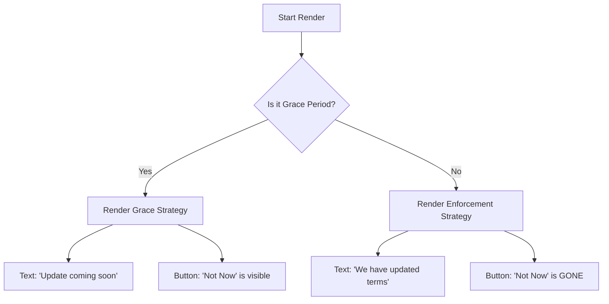

# Chapter 2: Policy Phase Content Strategies

Welcome back! In the previous chapter, [Grove Policy Dialog](01_grove_policy_dialog.md), we introduced the "Bouncer"—the component that stops users to ask for consent.

But a good Bouncer knows that timing is everything. You don't yell at a guest the moment a rule is proposed. You give them a heads-up first.

In this chapter, we will explore **Policy Phase Content Strategies**. This is the logic that allows our dialog to change its "personality" from a polite notification to a strict requirement based on the date.

## The Problem: The "Rent Due" Analogy

Imagine receiving a notice about your rent increasing.

1.  **Phase 1 (One week before):** The landlord sends a letter. *"Heads up, rent goes up next week."* You can read it, put it aside, and worry about it later.
2.  **Phase 2 (The due date):** The landlord stands at your door. *"Rent is due now."* You cannot ignore this. You must pay to enter.

If we treated Phase 1 like Phase 2, users would be annoyed. If we treated Phase 2 like Phase 1, users would never sign the new terms. We need a system that handles both.

## Key Concepts

Our strategy revolves around a single "Switch" that changes two things: **What we say** and **How we let users leave**.

### 1. The Grace Period (The Polite Phase)
*   **Time:** Before the enforcement deadline.
*   **Tone:** "An update is coming soon." (Future tense).
*   **Action:** The user can click "Not now" (Defer) and close the dialog without signing.

### 2. The Enforcement Period (The Strict Phase)
*   **Time:** On or after the deadline.
*   **Tone:** "We have updated our terms." (Past/Present tense).
*   **Action:** The "Not now" button is removed. The user **must** accept to proceed.

---

## How it Works: The Logic Flow

Before looking at the code, let's visualize how the component decides which "face" to wear.



This decision is made based on a configuration flag called `notice_is_grace_period`.

---

## Internal Implementation

Let's look at how we achieve this in `Grove.tsx`. We treat the content like a dynamic billboard.

### Step 1: The Switch
Inside the component, we check the configuration. This boolean value is calculated by the backend (which we will discuss in [Consent Decision Logic](03_consent_decision_logic.md)).

```tsx
// Inside GroveDialog rendering logic
const isGracePeriod = groveConfig?.notice_is_grace_period;

<Box flexDirection="column">
  {isGracePeriod 
    ? <GracePeriodContentBody />      // Strategy A
    : <PostGracePeriodContentBody />  // Strategy B
  }
</Box>
```

**Explanation:** This is a standard "Ternary Operator". It asks: "Is this the grace period?" If yes, render the first component. If no, render the second.

### Step 2: The Content Strategy
We create two separate small components so we don't mix up our messaging.

**Strategy A: Grace Period Text**
Notice the future tense ("will take effect") and the specific date.

```tsx
function GracePeriodContentBody() {
  return (
    <Text>
      An update to our Terms will take effect on
      <Text bold> October 8, 2025</Text>.
      You can accept the updated terms today.
    </Text>
  );
}
```

**Strategy B: Enforcement Text**
Notice the past tense ("We've updated"). The date doesn't matter anymore because the change has already happened.

```tsx
function PostGracePeriodContentBody() {
  return (
    <Text>
      We've updated our Consumer Terms and Privacy Policy.
    </Text>
  );
}
```

### Step 3: The "Exit Hatch" Strategy
This is the most critical part for user experience. In the Grace Period, we *inject* an extra button into the options list.

```tsx
// 1. Define the mandatory "Accept" options
const acceptOptions = [
  { label: "Accept & Opt-in", value: "accept_opt_in" },
  { label: "Accept & Opt-out", value: "accept_opt_out" }
];

// 2. Define the optional "Defer" button
const deferOption = isGracePeriod
  ? [{ label: "Not now", value: "defer" }] 
  : []; // Empty list if strictly enforced

// 3. Combine them
const finalOptions = [...acceptOptions, ...deferOption];
```

**Explanation:**
*   If `isGracePeriod` is **true**, `finalOptions` has 3 buttons. The user can click "Not now".
*   If `isGracePeriod` is **false**, `finalOptions` only has 2 buttons. The user **cannot** dismiss the dialog.

### Step 4: Handling the Cancel Action
Users often try to press `Esc` on their keyboard to close modals. We need to handle that based on the phase too.

```tsx
const handleCancel = () => {
  // If we are being nice (Grace Period), let them defer
  if (groveConfig?.notice_is_grace_period) {
    onChange("defer"); 
    return;
  }
  
  // If we are enforcing, 'Esc' does nothing (or logs an attempt)
  onChange("escape"); 
};
```

**Explanation:**
This ensures that savvy users can't bypass the mandatory phase just by hitting the Escape key. If they try to escape during the enforcement phase, the dialog refuses to close.

## Summary

In this chapter, you learned how **Policy Phase Content Strategies** turn a static dialog into a dynamic tool.

*   We use a **boolean flag** (`notice_is_grace_period`) to detect the current phase.
*   We swap the **text** from informative to declarative.
*   We conditionally remove the **"Not now"** button to enforce compliance when the deadline passes.

But how does the system know *when* to toggle that flag? And how does it know if a user has *already* signed? We will answer those questions in the next chapter.

[Next Chapter: Consent Decision Logic](03_consent_decision_logic.md)

---

Generated by [Code IQ](https://github.com/adityasoni99/Code-IQ)