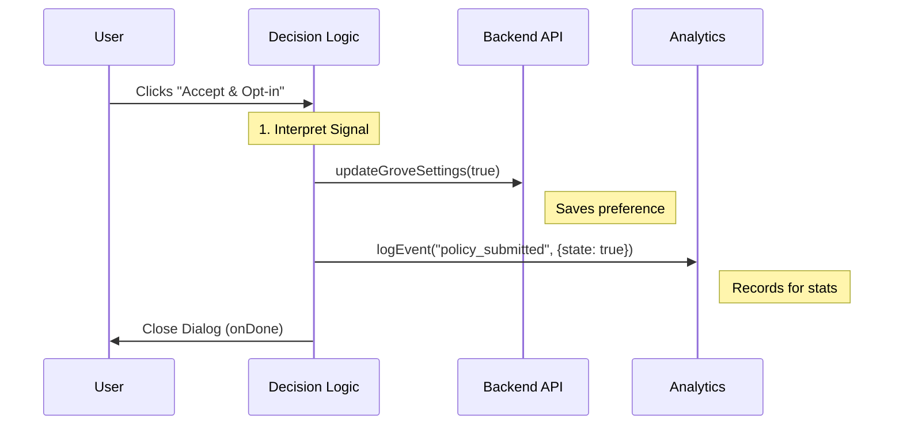

# Chapter 3: Consent Decision Logic

Welcome to Chapter 3! In the previous chapter, [Policy Phase Content Strategies](02_policy_phase_content_strategies.md), we learned how to change the text and buttons based on the date.

Now, we have a beautiful dialog with buttons, but clicking them doesn't actually **do** anything yet. We need a brain to connect the "Click" to the "Database".

In this chapter, we will explore **Consent Decision Logic**.

## The Problem: The "Voting Booth" Analogy

Imagine a voting booth.
1.  **The Ballot (UI):** This is what the user sees. It lists the candidates (Options).
2.  **The Machine (Logic):** When you pull the lever, the machine must physically punch the card, record the vote in a secure box, and give you an "I Voted" sticker.

If we only had the Ballot (UI), you could mark your choice, walk away, and no one would ever know. We need the **Logic** to ensure:
*   The choice is saved to the server (The Vote).
*   The system tracks that a choice was made (The Analytics).
*   The user is allowed to leave the booth (The UI Dismissal).

## Key Concepts

The Consent Decision Logic is essentially a **State Machine** that maps a specific user action to a set of backend instructions.

### 1. The Decision Types
The UI sends us a simple string (a "Signal") representing what the user clicked:
*   `'accept_opt_in'`: User agrees and wants to help train AI.
*   `'accept_opt_out'`: User agrees but keeps data private.
*   `'defer'`: User wants to decide later (Grace Period only).
*   `'escape'`: User tried to close the window without choosing.

### 2. The Side Effects
For every signal, we trigger "Side Effects." These are actions that happen outside the UI:
*   **API Call:** Send `true` or `false` to the database.
*   **Analytics:** Log exactly what happened for our data team.
*   **Flow Control:** Tell the parent component to close the dialog.

---

## The Workflow

Before looking at the code, let's visualize the lifecycle of a single click.



---

## How to Use It

The core of this logic lives inside a function usually named `onChange`. This function serves as the central traffic controller.

### The Input
The function receives a single string value from the buttons we created in Chapter 2.

```tsx
// This value comes from the button click
type GroveDecision = 
  | 'accept_opt_in' 
  | 'accept_opt_out' 
  | 'defer' 
  | 'escape';
```

### The Logic Block
We use a `switch` statement to handle the routing. This makes the code very readable and easy to extend if we add new options later.

```tsx
const onChange = async (value: GroveDecision) => {
  switch (value) {
    case 'accept_opt_in':
      // Handle the "Yes" case
      break;
    case 'accept_opt_out':
      // Handle the "No" case
      break;
    // ... handle other cases
  }
  // Finally, tell the UI we are finished
  onDone(value);
};
```

---

## Internal Implementation details

Let's look at the actual code implementation in `Grove.tsx`. We will break it down by the specific decisions.

### 1. Handling "Opt-In"
When the user clicks **"Accept & Opt-in"**, two things must happen:
1.  We tell the API `true` (Enable data training).
2.  We log that the user submitted the form with a `true` state.

```tsx
case 'accept_opt_in': {
  // 1. API Call: Update settings to TRUE
  await updateGroveSettings(true);
  
  // 2. Analytics: Log the positive consent
  logEvent('tengu_grove_policy_submitted', {
    state: true,
    dismissable: isGracePeriod // Was this forced or optional?
  });
  break;
}
```

### 2. Handling "Opt-Out"
This is the same as Opt-In, but we send `false` to the API. This records that they accepted the terms, but *declined* the data training.

```tsx
case 'accept_opt_out': {
  // 1. API Call: Update settings to FALSE
  await updateGroveSettings(false);

  // 2. Analytics: Log the negative consent
  logEvent('tengu_grove_policy_submitted', {
    state: false, 
    dismissable: isGracePeriod
  });
  break;
}
```

**Note:** Notice that regardless of `true` or `false`, the user has "Submitted" the policy. The backend records the date of this action effectively signing the "Terms of Service."

### 3. Handling "Defer" (Grace Period)
If the user clicks "Not Now," we do **not** call the `updateGroveSettings` API. We don't want to save a permanent decision yet. We only log that they saw it and skipped it.

```tsx
case 'defer': {
  // No API call here!
  
  // Just log that they dismissed it
  logEvent('tengu_grove_policy_dismissed', {
    state: true // True means "Yes, it was dismissed"
  });
  break;
}
```

### 4. Handling "Escape"
Users often press the `Esc` key on their keyboard. We capture this as a distinct event from clicking a button.

```tsx
case 'escape': {
  // Log that they used the keyboard escape
  logEvent('tengu_grove_policy_escaped', {});
  break;
}
```

### The "Gatekeeper" Logic for Escaping
In Chapter 2, we mentioned the **Enforcement Phase**. We need logic to ensure the user cannot trigger the `defer` or `escape` path if the grace period is over.

We wrap the cancel action in a special handler:

```tsx
const handleCancel = () => {
  // Check our config (from Chapter 2)
  if (groveConfig?.notice_is_grace_period) {
    // If we are nice, let them defer
    onChange('defer'); 
    return;
  }
  
  // If we are strict, just log the attempt, but DO NOT close
  onChange('escape'); 
};
```

**Crucial Detail:** Notice that in the strict phase, `onChange('escape')` is called, but the dialog's `onCancel` prop logic (in the UI layer) will prevent the window from actually closing if it's mandatory.

## Summary

You have implemented the **Consent Decision Logic**, the brain of the operation.

*   You learned how to map **User Actions** (`accept_opt_in`) to **Backend Calls** (`updateGroveSettings`).
*   You learned to distinguish between **Saving Data** (Accept) and **Skipping** (Defer).
*   You secured the flow by logging every interaction for analytics.

Now that the user has accepted the terms and potentially opted in or out, they might change their mind later. Where do they go to do that?

In the next chapter, we will build the interface that allows users to manage these choices after the initial dialog is gone.

[Next Chapter: Privacy Settings Interface](04_privacy_settings_interface.md)

---

Generated by [Code IQ](https://github.com/adityasoni99/Code-IQ)