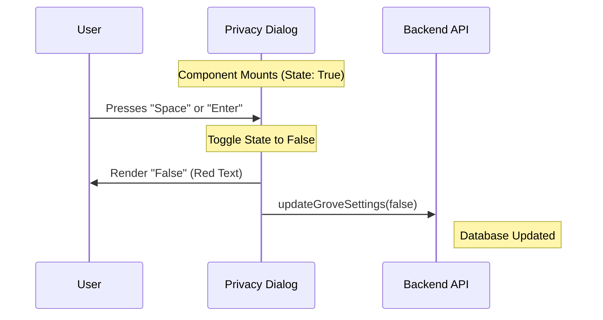

# Chapter 4: Privacy Settings Interface

Welcome to Chapter 4!

In the previous chapter, [Consent Decision Logic](03_consent_decision_logic.md), we built the logic to save a user's initial choice when they first encounter the new terms.

But what if the user changes their mind? A user might agree to share data today but decide to stop sharing tomorrow. We cannot force them to re-read the entire Terms of Service just to flip a single switch.

In this chapter, we will build the **Privacy Settings Interface**.

## The Problem: The "Thermostat" Analogy

Think of the [Grove Policy Dialog](01_grove_policy_dialog.md) (Chapter 1) like signing a lease for an apartment. You do it once, it's mandatory, and it's a big deal.

The **Privacy Settings Interface** is like the **Thermostat** in that apartment.
1.  **Accessible:** You can walk up to it anytime.
2.  **Simple:** You don't re-read the lease; you just turn the dial up or down.
3.  **Immediate:** The temperature (or data setting) changes right away.

We need a component that shows the current status (On/Off) and lets the user toggle it with a simple keystroke.

## Key Concepts

### 1. The Toggle State
Unlike the previous dialog which had multiple buttons ("Accept", "Defer"), this interface revolves around a single Boolean state: `True` (Opt-in) or `False` (Opt-out).

### 2. Immediate Persistence
When the user hits the toggle, we don't wait for a "Save" button. We update the backend immediately. This feels snappy and modern.

### 3. Read-Only Mode (Domain Exclusions)
Sometimes, a user *cannot* change the thermostat because the building manager locked it. In our case, if a user belongs to a corporate account ("Domain Excluded"), their admin might have forced the setting to `False`. Our interface must show this state without letting the user change it.

---

## How to Use It

The `PrivacySettingsDialog` is usually triggered from a main menu or a command like `settings`.

### Basic Usage

It requires the current settings object and a function to close it.

```tsx
import { PrivacySettingsDialog } from './Grove';

// ... inside your app
<PrivacySettingsDialog 
  settings={currentUserSettings} // e.g., { grove_enabled: true }
  onDone={() => setView('main_menu')}
/>
```

### Inputs (Props)
*   `settings`: Contains the current `grove_enabled` status.
*   `domainExcluded`: (Optional) Boolean. If true, the user is locked out of changing the setting.
*   `onDone`: Function to call when the user presses `Esc` to leave.

---

## Internal Implementation: The Flow

How does the component handle the "Switching" action?



---

## Code Walkthrough

Let's look at `Grove.tsx` again. This time we are focusing on the `PrivacySettingsDialog` component.

### 1. Local State Setup
We initialize the state using the data passed in via props. This acts as our "Thermostat" display.

```tsx
export function PrivacySettingsDialog({ settings, domainExcluded, onDone }) {
  // Initialize local state with the value from the database
  const [groveEnabled, setGroveEnabled] = useState(settings.grove_enabled);

  // ...
}
```

### 2. The Interaction Logic (The Brain)
Since this is a CLI application, we don't have mouse clicks. We use the `useInput` hook to listen for keyboard events.

```tsx
useInput(async (input, key) => {
  // 1. Check if the user is ALLOWED to change this
  if (domainExcluded) return;

  // 2. Check if they pressed Enter, Return, or Space
  if (key.tab || key.return || input === " ") {
    const newValue = !groveEnabled; // Flip the switch
    
    setGroveEnabled(newValue);      // Update UI immediately
    await updateGroveSettings(newValue); // Update Backend
  }
});
```

**Explanation:**
*   **Guard Clause:** `if (domainExcluded)` ensures locked accounts can't toggle the value.
*   **Toggle:** `!groveEnabled` takes whatever the value is and flips it.
*   **Sync:** We update the UI *and* the API simultaneously.

### 3. Visual Feedback (The Display)
We want to clearly show the user if the setting is On or Off. We use colors to make it obvious.

```tsx
let valueComponent = <Text color="error">false</Text>; // Default Red

if (groveEnabled) {
  // If true, make it Green
  valueComponent = <Text color="success">true</Text>;
}
```

**Explanation:**
This variable `valueComponent` will be inserted into the final render. If `groveEnabled` is true, users see a green "true". If false, a red "false".

### 4. Handling the "Locked" State
If the domain is excluded, we override the display to explain *why* they can't change it.

```tsx
if (domainExcluded) {
  valueComponent = (
    <Text color="error">
      false (for emails with your domain)
    </Text>
  );
}
```

**Explanation:**
This is crucial for user trust. If a button doesn't work, you must tell the user why. Here, we clarify that their email domain prevents opting in.

### 5. The Final Render
Finally, we wrap everything in our standard `Dialog` component.

```tsx
return (
  <Dialog 
    title="Data Privacy" 
    onCancel={onDone} // Pressing Esc closes the dialog
  >
    <Box>
      <Text bold>Help improve Claude</Text>
      <Box>{valueComponent}</Box> 
    </Box>
  </Dialog>
);
```

**Note:** The `valueComponent` we created in step 3 or 4 is placed right next to the label "Help improve Claude".

## Summary

In this chapter, you built the **Privacy Settings Interface**.

*   You learned how to manage **local state** for a toggle switch.
*   You implemented **keyboard listeners** (`useInput`) to handle user interaction in a text-based interface.
*   You handled **permissions** (`domainExcluded`) to prevent unauthorized changes.

We have now built the Policy Dialog, the Content Strategies, the Logic, and the Settings Interface. But where does all this run? How do we actually see this on our screen?

In the final chapter, we will explore the **CLI Interaction Layer**—the engine that renders these React components into your terminal.

[Next Chapter: CLI Interaction Layer](05_cli_interaction_layer.md)

---

Generated by [Code IQ](https://github.com/adityasoni99/Code-IQ)