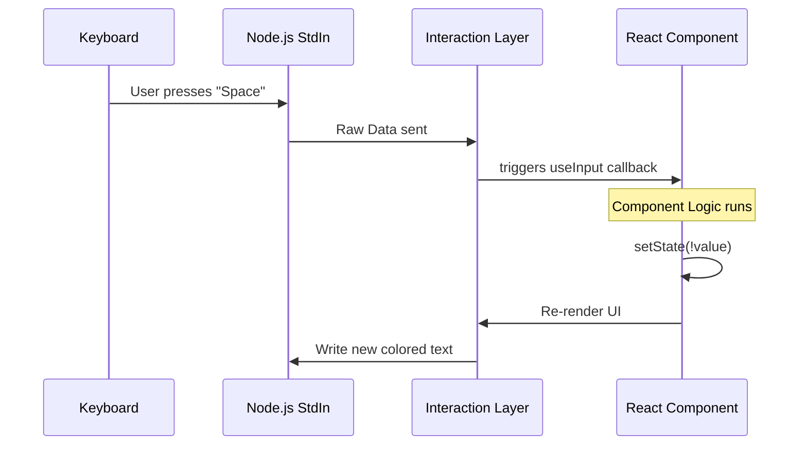

# Chapter 5: CLI Interaction Layer

Welcome to the final chapter of the Grove tutorial series!

In the previous chapter, [Privacy Settings Interface](04_privacy_settings_interface.md), we built a React component that acts like a thermostat, allowing users to toggle their privacy settings.

However, there is one big question left: **How do we render React components in a black-and-white terminal window?**

React is usually used for websites (HTML/DOM). Terminals don't understand HTML; they only understand text and special codes. In this chapter, we explore the **CLI Interaction Layer** that acts as the bridge between our React code and the user's terminal.

## The Problem: The "Translator" Problem

Imagine you are trying to give instructions to a construction crew.
1.  **You speak English (React):** You say, "Put a red box here with bold text."
2.  **The Crew speaks Alien (Terminal):** They only understand character streams and ANSI escape codes (like `\x1b[31m`).

If you send raw HTML (`<div class="red">...</div>`) to the terminal, it will just print the code as text. It won't draw a box.

We need a **Translator** that takes your React components and instantly converts them into text strings that visually look like a UI. This is what the **CLI Interaction Layer** (powered by a library called `ink`) does.

## Key Concepts

### 1. Visual Primitives (`Box` & `Text`)
In web development, you use `<div>` and `<span>`. In our CLI layer, we use:
*   **`Box`:** A container that handles layout. Surprisingly, it supports **Flexbox**. This allows us to arrange text in rows and columns, add padding, and manage margins inside a terminal.
*   **`Text`:** A component for rendering strings. It handles styling like **bold**, *italics*, and colors (e.g., green for success, red for errors).

### 2. Input Hooks (`useInput`)
Terminals usually don't support mouse clicks. Users interact by typing.
Instead of `onClick`, we use a hook called `useInput`. It acts like a specialized microphone that listens for specific keystrokes (like `Enter`, `Esc`, or arrows).

---

## How to Use It

Let's look at how we compose the `GroveDialog` using these visual primitives.

### 1. Structure with `Box`
We want to organize our dialog into a header (the ASCII art) and a body (the text). We use `Box` to stack them vertically or place them side-by-side.

```tsx
import { Box, Text } from '../../ink.js';

// Inside our render return
<Box flexDirection="row">
  {/* The main text content */}
  <Box flexDirection="column" gap={1}>
     <Text>We've updated our terms.</Text>
  </Box>

  {/* The ASCII Art on the right */}
  <Box flexShrink={0}>
     <Text color="professionalBlue">{NEW_TERMS_ASCII}</Text>
  </Box>
</Box>
```
**Explanation:**
*   `flexDirection="row"`: Puts the text and the ASCII art side-by-side.
*   `gap={1}`: Adds a 1-line space between elements (like CSS gap).
*   `color="professionalBlue"`: The `Text` component translates this prop into the specific color code for the terminal.

### 2. Typography with `Text`
We can mix and match styles within a single sentence by nesting `Text` components.

```tsx
<Text>
  An update will take effect on 
  <Text bold> October 8, 2025</Text>.
  You can <Text color="green">accept</Text> today.
</Text>
```
**Output:** An update will take effect on **October 8, 2025**. You can <span style="color:green">accept</span> today.

### 3. Handling User Input
This is where the magic happens. We connect the user's keyboard to the logic we wrote in [Consent Decision Logic](03_consent_decision_logic.md).

```tsx
import { useInput } from '../../ink.js';

// Inside PrivacySettingsDialog
useInput((input, key) => {
  // Check if user pressed "Enter" or "Tab"
  if (key.return || key.tab) {
    toggleSetting(); // Flip the switch
  }
  
  // Check if user pressed "Escape"
  if (key.escape) {
    onDone(); // Close the window
  }
});
```
**Explanation:**
*   `key.return`: Returns `true` if the user hit Enter.
*   `key.escape`: Returns `true` if the user hit Esc.
*   We use these boolean flags to trigger our Javascript functions.

---

## Internal Implementation: Under the Hood

How does a keystroke travel from the user's keyboard to our React state?

### The Flow


### Code Walkthrough

Let's look at `Grove.tsx` to see how we combine `useInput` with the visual updates. We will look at the `PrivacySettingsDialog` as it is the cleanest example.

#### Step 1: Listening
We set up the listener. Note that this code runs on *every* keystroke, so we must be specific about which keys we care about.

```tsx
// Grove.tsx - PrivacySettingsDialog

useInput(async (input, key) => {
  // 1. Guard Clause: Ignore if domain is locked
  if (domainExcluded) return;

  // 2. Action: If Enter, Tab, or Space is pressed
  if (key.tab || key.return || input === " ") {
    const newValue = !groveEnabled;
    
    setGroveEnabled(newValue); // Update visual state
    await updateGroveSettings(newValue); // Update API
  }
});
```

#### Step 2: Visual Feedback
Because `setGroveEnabled` was called, React re-renders the component. The CLI Interaction Layer now needs to decide what color to paint the text.

```tsx
// Default state is Red (False)
let valueComponent = <Text color="error">false</Text>;

// If state is True, switch to Green
if (groveEnabled) {
  valueComponent = <Text color="success">true</Text>;
}
```

#### Step 3: The Final Output
The `valueComponent` is placed inside a `Box` and sent to the terminal.

```tsx
<Box>
  <Text bold>Help improve Claude</Text>
  <Box>{valueComponent}</Box> 
</Box>
```

**Result:** The user sees the text flip from <span style="color:red">false</span> to <span style="color:green">true</span> instantly.

---

## Summary

In this final chapter, you learned about the **CLI Interaction Layer**.

*   **Problem:** React outputs DOM, but Terminals need Text.
*   **Solution:** We use `ink` to translate React components into terminal output.
*   **Layout:** We use `Box` to apply Flexbox layouts in the terminal.
*   **Input:** We use `useInput` to capture keyboard events instead of mouse clicks.

### Tutorial Conclusion

Congratulations! You have walked through the entire architecture of the **Grove** project.

1.  **[Grove Policy Dialog](01_grove_policy_dialog.md):** You built the "Bouncer" that intercepts the user.
2.  **[Policy Phase Content Strategies](02_policy_phase_content_strategies.md):** You learned how to change the message based on the deadline.
3.  **[Consent Decision Logic](03_consent_decision_logic.md):** You connected the buttons to the database and analytics.
4.  **[Privacy Settings Interface](04_privacy_settings_interface.md):** You built a settings toggle for future changes.
5.  **CLI Interaction Layer:** You rendered it all to the terminal.

You now understand how we handle complex legal consents in a modern, user-friendly CLI environment. Happy coding!

---

Generated by [Code IQ](https://github.com/adityasoni99/Code-IQ)