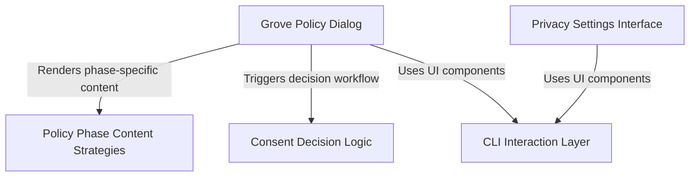

# Tutorial: grove

This project implements a **CLI-based** user interface for managing updates to **Consumer Terms** and **Privacy Policies**. It features a "gatekeeper" dialog that adapts its messaging based on whether the policy is in a *grace period* or effectively active, alongside a dedicated control panel for users to toggle data privacy settings like "Help improve Claude" directly from the terminal.

## Chapters

1. [Grove Policy Dialog](01_grove_policy_dialog.md)
2. [Policy Phase Content Strategies](02_policy_phase_content_strategies.md)
3. [Consent Decision Logic](03_consent_decision_logic.md)
4. [Privacy Settings Interface](04_privacy_settings_interface.md)
5. [CLI Interaction Layer](05_cli_interaction_layer.md)

---

Generated by [Code IQ](https://github.com/adityasoni99/Code-IQ)