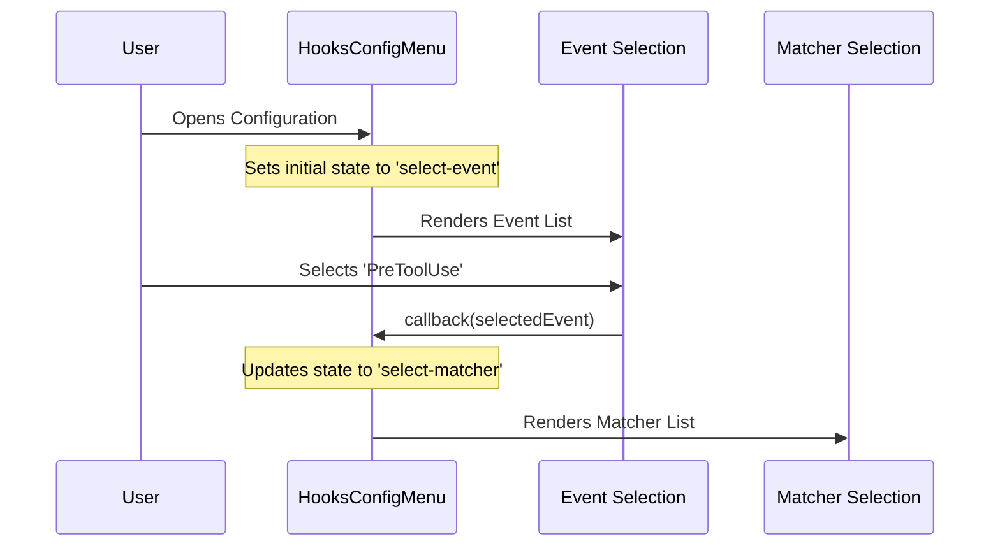

# Chapter 1: Hooks Config Menu

Welcome to the **Hooks** project tutorial! We are going to build an interface that allows users to manage "Hooks"—scripts that run automatically before or after tools are used.

In this first chapter, we will explore the **Hooks Config Menu**. This is the brain of our user interface.

## What is the Hooks Config Menu?

Imagine you are using a computer's "File Explorer" or "Finder" window.
- You start at the top level (selecting a drive).
- You click into a folder (selecting a category).
- You click a specific file (selecting an item).
- You view the file's details.

The **Hooks Config Menu** is exactly like that File Explorer window, but for your hooks. It doesn't display the specific details itself; instead, it acts as a **Container** and a **Router**. It remembers where you are and decides which specific view to show you next.

### The Use Case: Exploring Your Configuration

Imagine a user wants to check a specific script that runs before a tool is used.
1. They open the menu.
2. They choose the "Event" (e.g., *PreToolUse*).
3. They choose the "Matcher" (e.g., *exact matching*).
4. They find the specific hook.

The **Hooks Config Menu** manages this journey. It tracks that the user is currently at step 1, then updates its state to move them to step 2, and so on.

## Key Concepts

### 1. The Navigation State (`modeState`)
The most important job of this component is remembering "Where am I?". It uses a concept called a **State Machine**. At any given moment, the menu is in exactly one "Mode".

*   **Select Event:** The top level (Root).
*   **Select Matcher:** Inside a specific category.
*   **Select Hook:** Looking at a list of items.
*   **View Hook:** Reading the details of one item.

### 2. The Router (The Switch)
Based on the current `modeState`, the component acts like a traffic cop. It switches which sub-component is displayed on the screen.

### 3. Data Aggregator
Before showing anything, this menu counts all your hooks and checks if security policies allow them to run. It passes these statistics down to the sub-views so they can display summaries (like "5 hooks enabled").

## How It Works: The Flow

Before we look at the code, let's visualize how the User moves through this menu using a sequence diagram.



## Implementation Deep Dive

Let's look at how this is built in `HooksConfigMenu.tsx`. We will break it down into small, manageable pieces.

### Step 1: Defining the State
We need to track the current mode. We use a standard React hook called `useState`. Notice how the state changes shape depending on the mode (e.g., if we are selecting a matcher, we need to know *which* event we are inside).

```typescript
// Initial state is 'select-event' (the top level)
const [modeState, setModeState] = useState<ModeState>({
  mode: 'select-event',
});

// We also track if hooks are disabled by global policies
const [disabledByPolicy, setDisabledByPolicy] = useState(false);
```

### Step 2: Policy Safety Check
Before we let the user browse, we check if they are even allowed to use hooks. If a security policy disables hooks, we show a warning dialog immediately and don't render the rest of the file explorer.

```typescript
// If hooks are globally disabled, show a warning dialog
if (hooksDisabled) {
  return (
    <Dialog 
      title="Hook Configuration - Disabled" 
      onCancel={handleExit}
    >
      <Text>All hooks are currently disabled.</Text>
      {/* ... warning details ... */}
    </Dialog>
  );
}
```

### Step 3: The Routing Logic
This is the heart of the component. We use a standard JavaScript `switch` statement to decide what to render based on `modeState.mode`.

First, let's look at the default view, the **Event Selection**.

```typescript
switch (modeState.mode) {
  case 'select-event':
    return (
      <SelectEventMode 
        // We pass data down to the child
        totalHooksCount={totalHooksCount}
        // We define what happens when the user clicks an item
        onSelectEvent={(event) => {
           // Logic to determine next step goes here
           setModeState({ mode: 'select-matcher', event });
        }}
        onCancel={handleExit} 
      />
    );
```
*Note: This renders the component we will discuss in [Event Selection Mode](02_event_selection_mode.md).*

### Step 4: Drilling Down
If the user selects an event, the state updates to `select-matcher`. The `switch` statement re-runs and hits this case:

```typescript
  case 'select-matcher':
    return (
      <SelectMatcherMode
        // We now pass which event we are looking at
        selectedEvent={modeState.event}
        onSelect={(matcher) => {
          // Move deeper into the folder structure
          setModeState({
            mode: 'select-hook',
            event: modeState.event,
            matcher
          });
        }}
        // Going back moves up one level
        onCancel={() => setModeState({ mode: 'select-event' })}
      />
    );
```
*Note: This renders the component for [Matcher Selection Mode](03_matcher_selection_mode.md).*

### Step 5: Handling "Go Back"
Navigating isn't just about going forward; it's about going back too. The component listens for "Escape" keys or "Cancel" actions from the child components.

```typescript
// Example of handling cancellation in the 'select-matcher' view
onCancel={() => {
    // Return to the previous state (Root level)
    setModeState({ mode: 'select-event' });
}}
```

## Summary

The **Hooks Config Menu** is the container that holds the entire experience together. It doesn't know *how* to display a list of matchers or the details of a script, but it knows *when* to show them.

1.  It holds the **State** (Current Mode).
2.  It calculates **Global Stats** (Total hook counts).
3.  It **Routes** the user to the correct sub-component.

In the next chapter, we will look at the first view this menu renders: the [Event Selection Mode](02_event_selection_mode.md).

---

Generated by [Code IQ](https://github.com/adityasoni99/Code-IQ)