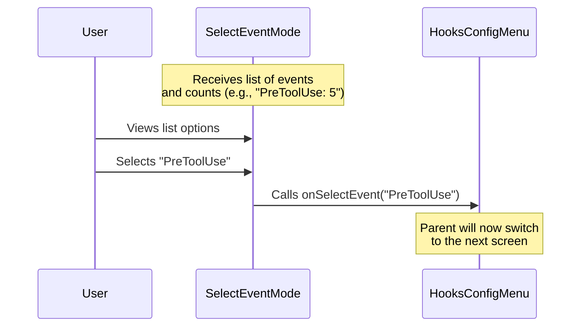

# Chapter 2: Event Selection Mode

Welcome back! in the previous chapter, [Hooks Config Menu](01_hooks_config_menu.md), we built the "brain" of our application—the router that decides which screen to show.

Now, we are going to build the **first screen** the user actually sees: the **Event Selection Mode**.

## The Concept: The Department Store Directory

Imagine walking into a massive department store. You are looking for a specific pair of running shoes. You don't immediately start looking at every single item in the store. Instead, you look at the **Directory**:

1.  **Men's Clothing**
2.  **Home Goods**
3.  **Electronics**

You select **Men's Clothing**, and *then* you go deeper.

The **Event Selection Mode** is that directory. We have many hooks (scripts), but they are organized by **when** they run (the "Event").
*   **PreToolUse:** Before a tool runs.
*   **PostToolExecution:** After a tool runs.

### The Use Case

**The Problem:** A user has 50 different hooks configured. They want to check a script that cleans up data *after* a tool finishes. If we showed a list of all 50 hooks, it would be a mess.

**The Solution:** We present a high-level list of "Lifecycles" (Events). The user clicks "PostToolExecution", and we only show them the hooks inside that category.

## High-Level Flow

Before we code, let's look at how data flows through this component.



## Key Concepts

To build this, we need to understand three simple concepts:

1.  **Metadata:** This is the description of the event (e.g., "Runs before a tool is invoked"). It helps the user understand what the category means.
2.  **Counts:** We want to show how many hooks are inside each category (e.g., `(3 hooks)`). This saves the user time; they won't click an empty category.
3.  **The Select Component:** A UI element that lets the user pick one item from a list.

## Implementation Deep Dive

Let's look at `SelectEventMode.tsx`. We will break the code down into the logic that prepares the data and the logic that renders the list.

### Step 1: Preparing the Options

The component receives a list of events. We need to transform this raw data into a format that our generic `<Select />` component can understand. We need a `label` (what the user sees), a `value` (the ID), and a `description`.

```typescript
// We map over the metadata to create menu options
const options = Object.entries(hookEventMetadata).map(([name, metadata]) => {
  // Get the count of hooks for this specific event
  const count = hooksByEvent[name] || 0;

  return {
    // If hooks exist, show the name AND the count (e.g., "PreToolUse (5)")
    label: count > 0 ? `${name} (${count})` : name, 
    value: name,
    description: metadata.summary // e.g., "Runs before a tool..."
  };
});
```

**Explanation:**
*   We use `.map()` to loop through every available event type.
*   We check `hooksByEvent` to see if the user has any scripts for this event.
*   We return an object representing a menu item.

### Step 2: Handling Policies

Sometimes, an administrator might disable hooks entirely for security reasons. We should visually warn the user if this is happening.

```typescript
// Check if policies restrict hooks
const policyWarning = restrictedByPolicy ? (
  <Box flexDirection="column">
    <Text color="suggestion">Hooks Restricted by Policy</Text>
    <Text dimColor>Only managed settings can run.</Text>
  </Box>
) : null;
```

**Explanation:**
*   If `restrictedByPolicy` is true, we create a small UI box with a warning message.
*   If not, `policyWarning` is null and nothing shows up.

### Step 3: Rendering the View

Finally, we return the JSX (the UI layout). We use a `Dialog` to frame the content and the `Select` component to show the list we created in Step 1.

```typescript
return (
  <Dialog title="Hooks" onCancel={onCancel}>
    <Box flexDirection="column" gap={1}>
      
      {/* 1. Show warning if needed */}
      {policyWarning}

      {/* 2. Show the interactive list */}
      <Select 
        options={options}
        onChange={(value) => onSelectEvent(value)} // Pass selection to parent
        onCancel={onCancel}
      />
      
    </Box>
  </Dialog>
);
```

**Explanation:**
*   **`<Dialog>`**: Draws a box around our content with a title.
*   **`onSelectEvent(value)`**: This is the most crucial line. When the user hits "Enter" on an option, this function tells the parent ([Hooks Config Menu](01_hooks_config_menu.md)) to change the state.

## Summary

In this chapter, we built the **Event Selection Mode**.

1.  We treated the list of events like a **Department Store Directory**.
2.  We calculated **Counts** so users know where their hooks are.
3.  We mapped this data into a **Select** component.

When the user makes a selection here, the parent component captures the event name (e.g., `PreToolUse`) and switches the view.

**What happens next?**
Now that the user has chosen a category (like "PreToolUse"), we need to ask them *how* they want to filter those hooks. Do they want to match a specific tool name? Or all tools?

Let's move on to [Chapter 3: Matcher Selection Mode](03_matcher_selection_mode.md).

---

Generated by [Code IQ](https://github.com/adityasoni99/Code-IQ)