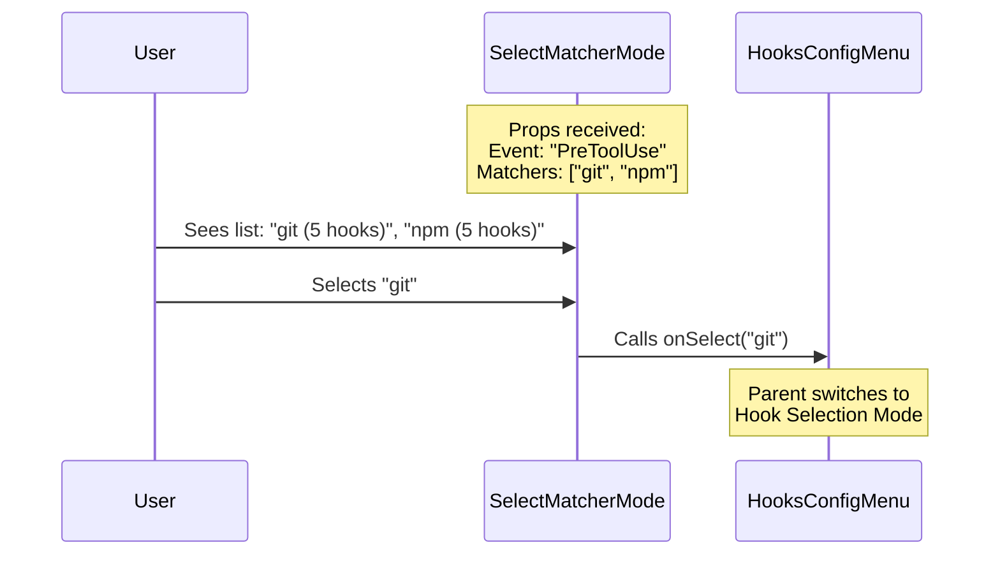

# Chapter 3: Matcher Selection Mode

Welcome back!

In the previous chapter, [Event Selection Mode](02_event_selection_mode.md), we built the "Department Store Directory." We allowed the user to choose **When** a script runs (e.g., "Before a Tool is Used").

Now, we need to let them choose **What** tool triggers the script. This is the **Matcher Selection Mode**.

## The Concept: The Clothing Rack

Let's stick with our department store analogy. You have already entered the "Men's Clothing" department (The Event). Now, you are looking for a specific brand.

You don't want to browse through a pile of 1,000 random shirts. You want to see signs for the brands:
*   **Nike** (3 items)
*   **Adidas** (5 items)
*   **Generic/All** (10 items)

In our specific context:
*   **Event:** `PreToolUse` (Before a tool runs)
*   **Matcher:** `git` (Only run when the user types `git`)

### The Use Case

**The Problem:** The user has selected "PreToolUse". They have 20 different scripts. 5 of them are for `git`, 5 are for `npm`, and 10 run for *every* command. Showing a flat list of 20 items is confusing.

**The Solution:** We group these scripts by their "Matcher" (the tool name). The user sees a clean list of tool names. They select `git`, and *then* we show them the 5 specific scripts.

## High-Level Flow

Here is how the user interacts with this specific view:



## Key Concepts

To understand this component, we need to look at three things:

1.  **The Matcher:** This is simply a string. It is usually the name of the tool (like `ls`, `cat`, `git`). If a hook applies to everything, the matcher might be empty or labelled `(all)`.
2.  **Aggregation:** We are not showing individual hooks yet. We are showing *groups* of hooks. We need to count how many hooks belong to each tool.
3.  **Sources:** Hooks can come from different places (e.g., a "Global" setting on your computer vs. a "Project" setting in a repository). We want to show the user where these hooks are coming from.

## Implementation Deep Dive

Let's explore `SelectMatcherMode.tsx`.

### Step 1: Grouping and Counting

The component receives a list of matchers and a big object containing all the hooks. We need to combine these to figure out how many hooks exist for each matcher.

We use `React.useMemo` to do this calculation only when data changes, so the menu stays snappy.

```typescript
const matchersWithSources = React.useMemo(() => {
  return matchersForSelectedEvent.map(matcher => {
    // 1. Get all hooks for this specific tool (e.g., 'git')
    const hooks = hooksByEventAndMatcher[selectedEvent]?.[matcher] || [];
    
    // 2. Return the data we need for the UI
    return {
      matcher, // e.g., "git"
      hookCount: hooks.length, // e.g., 5
    };
  });
}, [matchersForSelectedEvent, hooksByEventAndMatcher]);
```

**Explanation:**
*   We loop through every matcher (tool name).
*   We look up the list of hooks for that tool.
*   We count them (`hooks.length`).

### Step 2: Preparing the Menu Options

Just like in the previous chapter, we need to format this data for our `<Select />` component. We want the label to look informative, for example: `[Global] git`.

```typescript
const options = matchersWithSources.map(item => {
  // 1. Create a display label (e.g., "(all)" or "git")
  const matcherLabel = item.matcher || '(all)';

  return {
    // 2. Combine source info and label
    label: `[${sourceText}] ${matcherLabel}`,
    
    // 3. The value we pass back when selected
    value: item.matcher,
    
    // 4. Helpful description
    description: `${item.hookCount} hooks` 
  };
});
```

**Explanation:**
*   **`label`**: This is what the user clicks on. It combines the source (where the config lives) and the tool name.
*   **`value`**: This is the raw ID (the tool name) we will send to the parent.
*   **`description`**: Tells the user how many items are inside this folder.

### Step 3: Handling Empty States

What if the user clicks "PreToolUse," but there are actually no hooks configured for it? We shouldn't show an empty list; we should tell them what's going on.

```typescript
if (matchersForSelectedEvent.length === 0) {
  return (
    <Dialog title={`${selectedEvent} - Matchers`} onCancel={onCancel}>
      <Box flexDirection="column" gap={1}>
        <Text dimColor>No hooks configured for this event.</Text>
        <Text dimColor>To add hooks, edit settings.json.</Text>
      </Box>
    </Dialog>
  );
}
```

**Explanation:**
*   We check the length of our list.
*   If it is 0, we render a helpful message instead of the list.

### Step 4: The Render

If we have data, we render the interactive list.

```typescript
return (
  <Dialog 
    title={`${selectedEvent} - Matchers`} 
    onCancel={onCancel}
  >
    <Box flexDirection="column">
      <Select 
        options={options} 
        onChange={(value) => onSelect(value)} // Pass "git" to parent
        onCancel={onCancel} 
      />
    </Box>
  </Dialog>
);
```

**Explanation:**
*   **`title`**: Updates dynamically, e.g., "PreToolUse - Matchers".
*   **`onChange`**: When the user presses Enter on "git", this function fires. It tells the [Hooks Config Menu](01_hooks_config_menu.md) to move to the next state.

## Summary

In this chapter, we built the **Matcher Selection Mode**.

1.  We took a raw list of scripts and **Grouped** them by tool name.
2.  We calculated **Counts** to show the user how many scripts exist for each tool.
3.  We handled the **Empty State** gracefully.

**The Journey So Far:**
1.  User opened Menu.
2.  User selected "PreToolUse" ([Event Selection](02_event_selection_mode.md)).
3.  User selected "git" (**You are here**).

**What's Next?**
Now that the user has selected "git", they want to see the actual list of scripts that run before git commands. It is finally time to show the individual items.

Let's move on to [Chapter 4: Hook Selection Mode](04_hook_selection_mode.md).

---

Generated by [Code IQ](https://github.com/adityasoni99/Code-IQ)