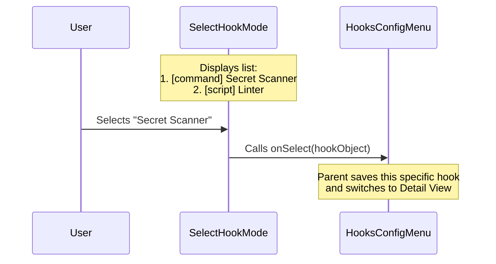

# Chapter 4: Hook Selection Mode

Welcome to Chapter 4!

In the previous chapter, [Matcher Selection Mode](03_matcher_selection_mode.md), we narrowed down our search by selecting a tool name (like `git`).

Now, we have reached the bottom of our "Department Store" directory. We are finally looking at the shelf with the actual products. This is the **Hook Selection Mode**.

## The Concept: The File List

Think of your computer's file explorer:
1.  **Drive C:** (The Event - Chapter 2)
2.  **Program Files** (The Matcher - Chapter 3)
3.  **app.exe, config.ini** (The Hooks - **This Chapter**)

We have filtered down to a specific context (e.g., "Before `git` runs"). Now we simply need to list every script that is scheduled to run in this context so the user can pick one to examine.

### The Use Case

**The Problem:**
You have selected `git`. However, you might have **multiple** scripts that run before git.
1.  A "Secret Scanner" (checks if you are accidentally committing passwords).
2.  A "Linter" (checks if your code style is correct).

We need to list both of these items, along with a label indicating what kind of hook they are (e.g., a simple command or a complex script).

## High-Level Flow

Here is how the data flows when the user interacts with this list:



## Key Concepts

To build this, we focus on three elements:

1.  **The List Index:** Unlike previous chapters where the "ID" was a name (like "git"), here we might have two identical hooks. We use the **array index** (0, 1, 2) to identify which item the user clicked.
2.  **The Source:** A hook might come from your local `settings.json` or from an installed Plugin. We need to display this so the user knows where the setting originated.
3.  **The Type:** Is this hook a `command`? A `prompt`? We show this in brackets `[]` to categorize the items visually.

## Implementation Deep Dive

Let's look at `SelectHookMode.tsx`. This component is very similar to the previous ones, but it handles the final level of detail.

### Step 1: Mapping the Hooks

We receive a list of hook objects (`hooksForSelectedMatcher`). We need to convert these into options for our menu.

We want the list item to look like: `[command] echo "hello"`.

```typescript
const options = hooksForSelectedMatcher.map((hook, index) => {
  return {
    // Show type and a summary of the command
    label: `[${hook.config.type}] ${getHookDisplayText(hook.config)}`,
    
    // We use the index as the unique ID
    value: index.toString(),
    
    // Show if this came from a Plugin or a Local file
    description: getSourceDescription(hook) 
  };
});
```

**Explanation:**
*   **`label`**: We combine the type (e.g., `command`) with a display text (the actual script command).
*   **`value`**: We convert the numeric index (0, 1, 2) to a string so our generic Select component can handle it.

### Step 2: Handling Selection

When the user chooses an item, we get the `value` back (which is the index string, like "0"). We need to convert that back into the actual hook object.

```typescript
const handleSelect = (value: string) => {
  // 1. Convert "0" back to number 0
  const index = parseInt(value, 10);
  
  // 2. Find the object in our list
  const selectedHook = hooksForSelectedMatcher[index];
  
  // 3. Tell the parent component we found it
  if (selectedHook) {
    onSelect(selectedHook);
  }
};
```

**Explanation:**
*   We use `parseInt` to turn the ID back into a number.
*   We grab the specific configuration object from our array.
*   We pass that full object up to the [Hooks Config Menu](01_hooks_config_menu.md).

### Step 3: Handling Empty States (Safety)

Ideally, if we reached this screen, there should be hooks. But if something went wrong or the list is empty, we show a helpful message.

```typescript
if (hooksForSelectedMatcher.length === 0) {
  return (
    <Dialog title={title} onCancel={onCancel}>
      <Box flexDirection="column" gap={1}>
        <Text dimColor>No hooks configured for this event.</Text>
        <Text dimColor>Edit settings.json to add one.</Text>
      </Box>
    </Dialog>
  );
}
```

### Step 4: Rendering the List

Finally, we render the dialog containing our list.

```typescript
return (
  <Dialog 
    title={title} 
    subtitle={hookEventMetadata.description} 
    onCancel={onCancel}
  >
    <Box flexDirection="column">
      <Select 
        options={options} 
        onChange={handleSelect} // Uses the logic from Step 2
        onCancel={onCancel} 
      />
    </Box>
  </Dialog>
);
```

**Explanation:**
*   **`subtitle`**: We remind the user what this event does (e.g., "Runs before a tool execution").
*   **`Select`**: Displays the list we built in Step 1.

## Summary

In this chapter, we built the **Hook Selection Mode**.

1.  We took a specific list of hooks (filtered by Event and Tool).
2.  We displayed them with helpful metadata (Type and Source).
3.  We used the **List Index** to track which specific item was selected.

**The Journey So Far:**
1.  User Selected "PreToolUse" ([Event Selection](02_event_selection_mode.md)).
2.  User Selected "git" ([Matcher Selection](03_matcher_selection_mode.md)).
3.  User Selected the specific "Secret Scanner" hook (**You are here**).

**What's Next?**
The user has finally picked a single item! Now they want to see the full details: the exact script command, the working directory, and other settings.

Let's move on to [Chapter 5: Hook Detail View](05_hook_detail_view.md).

---

Generated by [Code IQ](https://github.com/adityasoni99/Code-IQ)