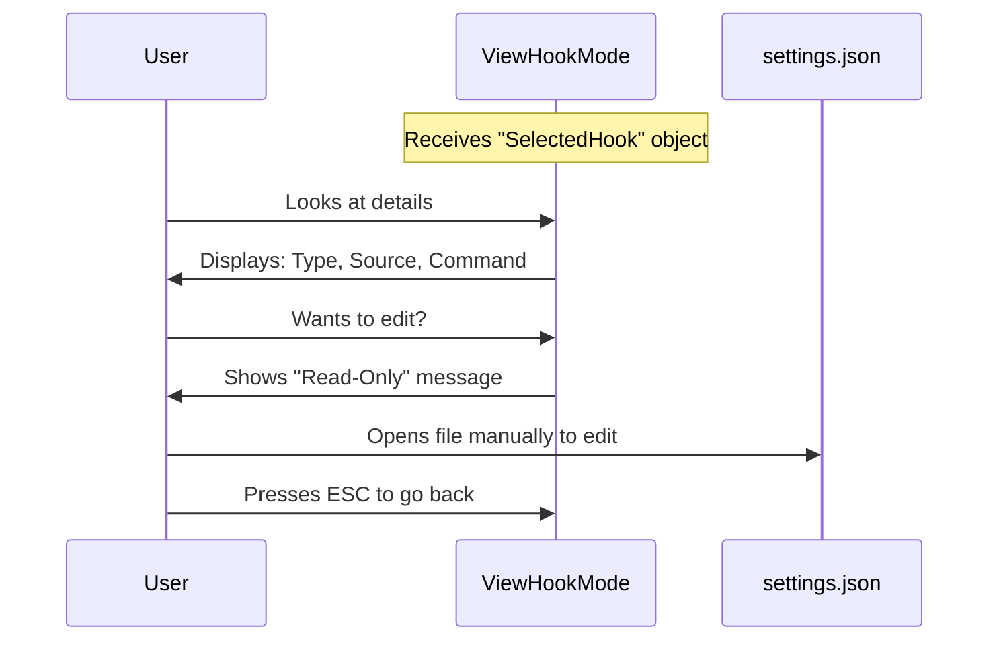

# Chapter 5: Hook Detail View

Welcome to Chapter 5!

In the previous chapter, [Hook Selection Mode](04_hook_selection_mode.md), we navigated through our configuration hierarchy and finally selected a specific script (like a "Secret Scanner").

Now, we need to answer the most important question: **"What does this script actually do?"**

This brings us to the **Hook Detail View**.

## The Concept: The "Properties" Window

Imagine you are using your computer's File Explorer. You find a file called `run.bat`. Before you double-click it, you want to know what commands are inside. You right-click and select **Properties** or **Edit** to view the raw text.

The **Hook Detail View** serves the same purpose. It is a **Read-Only Inspector**.

### The Use Case

**The Scenario:**
A user sees a hook named "Project Cleanup" in their configuration. They are worried: "Does this script just delete temporary files, or is it going to delete my entire project?"

**The Solution:**
The user selects the hook. The Detail View pops up and displays the exact command: `rm -rf ./temp/*`. The user sees this and thinks, "Okay, that looks safe."

**Why Read-Only?**
You might wonder, "Why can't I edit the script here?"
Hooks can come from many places: a local `settings.json` file, a global configuration, or a locked third-party plugin. To prevent conflicts, we only *display* the data here. If the user wants to change it, we gently guide them to the source file.

## High-Level Flow

Here is the lifecycle of this view:



## Key Concepts

To build this view, we handle three main tasks:

1.  **Polymorphism:** Different hooks have different data. A `command` hook has a script. An `http` hook has a URL. We need to handle both.
2.  **Source Attribution:** We need to tell the user *where* this setting is coming from (e.g., "This is from the Global Plugin 'SecurityCheck'").
3.  **Visual Grouping:** We want to separate the "Metadata" (Type, Event) from the "Content" (The actual script).

## Implementation Deep Dive

Let's look at `ViewHookMode.tsx`. This component renders a dialog box with the details.

### Step 1: Handling Different Hook Types

Since a hook can be a command, a prompt, or a URL, we can't just print `hook.command`. We need a helper function to figure out what data to show.

We use a helper function called `getContentFieldValue`.

```typescript
function getContentFieldValue(config) {
  switch (config.type) {
    case 'command':
      return config.command; // Return the script
    case 'http':
      return config.url;     // Return the website address
    case 'prompt':
      return config.prompt;  // Return the AI prompt
    default:
      return '';
  }
}
```

**Explanation:**
*   We look at the `type`.
*   Depending on the type, we grab the specific field that matters.
*   This allows our UI to be flexible.

### Step 2: Displaying Metadata

At the top of our view, we want to show the context. This confirms to the user what they are looking at.

```typescript
<Box flexDirection="column">
  <Text>Event: <Text bold>{selectedHook.event}</Text></Text>
  
  {/* Only show Matcher if the event uses one */}
  {eventSupportsMatcher && (
    <Text>Matcher: <Text bold>{selectedHook.matcher || "(all)"}</Text></Text>
  )}
  
  <Text>Type: <Text bold>{selectedHook.config.type}</Text></Text>
</Box>
```

**Explanation:**
*   We use `<Text>` components to list the properties.
*   We use conditional rendering (`&&`) to hide the "Matcher" line if the event (like `ApplicationStart`) doesn't support matchers.

### Step 3: Displaying the Content

Now we show the most important part: the code or command. We wrap it in a box to make it look like a code block.

```typescript
const label = getContentFieldLabel(selectedHook.config); // e.g. "Command"
const value = getContentFieldValue(selectedHook.config); // e.g. "echo hello"

return (
  <Box flexDirection="column">
    <Text dimColor>{label}:</Text>
    
    {/* The 'Code Block' box */}
    <Box borderStyle="round" borderDimColor paddingX={1}>
      <Text>{value}</Text>
    </Box>
  </Box>
);
```

**Explanation:**
*   We dynamically fetch the label (so it says "URL:" for web hooks and "Command:" for scripts).
*   We create a `Box` with `borderStyle="round"` to visually frame the content, making it stand out as the "data" payload.

### Step 4: The Read-Only Footer

Finally, we need to communicate that this menu is not for editing. We place a helpful message at the bottom.

```typescript
<Text dimColor>
  To modify or remove this hook, edit settings.json directly 
  or ask Claude to help.
</Text>
```

**Explanation:**
*   We use `dimColor` (grey text) so this instruction doesn't distract from the main data.
*   It explicitly tells the user *how* to solve their problem (editing the file).

## Putting It All Together

When rendered, the component combines these pieces into a clean `Dialog`.

```typescript
export function ViewHookMode({ selectedHook, onCancel }) {
  return (
    <Dialog 
      title="Hook details" 
      onCancel={onCancel}
      inputGuide={() => <Text>Esc to go back</Text>}
    >
      <Box flexDirection="column" gap={1}>
        {/* 1. Metadata Section */}
        {renderMetadata(selectedHook)}
        
        {/* 2. Content/Code Section */}
        {renderContent(selectedHook)}
        
        {/* 3. Footer instructions */}
        {renderFooter()}
      </Box>
    </Dialog>
  );
}
```

## Summary

In this chapter, we built the **Hook Detail View**.

1.  We created a **Read-Only** interface to safely inspect scripts.
2.  We used **Helper Functions** to handle different types of hooks (Commands vs URLs).
3.  We provided clear **Instructions** on how to edit the configuration externally.

This concludes our deep dive into the **Configuration Menu** system! We have successfully built a full navigation tree:
1.  **Menu** (Router)
2.  **Event** (Directory)
3.  **Matcher** (Filter)
4.  **Hook** (List)
5.  **Detail** (Inspector)

In the final chapter of this series, we will look at a special utility component used throughout the application to handle user confirmation and simple inputs.

[Next Chapter: Prompt Dialog](06_prompt_dialog.md)

---

Generated by [Code IQ](https://github.com/adityasoni99/Code-IQ)