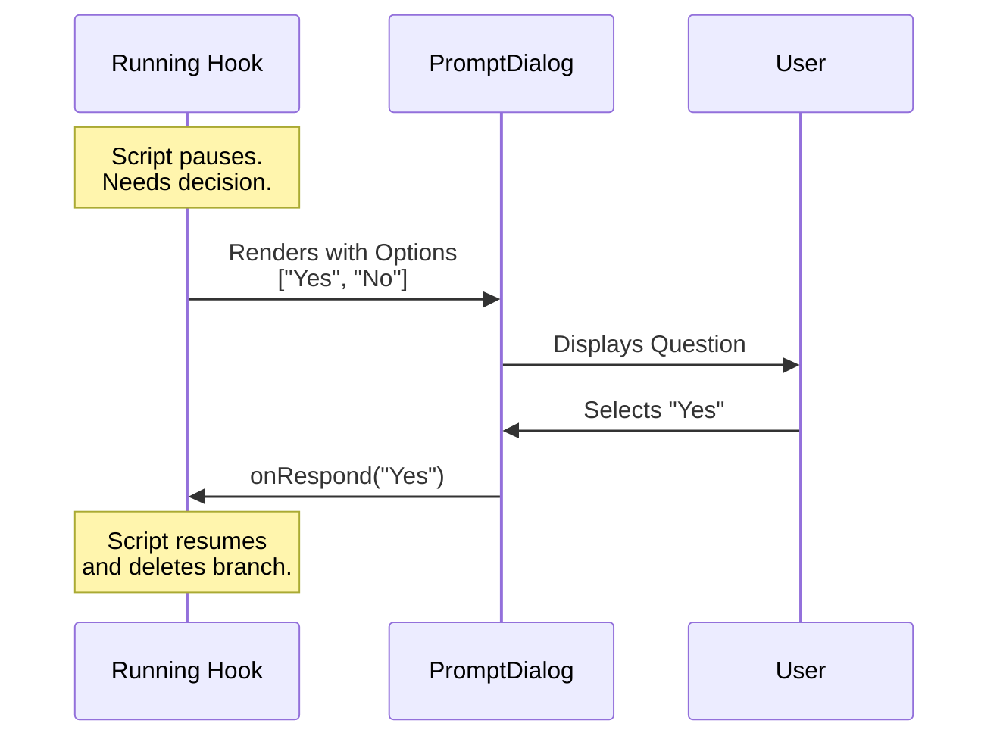

# Chapter 6: Prompt Dialog

Welcome to the final chapter of our tutorial series!

In the previous chapter, [Hook Detail View](05_hook_detail_view.md), we learned how to passively **inspect** the details of a script. We were just looking at information.

Now, we are going to switch gears. Sometimes, the application needs to stop and **ask the user a question**. This is where the **Prompt Dialog** comes in.

## The Concept: The Pop-Up Question

Imagine you are installing a new program on your computer. Suddenly, a window pops up:
> "Do you want to allow this app to make changes to your device?"
> **[Yes]**   **[No]**

You cannot proceed until you click one of those buttons. This is a **Prompt Dialog**.

In our `hooks` project, scripts (hooks) run automatically. But sometimes, a script might be dangerous (like deleting files) or ambiguous (needing user input). The script pauses, this dialog appears, and the script waits for your answer.

### The Use Case

**The Scenario:**
You have a hook called "Branch Cleanup" that runs after you merge code. It finds an old branch named `feature-login`.
Instead of deleting it immediately, the hook wants to ask: *"Delete branch 'feature-login'?"*

**The Solution:**
We render the **Prompt Dialog**.
1.  **Title:** "Permission Request"
2.  **Message:** "Delete branch 'feature-login'?"
3.  **Options:** "Yes", "No"

## High-Level Flow

Let's visualize how this component interrupts the flow to get an answer.



## Key Concepts

To build this, we need three things:

1.  **The Request Object:** This is a packet of data that contains the question and the available answers.
2.  **The Interruption:** This component is "modal," meaning it takes over the keyboard focus. The user must deal with it before doing anything else.
3.  **The Callback:** A function (`onRespond`) that tells the rest of the app what the user chose.

## Implementation Deep Dive

Let's look at `PromptDialog.tsx`. This component is actually quite simple because it reuses pieces we built in earlier chapters.

### Step 1: Defining the Props

First, we need to know what data this component accepts.

```typescript
type Props = {
  title: string;           // e.g. "Permission Required"
  request: PromptRequest;  // Contains the message and options
  onRespond: (key: string) => void; // What to do when user picks an answer
  onAbort: () => void;     // What to do if user presses ESC
};
```

**Explanation:**
*   **`request`**: This holds the dynamic data (the specific question asking to be answered).
*   **`onRespond`**: This is the "phone line" back to the script. When the user selects an option, we call this function with their answer.

### Step 2: Mapping the Options

The `request` object might have options in a raw format. We need to convert them into a format that our generic `Select` component understands (Label + Value).

```typescript
// We map the raw request options to UI-friendly options
const options = request.options.map(opt => ({
  label: opt.label,       // What the user sees (e.g., "Yes")
  value: opt.key,         // The ID sent back (e.g., "yes")
  description: opt.description, // Extra details
}));
```

**Explanation:**
*   We use `.map()` to loop through the options provided by the hook.
*   We prepare them for the generic list component we used in [Event Selection Mode](02_event_selection_mode.md).

### Step 3: Handling "Escape"

Since this dialog interrupts the user, they might want to cancel the whole operation. We need to listen for the "Interrupt" key (usually `Ctrl+C` or `Esc`).

```typescript
import { useKeybinding } from '../../keybindings/useKeybinding.js';

// Listen for 'app:interrupt' key press
useKeybinding('app:interrupt', onAbort, { isActive: true });
```

**Explanation:**
*   We use a helper hook `useKeybinding`.
*   If the user triggers an interrupt, we immediately call `onAbort`. This usually stops the script entirely.

### Step 4: Rendering the UI

Finally, we put it all together using a `PermissionDialog` (a wrapper that makes it look like a security prompt) and our trusted `Select` list.

```typescript
return (
  <PermissionDialog 
    title={title} 
    subtitle={request.message} // The actual question
  >
    <Box flexDirection="column" paddingY={1}>
      <Select 
        options={options}
        // When user hits Enter, send the value back
        onChange={(value) => onRespond(value)}
      />
    </Box>
  </PermissionDialog>
);
```

**Explanation:**
*   **`<PermissionDialog>`**: Draws a scary or serious-looking border around the content so the user pays attention.
*   **`onChange`**: This is the moment of truth. The user made a choice, and we send that choice back to the application.

## Summary

In this chapter, we built the **Prompt Dialog**.

1.  It is an **Active Component** that interrupts the flow to ask a question.
2.  It takes a **Request Object** containing a message and options.
3.  It uses a **Callback** to deliver the user's answer back to the running script.

### Tutorial Conclusion

Congratulations! You have navigated through the entire architecture of the **Hooks UI**.

Let's recap your journey:
1.  **[Hooks Config Menu](01_hooks_config_menu.md):** You built the main router and state machine.
2.  **[Event Selection Mode](02_event_selection_mode.md):** You created a directory to browse hooks by "Time".
3.  **[Matcher Selection Mode](03_matcher_selection_mode.md):** You filtered hooks by "Tool Name".
4.  **[Hook Selection Mode](04_hook_selection_mode.md):** You listed the specific scripts available.
5.  **[Hook Detail View](05_hook_detail_view.md):** You built a safe, read-only inspector.
6.  **Prompt Dialog (This Chapter):** You built the mechanism for active decision-making.

You now understand how the `hooks` project manages configuration, navigation, and user interaction. Happy coding!

---

Generated by [Code IQ](https://github.com/adityasoni99/Code-IQ)