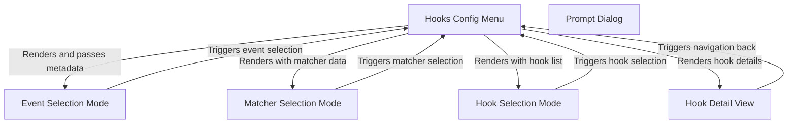

# Tutorial: hooks

The **Hooks** project provides a terminal-based interface for browsing and inspecting configured lifecycle hooks. The central **Hooks Config Menu** acts as a read-only file explorer, allowing users to drill down through *Events* (like `PreToolUse`), *Matchers* (specific tools), and individual *Hooks* to view their details. It also includes a standalone **Prompt Dialog** component used at runtime to handle user interactions for prompt-based hooks.

## Chapters

1. [Hooks Config Menu](01_hooks_config_menu.md)
2. [Event Selection Mode](02_event_selection_mode.md)
3. [Matcher Selection Mode](03_matcher_selection_mode.md)
4. [Hook Selection Mode](04_hook_selection_mode.md)
5. [Hook Detail View](05_hook_detail_view.md)
6. [Prompt Dialog](06_prompt_dialog.md)

---

Generated by [Code IQ](https://github.com/adityasoni99/Code-IQ)