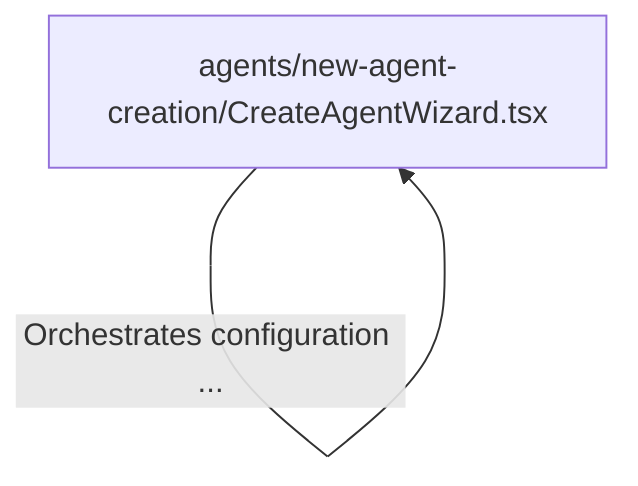

# Tutorial: components

This project focuses on the **Agent Creation** process, providing a user-friendly interface to build and customize AI assistants. It utilizes a *Wizard component* to guide users through a sequence of specific steps—such as selecting a **Model**, defining a **Prompt**, and enabling various **Tools**—to ensure a complete and structured agent setup.

## Chapters

1. [agents/new-agent-creation/CreateAgentWizard.tsx](01_agents_new_agent_creation_createagentwizard_tsx.md)

---

Generated by [Code IQ](https://github.com/adityasoni99/Code-IQ)