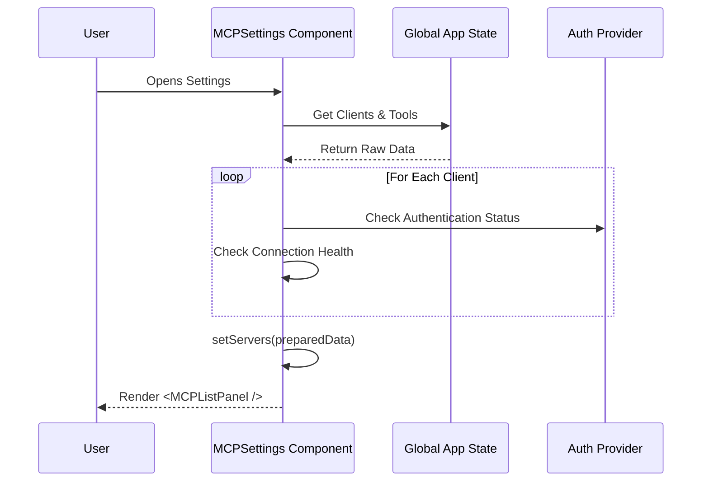

# Chapter 1: MCP Settings Coordinator

Welcome to the first chapter of the MCP (Model Context Protocol) tutorial!

In this chapter, we will build the foundation of our settings interface. Before we can list servers, check connections, or inspect tools, we need a "brain" to manage the whole operation. We call this the **MCP Settings Coordinator**.

## The Problem: Managing Chaos

Imagine you have a smart assistant that connects to many different services: a local file server, a remote database, and an AI proxy. Each of these has a different status:
*   Is it connected?
*   Does it need a password?
*   What tools does it offer?

Without a coordinator, you would have to query each service individually every time you wanted to check something. It would be messy and slow.

## The Solution: The Coordinator

The **MCP Settings Coordinator** (implemented in `MCPSettings.tsx`) acts like **Grand Central Station**. It is the first thing that loads when you open the settings. Its jobs are:
1.  **Gather Data:** Pull raw configuration data from the global app state.
2.  **Prepare Info:** Check which servers are authenticated and healthy.
3.  **Direct Traffic:** Decide which screen to show (the main list, a specific server, or tool details).

## Core Concepts

### 1. The Global State Hook
The coordinator doesn't store the raw data itself; it borrows it from the application's global state.

```tsx
// Inside MCPSettings.tsx
import { useAppState } from '../../state/AppState.js';

export function MCPSettings({ onComplete }: Props) {
  // Grab the raw MCP state (clients, tools, etc.)
  const mcp = useAppState(s => s.mcp);
  
  // Grab agent definitions
  const agentDefinitions = useAppState(s => s.agentDefinitions);
  
  // ...
}
```
*Explanation:* We use `useAppState` to "subscribe" to changes. If a new server is added anywhere in the app, this component automatically notices.

### 2. View State (The Router)
Instead of using a heavy URL router, the coordinator uses a simple "View State" variable to track where the user is.

```tsx
// Defining where the user is currently looking
const [viewState, setViewState] = React.useState<MCPViewState>({
  type: 'list', // Start by showing the list
});
```
*Explanation:* `viewState` determines what is rendered. It starts at `'list'`. If you click a server, it changes to `'server-menu'`.

### 3. Data Preparation
Raw data isn't always ready to display. We need to convert "Clients" into "Server Info" that the UI understands (e.g., adding an `isAuthenticated` flag).

```tsx
const [servers, setServers] = React.useState<ServerInfo[]>([]);

// Filter out internal clients (like 'ide') and sort by name
const filteredClients = React.useMemo(() => 
  mcp.clients
    .filter(client => client.name !== 'ide')
    .sort((a, b) => a.name.localeCompare(b.name)),
  [mcp.clients]
);
```
*Explanation:* We filter out system clients (like the IDE itself) so the user only sees relevant MCP servers.

## Orchestrating the Views

The heart of the Coordinator is a `switch` statement. It looks at the `viewState` and decides which sub-component to render.

### The Main List
When the state is `list`, we show the registry of all servers.

```tsx
switch (viewState.type) {
  case 'list':
    return (
      <MCPListPanel 
        servers={servers} 
        onSelectServer={server => 
          setViewState({ type: 'server-menu', server })
        } 
        // ... other props
      />
    );
```
*Note:* This renders the [Server Registry View](02_server_registry_view.md), which we will cover in the next chapter.

### The Server Menu
When a user clicks a server, the state changes to `server-menu`.

```tsx
  case 'server-menu':
    // Decide which menu to show based on connection type
    if (viewState.server.transport === 'stdio') {
      return <MCPStdioServerMenu server={viewState.server} ... />;
    } else {
      return <MCPRemoteServerMenu server={viewState.server} ... />;
    }
```
*Note:* This hands off control to the [Server Instance Controllers](03_server_instance_controllers.md).

## Internal Implementation: What happens when it loads?

Let's look at the lifecycle of this component using a sequence diagram. This shows how raw data becomes a visible UI.



### The Preparation Effect
The most complex part of `MCPSettings.tsx` is the `useEffect` that runs the "preparation" loop shown in the diagram above.

```tsx
React.useEffect(() => {
  async function prepareServers() {
    // Map over every client to create UI-ready info
    const serverInfos = await Promise.all(filteredClients.map(async client => {
      // Logic to check authentication determines 'isAuthenticated'
      const isSSE = client.config.type === 'sse';
      
      // ... (Auth checking logic hidden for brevity) ...

      return {
        name: client.name,
        transport: 'sse', // or 'http', 'stdio'
        isAuthenticated: isAuthenticated, 
        config: client.config
      };
    }));
    setServers(serverInfos);
  }
  prepareServers();
}, [filteredClients, mcp.tools]);
```

*Explanation:* 
1.  We iterate through `filteredClients`.
2.  We identify the transport type (SSE, HTTP, or Stdio).
3.  We check if we have tokens or an active session (`isAuthenticated`).
4.  We save this clean list into `setServers`.

This preparation ensures that when we eventually render the [Configuration Diagnostics](06_configuration_diagnostics.md) or lists, the data is accurate.

## Handling Navigation

The Coordinator also handles "Going Back." Because it manages the state, sub-components simply ask the Coordinator to restore the previous state.

```tsx
// Inside the 'server-tools' case
<MCPToolListView 
  server={viewState.server}
  onBack={() => 
    // Go back up one level to the Server Menu
    setViewState({ type: 'server-menu', server: viewState.server })
  }
/>
```

This allows us to drill down into [Tool Introspection](04_tool_introspection.md) and back up without losing context.

## Conclusion

The **MCP Settings Coordinator** is the glue that holds the settings interface together. It doesn't draw the fancy buttons or lists itself; instead, it prepares the data and decides which specialized component should be on stage.

Now that we have our coordinator and prepared data, we need to display it to the user.

[Next Chapter: Server Registry View](02_server_registry_view.md)

---

Generated by [Code IQ](https://github.com/adityasoni99/Code-IQ)