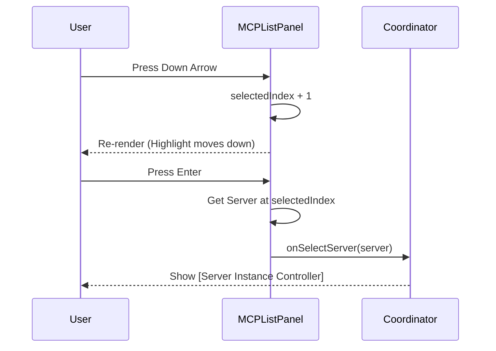

# Chapter 2: Server Registry View

In the previous chapter, [MCP Settings Coordinator](01_mcp_settings_coordinator.md), we built the "brain" of our settings page. It gathered all the data we need. Now, we need to give that brain a "face."

Welcome to the **Server Registry View**.

## The Problem: The Unsorted Pile

Imagine you walk into a library, but there are no shelves. All the books—thousands of them—are dumped in a pile in the middle of the room. Finding the specific book you need would be a nightmare.

In our system, the Coordinator gives us a list of servers. Without the **Server Registry View**, the user would just see a raw, messy JSON list. We need to:
1.  **Organize** the servers into categories (Shelves).
2.  **Sort** them alphabetically (A-Z).
3.  **Navigate** them using a keyboard (Walk through the aisles).

## The Solution: MCP List Panel

The `MCPListPanel` component acts as our librarian. It takes the raw pile of servers and renders a clean, organized, and interactive directory.

### Core Concept 1: Scopes (The Shelves)

Not all servers are equal. Some are defined globally for your User account, while others are specific to the Project you are working on. We organize servers by **Scope**.

The Registry defines a strict order for how these groups appear:

```typescript
// The order in which we display the groups on screen
const SCOPE_ORDER: ConfigScope[] = [
  'project',    // Specific to this folder
  'local',      // Local machine configs
  'user',       // Global user configs
  'enterprise'  // Company-wide configs
];
```

### Core Concept 2: Visual Status (The Traffic Lights)

Users need to know *immediately* if a server is working. We don't just list the name; we list the **Status**.

*   **Green Check:** Connected and happy.
*   **Red Cross:** Connection failed.
*   **Grey Circle:** Disabled or pending.

### Core Concept 3: Keyboard Navigation

Since this is a terminal-based interface (using a library called `ink`), users can't always use a mouse. We must listen for `Up Arrow`, `Down Arrow`, and `Enter` to allow the user to pick a server.

## Implementing the Logic

Let's look at how the Registry processes data under the hood.

### Step 1: Grouping the Servers

Before we draw anything, we need to sort the "pile" of servers into "buckets" based on their scope.

```typescript
function groupServersByScope(serverList: ServerInfo[]) {
  const groups = new Map<ConfigScope, ServerInfo[]>();
  
  for (const server of serverList) {
    // If this scope bucket doesn't exist yet, create it
    if (!groups.has(server.scope)) {
      groups.set(server.scope, []);
    }
    // Add the server to the correct bucket
    groups.get(server.scope)!.push(server);
  }
  return groups;
}
```
*Explanation:* We loop through every server. If a server belongs to the 'project' scope, we toss it into the 'project' bucket.

### Step 2: Sorting

Once grouped, we sort the contents of each bucket alphabetically so "Analytics" comes before "Zendesk".

```typescript
// Inside the main component
const serversByScope = React.useMemo(() => {
  const groups = groupServersByScope(servers);
  
  // Sort every group alphabetically by name
  for (const [, groupServers] of groups) {
    groupServers.sort((a, b) => a.name.localeCompare(b.name));
  }
  
  return groups;
}, [servers]);
```
*Explanation:* We use `useMemo` so we don't re-sort the list every time the cursor blinks. This keeps the interface snappy.

### Step 3: Rendering the List

Now we draw the UI. We iterate through our defined `SCOPE_ORDER` and ask: "Do we have any servers for this scope?"

```tsx
{SCOPE_ORDER.map(scope => {
  // Get servers for this specific scope (e.g., 'project')
  const scopeServers = serversByScope.get(scope);

  // If this shelf is empty, don't draw it
  if (!scopeServers || scopeServers.length === 0) return null;

  return (
    <Box key={scope} flexDirection="column">
      <Text bold>{getScopeHeading(scope).label}</Text>
      {scopeServers.map(server => renderServerItem(server))}
    </Box>
  );
})}
```

## User Interaction Flow

How does the user actually select something? We track a `selectedIndex` number.



### The Keybindings

We use a hook to listen for specific keys. This is what makes the menu feel "alive."

```typescript
useKeybindings({
  'confirm:previous': () => {
    // Move selection up (wrap around to bottom if at top)
    setSelectedIndex(prev => prev === 0 ? totalItems - 1 : prev - 1);
  },
  'confirm:next': () => {
    // Move selection down
    setSelectedIndex(prev => prev === totalItems - 1 ? 0 : prev + 1);
  },
  'confirm:yes': handleSelect // User pressed Enter
});
```

## Specialized Items: Agents and Built-ins

The Registry View is smart enough to handle special types of items beyond standard servers:

1.  **Built-in MCPs (Dynamic):** These are hardcoded into the system. They are rendered last in the list to keep the custom stuff at the top.
2.  **Agent MCPs:** Sometimes an AI agent provides its own tools. These are grouped separately so you know they came from an Agent, not a config file.

## Conclusion

The **Server Registry View** turns raw data into a navigable, organized dashboard. It groups items logically, handles keyboard inputs, and provides instant visual feedback on server health.

Once a user presses **Enter** on a server, we need to drill down into the details of that specific connection. This brings us to the next layer of our architecture.

[Next Chapter: Server Instance Controllers](03_server_instance_controllers.md)

---

Generated by [Code IQ](https://github.com/adityasoni99/Code-IQ)