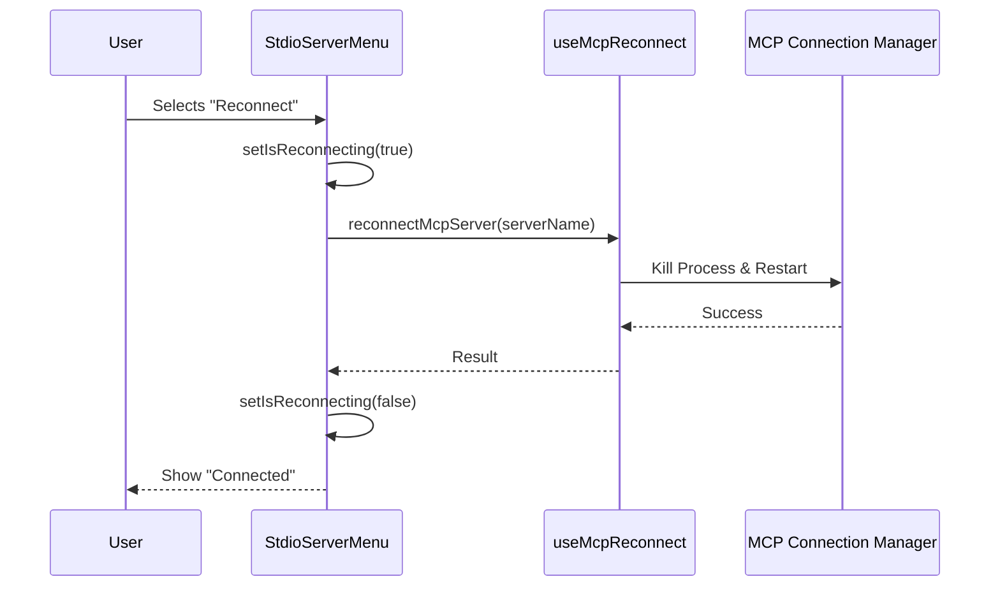

# Chapter 3: Server Instance Controllers

In the previous chapter, [Server Registry View](02_server_registry_view.md), we organized our messy pile of servers into a clean, navigable list. We learned how to find the server we want.

Now, imagine you have selected a server and pressed **Enter**. What happens?

You enter the **Server Instance Controller**.

## The Problem: Different Servers, Different Needs

Not all servers are the same.
1.  **Local Servers (Stdio):** Run on your computer. You might need to restart them if they crash, or turn them off to save RAM.
2.  **Remote Agents (HTTP/SSE):** Live on the internet. You don't "restart" them, but you might need to log in (Authenticate) to use them.

If we used the exact same menu for both, it would be confusing. You can't "reboot" a remote web server, and you usually don't need to "log in" to a local script.

## The Solution: Specialized Cockpits

The **Server Instance Controller** is like a specialized cockpit for the specific type of server you are managing.

*   **Stdio Controller:** Focuses on *Lifecycle* (Start, Stop, Restart).
*   **Agent Controller:** Focuses on *Access* (Authentication, Tokens).

## Concept 1: The Local Controller (Stdio)

The `MCPStdioServerMenu` component manages servers running locally on your machine. Its main job is to keep you informed about the **Connection Lifecycle**.

### Visualizing Health
First, the controller checks the `server.client.type` to decide what icon to show.

```tsx
// Inside MCPStdioServerMenu.tsx
<Box>
  <Text bold>Status: </Text>
  {server.client.type === 'connected' 
    ? <Text color="success">{figures.tick} connected</Text>
    : <Text color="error">{figures.cross} failed</Text>
  }
</Box>
```
*Explanation:* This is a simple conditional render. If the status is 'connected', show a green checkmark. Otherwise, show a red cross.

### Managing the Lifecycle
The menu offers actions based on the current state. If a server is running, we might want to **Disable** it. If it's stopped, we want to **Enable** it.

```typescript
const menuOptions = [];

// Dynamic button label
menuOptions.push({
  label: server.client.type !== 'disabled' ? 'Disable' : 'Enable',
  value: 'toggle-enabled'
});
```
*Explanation:* We build the menu dynamically. The user sees "Disable" or "Enable" depending on the current state, but the underlying action (`toggle-enabled`) remains the same.

## Concept 2: The Agent Controller (HTTP)

The `MCPAgentServerMenu` handles remote connections. The biggest challenge here is security. We often need to perform an **OAuth Flow** (like a "Login with Google" popup) to talk to these agents.

### Handling Authentication
Instead of a "Restart" button, this controller prioritizes authentication.

```tsx
// Inside MCPAgentServerMenu.tsx
if (agentServer.needsAuth) {
  menuOptions.push({
    label: agentServer.isAuthenticated ? 'Re-authenticate' : 'Authenticate',
    value: 'auth'
  });
}
```
*Explanation:* The controller checks `needsAuth`. If true, it gives the user a button to start the login process.

### The Auth Loop
When you click "Authenticate", the controller doesn't just send a command; it pauses the UI and waits for a browser interaction.

```tsx
if (isAuthenticating) {
  return (
    <Box flexDirection="column">
      <Spinner />
      <Text>A browser window will open for authentication...</Text>
    </Box>
  );
}
```
*Explanation:* We replace the entire menu with a loading screen (`Spinner`) while the user logs in via their web browser.

## Internal Implementation: How Actions Work

When a user selects an action (like "Reconnect"), the controller doesn't do the heavy lifting itself. It calls a **Service Hook**.

Let's look at the flow for reconnecting a local server:



### The Reconnect Logic
Here is the actual code that runs when you hit "Reconnect" in `MCPStdioServerMenu.tsx`:

```tsx
const reconnectMcpServer = useMcpReconnect();

// Inside the menu selection handler:
if (value === 'reconnectMcpServer') {
  setIsReconnecting(true);
  try {
    // 1. Ask the backend to restart the process
    await reconnectMcpServer(server.name);
    // 2. Notify parent that we are done
    onComplete?.('Server restarted successfully');
  } finally {
    setIsReconnecting(false);
  }
}
```
*Explanation:* 
1.  We get the `reconnectMcpServer` function from a custom hook.
2.  We wrap the call in a `try/finally` block to ensure the loading spinner stops spinning (`setIsReconnecting(false)`) even if the connection fails.

This logic is crucial for [Connection Lifecycle & Recovery](05_connection_lifecycle___recovery.md), which handles the gritty details of process management.

## Drilling Down: Viewing Tools

Both controllers share one common goal: allowing you to see what the server *does*. 

If a server is connected and has tools (functions the AI can use), a "View Tools" option appears.

```typescript
if (serverToolsCount > 0) {
  menuOptions.push({
    label: 'View tools',
    value: 'tools'
  });
}
```

Selecting this option triggers the `onViewTools` callback, which tells the parent (The Coordinator) to switch the screen to the **Tool Introspection** view.

## Summary

The **Server Instance Controllers** are the dashboards of our application. 
*   They adapt to the **Transport Type** (Stdio vs HTTP).
*   They provide context-aware actions (Restart vs Authenticate).
*   They manage the visual state while asynchronous tasks (like connecting) happen in the background.

Now that we have a connected, healthy server, it's time to see what superpowers it provides.

[Next Chapter: Tool Introspection](04_tool_introspection.md)

---

Generated by [Code IQ](https://github.com/adityasoni99/Code-IQ)