# Chapter 4: Tool Introspection

In the previous chapter, [Server Instance Controllers](03_server_instance_controllers.md), we successfully managed the connection to our servers. We know they are running and authenticated.

But being connected isn't enough. Imagine buying a new Swiss Army Knife. It's great that it's in your pocket (connected), but to be useful, you need to open it up and see exactly which blades and screwdrivers it has.

This is **Tool Introspection**.

## The Problem: The Black Box

When you connect an LLM to a server (like a database or a file system), the LLM initially knows nothing about it. It treats the server like a "Black Box."

*   "Can I read files?"
*   "Can I delete data?"
*   "What arguments does the `search` function require?"

Without a way to look inside the server, the user (and the AI) is flying blind. We need a way to **browse the API** dynamically.

## The Solution: The Interactive Browser

**Tool Introspection** is a set of three views that allow us to peel back the layers of the server:
1.  **The Summary:** A quick glance to see if tools exist.
2.  **The List:** A menu of available functions.
3.  **The Detail View:** A deep dive into specific parameters and descriptions.

## Concept 1: The Capabilities Summary

Before we list every single tool, we just want to know: *Does this server even have tools?*

The `CapabilitiesSection` component is a small piece of UI that sits in the server menu. It checks the counts of three core MCP primitives: **Tools** (functions), **Resources** (data sources), and **Prompts** (templates).

```tsx
// Inside CapabilitiesSection.tsx
const capabilities = [];

if (serverToolsCount > 0) {
  capabilities.push('tools');
}
if (serverResourcesCount > 0) {
  capabilities.push('resources');
}
// ... checks for prompts ...
```

*Explanation:* If the counts are greater than zero, we display a simple tag like `Capabilities: tools, resources`. This tells the user it's worth clicking "View Tools."

## Concept 2: The Tool List

When the user selects "View Tools," we switch to the `MCPToolListView`. This isn't just a simple list of names; it's a **Safety Dashboard**.

In the MCP protocol, tools can be marked with special flags:
*   **Destructive:** The tool can change or delete data.
*   **Read-Only:** The tool is safe to use freely.

We need to filter tools specifically for the current server and display these safety flags.

```tsx
// Inside MCPToolListView.tsx
const toolOptions = serverTools.map((tool, index) => {
  const annotations = [];
  
  // check flags
  if (tool.isDestructive?.()) annotations.push('destructive');
  if (tool.isReadOnly?.()) annotations.push('read-only');

  return {
    label: tool.displayName, // e.g., "ReadFile"
    description: annotations.join(', '), 
    descriptionColor: tool.isDestructive?.() ? 'error' : 'success'
  };
});
```

*Explanation:* We iterate through the raw tools. If a tool is "destructive," we add a red warning label. If it's "read-only," we add a green safety label. This helps the user decide which tools are safe to authorize.

## Concept 3: The Detail View (The Microscope)

This is the deepest level of introspection. When you select a specific tool (e.g., `write_file`), the `MCPToolDetailView` opens.

This view has two critical jobs:
1.  **Fetch the Description:** Sometimes descriptions are dynamic. We have to ask the tool to describe itself.
2.  **Parse the Schema:** Tools have strict requirements (e.g., "path must be a string"). We need to read the **JSON Schema** and display it legibly.

### Dynamic Description Loading

We use a `useEffect` hook to ask the tool for its latest description.

```tsx
// Inside MCPToolDetailView.tsx
React.useEffect(() => {
  async function loadDescription() {
    try {
      // Ask the tool for its details
      const desc = await tool.description({}, { /* context */ });
      setToolDescription(desc);
    } catch {
      setToolDescription('Failed to load description');
    }
  }
  loadDescription();
}, [tool]);
```

*Explanation:* The description isn't always static text. By calling `tool.description()`, we ensure we show exactly what the server wants the user to see right now.

## Internal Implementation: The User Journey

Let's visualize the flow of data when a user decides to inspect a tool.

```mermaid
sequenceDiagram
    participant User
    participant List as Tool List View
    participant Detail as Tool Detail View
    participant Tool as MCP Tool Object

    User->>List: Selects "WriteFile"
    List->>Detail: Render Detail View
    
    rect rgb(25, 25, 25)
        note right of Detail: Fetching Info
        Detail->>Tool: tool.description()
        Tool-->>Detail: "Writes text to a file path"
        Detail->>Detail: setToolDescription(...)
    end
    
    Detail->>Detail: Parse Input JSON Schema
    Detail-->>User: Show Description & Parameters
```



## Deep Dive: Rendering Parameters

The most complex part of introspection is displaying the arguments a tool accepts. This information is stored in a format called **JSON Schema**.

We don't want to show raw JSON to a beginner. We want to show a bulleted list.

```tsx
// Inside MCPToolDetailView.tsx rendering logic
{Object.entries(tool.inputJSONSchema.properties).map(([key, value]) => {
  
  // Check if this specific key is in the 'required' array
  const isRequired = tool.inputJSONSchema.required?.includes(key);

  return (
    <Text key={key}>
      • {key} 
      {isRequired && <Text dimColor>(required)</Text>}
      : {value.type}
    </Text>
  );
})}
```

*Explanation:*
1.  We look at `properties` (the list of arguments, like `path` or `content`).
2.  We check if that argument is in the `required` list.
3.  We render a clean line: `• path (required): string`.

This transforms technical schema data into a readable instruction manual.

## Conclusion

**Tool Introspection** turns the abstract concept of a "Server" into a concrete menu of capabilities.
1.  **Capabilities Section** tells us *if* tools exist.
2.  **Tool List** tells us *what* they are called and if they are dangerous.
3.  **Detail View** tells us *how* to use them by reading their schema.

Now that we can connect to servers and see their tools, we have a fully functional setup. However, networks are unreliable. Cables get unplugged. Servers crash.

How do we handle it when things go wrong?

[Next Chapter: Connection Lifecycle & Recovery](05_connection_lifecycle___recovery.md)

---

Generated by [Code IQ](https://github.com/adityasoni99/Code-IQ)