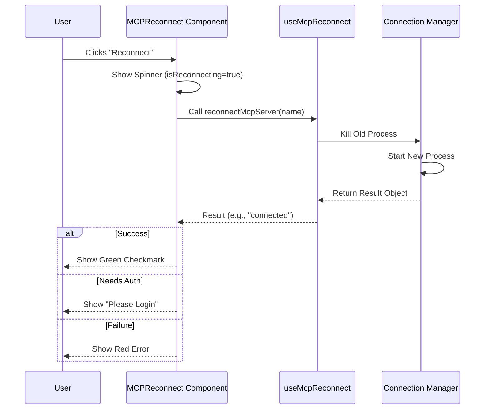

# Chapter 5: Connection Lifecycle & Recovery

In the previous chapter, [Tool Introspection](04_tool_introspection.md), we learned how to look inside a connected server to see its tools and capabilities.

But what happens if the "wire" gets cut?

Servers crash. Internet connections drop. Processes get stuck. If our application freezes every time a connection is lost, users will be frustrated. We need a way to detect issues and bring the connection back to life.

Welcome to **Connection Lifecycle & Recovery**.

## The Problem: The Dropped Call

Imagine you are on an important phone call, and suddenly the line goes dead. You don't just sit there holding the phone in silence. You try to call back.

In the world of MCP (Model Context Protocol), connections can drop for many reasons:
1.  **Process Death:** A local script crashed.
2.  **Network Timeout:** A remote server stopped responding.
3.  **Auth Expiry:** Your login token expired.

Without a recovery system, the user sees a broken app. We need an "Auto-Redial" system.

## The Solution: The Reconnect Component

We solve this with a specialized component called `MCPReconnect` (found in `MCPReconnect.tsx`).

This component acts like a specialized mechanic. When called upon, it:
1.  **Isolates the problem:** Focuses on one specific server.
2.  **Attempts the fix:** Triggers the reconnection logic.
3.  **Reports back:** Tells the user if it worked, failed, or if they need to log in again.

## Core Concepts

### 1. The Async Attempt
Reconnecting takes time. It's not instant. We need to trigger an asynchronous operation (a "Promise") and wait for the result.

### 2. Visual Feedback (The Spinner)
While the mechanic is working under the hood, the user shouldn't be left wondering. We show a "Spinner" (a loading animation) to indicate that work is being done.

### 3. Result Interpretation
The server might respond in different ways. It's not just "Success" or "Fail." It might say, "I'm here, but I need a password." We need to handle these nuances.

## Implementing the Recovery Logic

Let's look at how `MCPReconnect.tsx` works. It uses a React hook to manage the lifecycle.

### Step 1: Setting the Stage
First, we grab the reconnection function from our connection manager and set up our state.

```tsx
export function MCPReconnect({ serverName, onComplete }: Props) {
  // Get the logic to actually restart the server
  const reconnectMcpServer = useMcpReconnect();
  
  // Track if we are currently working
  const [isReconnecting, setIsReconnecting] = React.useState(true);
  
  // Track any errors we encounter
  const [error, setError] = React.useState<string | null>(null);
  
  // ...
}
```
*Explanation:* `isReconnecting` starts as `true`. As soon as this component mounts, it assumes it should start working immediately.

### Step 2: The Attempt Loop
We use `useEffect` to trigger the reconnection as soon as the component appears.

```tsx
React.useEffect(() => {
  async function attemptReconnect() {
    try {
      // The heavy lifting happens here:
      const result = await reconnectMcpServer(serverName);
      
      // We check what happened
      handleResult(result); 
    } catch (err) {
      setError(String(err));
    }
  }
  attemptReconnect();
}, [serverName]);
```
*Explanation:* This function runs automatically. It calls `reconnectMcpServer` and waits. This keeps the UI responsive while the background process works.

### Step 3: Handling the Outcomes
Once the server responds, we check the `client.type`. This is the "Result Interpretation."

```tsx
switch (result.client.type) {
  case 'connected':
    setIsReconnecting(false);
    onComplete(`Successfully reconnected to ${serverName}`);
    break;

  case 'needs-auth':
    // The server is up, but locked
    onComplete(`${serverName} requires authentication.`);
    break;

  case 'failed':
    setError(`Failed to reconnect to ${serverName}`);
    break;
}
```
*Explanation:* 
*   **Connected:** Success! We tell the parent component we are done via `onComplete`.
*   **Needs-Auth:** A special state. The connection worked, but we can't use it yet.
*   **Failed:** The mechanic couldn't fix it. We show an error.

## Under the Hood: The Sequence

What actually happens when a user clicks "Retry"?



## Helper Logic: Translating Status

To keep our main component clean, we move the logic of "translating" status codes into English messages into a helper file: `utils/reconnectHelpers.tsx`.

This is a great pattern for keeping your code readable.

### The Helper Function

```typescript
// Inside utils/reconnectHelpers.tsx
export function handleReconnectResult(result, serverName) {
  switch (result.client.type) {
    case 'connected':
      return {
        message: `Reconnected to ${serverName}.`,
        success: true
      };
    
    case 'needs-auth':
      return {
        message: `${serverName} requires authentication.`,
        success: false // It's not a "full" success yet
      };
      
    // ... handle other cases
  }
}
```
*Explanation:* This function takes a raw technical object (`result`) and returns a human-friendly `message` and a simple `success` boolean. This makes it easy for the UI to know what color to display (Green for true, Red for false).

## Rendering the UI

Finally, we need to show the user what is happening based on the state.

### The Loading State
While `isReconnecting` is true:

```tsx
if (isReconnecting) {
  return (
    <Box flexDirection="column">
      <Text>Reconnecting to <Text bold>{serverName}</Text></Text>
      <Box>
        <Spinner />
        <Text> Establishing connection...</Text>
      </Box>
    </Box>
  );
}
```
*Explanation:* We use the `Spinner` component (an animation) so the user knows the app hasn't frozen.

### The Error State
If `error` is not null:

```tsx
if (error) {
  return (
    <Box flexDirection="column">
      <Text color="error">{figures.cross} Failed to reconnect</Text>
      <Text dimColor>Error: {error}</Text>
    </Box>
  );
}
```
*Explanation:* We use `figures.cross` (a generic "X" icon) and red text to clearly indicate failure.

## Conclusion

In this chapter, we built the safety net for our application.
1.  We learned that connections are fragile.
2.  We built **MCPReconnect** to handle the asynchronous "Redialing" process.
3.  We handled different outcomes: Success, Failure, and the special "Needs Auth" state.

Our servers are now listed, connected, introspected, and recoverable. But there is one final piece of the puzzle. Sometimes the server runs fine, but the *configuration settings* are wrong (like a bad API key).

How do we check for that?

[Next Chapter: Configuration Diagnostics](06_configuration_diagnostics.md)

---

Generated by [Code IQ](https://github.com/adityasoni99/Code-IQ)