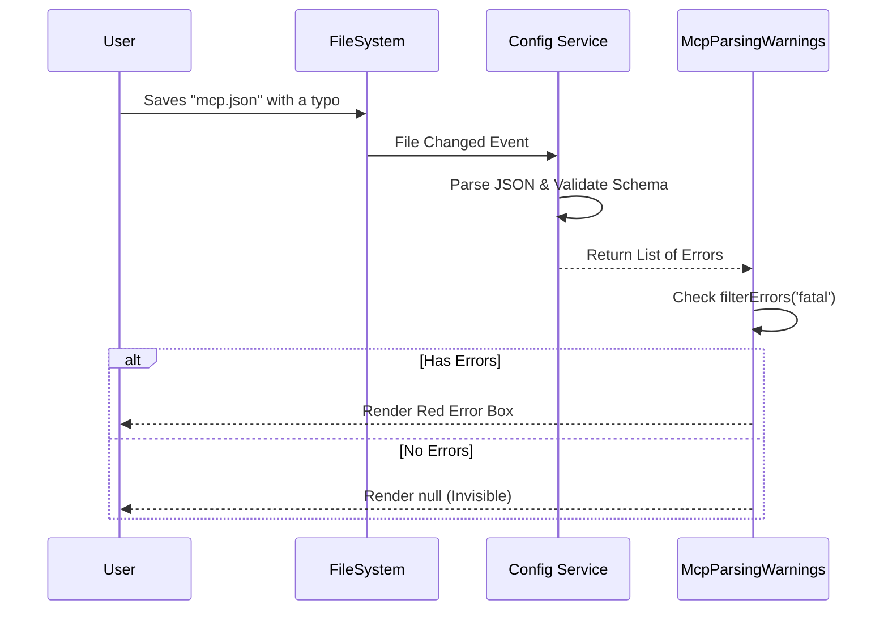

# Chapter 6: Configuration Diagnostics

Welcome to the final chapter of our MCP tutorial series! 

In the previous chapter, [Connection Lifecycle & Recovery](05_connection_lifecycle___recovery.md), we built a safety net for when network connections drop or processes crash. We learned how to "redial" a server.

But what if the server never starts in the first place because of a typo?

What if you missed a comma in your JSON configuration file? Or you defined two servers with the exact same name? The connection code won't even get a chance to run.

We need a "Spellchecker" for our settings. We call this **Configuration Diagnostics**.

## The Problem: JSON is Fragile

MCP servers are configured using JSON files. JSON is powerful, but it is also very strict.
*   Forget a closing bracket `}`? **Crash.**
*   Leave a trailing comma `,`? **Error.**
*   Type `"commnd"` instead of `"command"`? **Nothing works.**

Without diagnostics, the user would open the settings, see an empty list, and have no idea why. We need to parse these files and show helpful error messages right in the UI.

## The Solution: The Diagnostics Panel

The `McpParsingWarnings` component acts like a "Check Engine Light." 

1.  **It is Invisible:** If your configuration is perfect, this component renders nothing (`null`). It stays out of your way.
2.  **It is Global:** It scans all configuration scopes (User, Project, Local) simultaneously.
3.  **It is Specific:** It tells you exactly which file, which server, and what went wrong.

## Core Concepts

### 1. Scopes (Where are my settings?)
As we learned in the [Server Registry View](02_server_registry_view.md), settings live in different places. This component grabs configs from four distinct locations:

```typescript
const scopes = useMemo(() => [
  { scope: 'user', config: getMcpConfigsByScope('user') },
  { scope: 'project', config: getMcpConfigsByScope('project') },
  { scope: 'local', config: getMcpConfigsByScope('local') },
  // ... enterprise scope
], []);
```
*Explanation:* We use `useMemo` to gather the current state of all configuration files into one array called `scopes`.

### 2. Severity (Fatal vs. Warning)
Not all mistakes are equal.
*   **Fatal Error:** The file is broken (e.g., Invalid JSON). We cannot read it at all.
*   **Warning:** The file is readable, but something looks wrong (e.g., a missing recommended field).

We need a helper function to sort these out:

```typescript
function filterErrors(errors: ValidationError[], severity: 'fatal' | 'warning') {
  // Check the severity tag on the error object
  return errors.filter(e => e.mcpErrorMetadata?.severity === severity);
}
```

## Internal Implementation: The Flow

How does a typo in a text file end up as a red warning on your screen?



## Building the Component

Let's look at `McpParsingWarnings.tsx`.

### Step 1: The "Invisible" Check
The component's first job is to decide if it should exist.

```tsx
export function McpParsingWarnings() {
  // ... gather scopes ...

  // Check if ANY scope has errors
  const hasParsingErrors = scopes.some(s => 
    filterErrors(s.config.errors, 'fatal').length > 0
  );
  
  // If everything is fine, don't draw anything
  if (!hasParsingErrors && !hasWarnings) {
    return null;
  }
  
  // ... otherwise render the alert
}
```
*Explanation:* This prevents UI clutter. The user only sees this panel when they need to fix something.

### Step 2: Rendering the Error Section
If we find errors, we map over the scopes and render a `McpConfigErrorSection` for each one that has issues.

```tsx
return (
  <Box flexDirection="column" marginY={1}>
    <Text bold>MCP Config Diagnostics</Text>
    
    {scopes.map(({ scope, config }) => (
      <McpConfigErrorSection
        key={scope}
        scope={scope}
        parsingErrors={filterErrors(config.errors, 'fatal')}
        // ... pass warnings too
      />
    ))}
  </Box>
);
```

### Step 3: Displaying the Details
The `McpConfigErrorSection` component is responsible for formatting the specific error message. It helps the user locate the file.

```tsx
// Inside McpConfigErrorSection
<Box>
  <Text dimColor>Location: </Text>
  {/* Helper to show full path, e.g., /Users/name/project/.vscode/mcp.json */}
  <Text dimColor>{describeMcpConfigFilePath(scope)}</Text>
</Box>
```

Then, it loops through the actual error messages:

```tsx
{parsingErrors.map((error, i) => (
  <Box key={`error-${i}`}>
    <Text>
      <Text color="error">[Error]</Text>
      <Text dimColor> {error.message}</Text>
    </Text>
  </Box>
))}
```
*Explanation:* We use clear color coding. `color="error"` usually renders as Red, making it impossible to miss.

## Example Scenario

Imagine you edited your project config and accidentally wrote:
```json
{
  "mcpServers": {
    "weather-bot": { 
      "command": "node",
      "args": ["bot.js"] 
    }  <-- Missing comma here
    "file-bot": { ... }
  }
}
```

1.  The **Validator** detects a generic JSON syntax error.
2.  `McpParsingWarnings` detects a **Fatal** error in the `project` scope.
3.  It renders a box saying:
    *   **Scope:** Project
    *   **Location:** `/path/to/project/.vscode/mcp.json`
    *   **Error:** `Expected comma, found string "file-bot"`

This allows you to fix the comma immediately without digging through logs.

## Conclusion

**Configuration Diagnostics** is the final piece of our MCP interface. 

*   [MCP Settings Coordinator](01_mcp_settings_coordinator.md) manages the data flow.
*   [Server Registry View](02_server_registry_view.md) displays the list.
*   [Server Instance Controllers](03_server_instance_controllers.md) manage specific servers.
*   [Tool Introspection](04_tool_introspection.md) lets us see capabilities.
*   [Connection Lifecycle](05_connection_lifecycle___recovery.md) keeps connections alive.
*   **Configuration Diagnostics** ensures the instructions are readable.

Together, these components create a robust, user-friendly environment for managing Model Context Protocol servers. The user is guided from the moment they type a config file to the moment they are inspecting an AI tool's specific arguments.

Thank you for following this tutorial series! You now have a deep understanding of how to build a professional-grade settings interface for MCP.

---

Generated by [Code IQ](https://github.com/adityasoni99/Code-IQ)