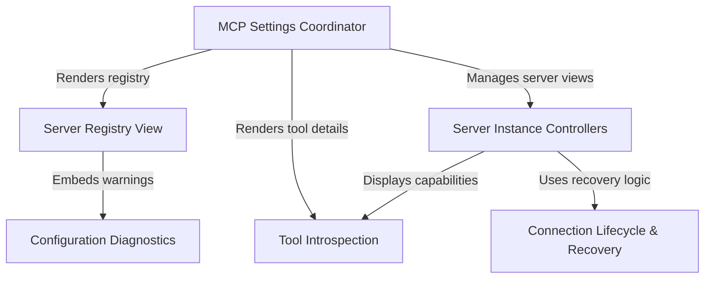

# Tutorial: mcp

The **MCP Settings** module provides a comprehensive user interface for configuring and managing **Model Context Protocol** servers within an application. It allows users to browse a registry of connected servers, manage their *lifecycles* (such as connecting, authenticating, or disabling), and inspect the specific **tools** and **resources** each server provides. The system also includes robust features for handling connection errors, managing authentication tokens, and displaying configuration diagnostics to help users troubleshoot their setup.

## Chapters

1. [MCP Settings Coordinator](01_mcp_settings_coordinator.md)
2. [Server Registry View](02_server_registry_view.md)
3. [Server Instance Controllers](03_server_instance_controllers.md)
4. [Tool Introspection](04_tool_introspection.md)
5. [Connection Lifecycle & Recovery](05_connection_lifecycle___recovery.md)
6. [Configuration Diagnostics](06_configuration_diagnostics.md)

---

Generated by [Code IQ](https://github.com/adityasoni99/Code-IQ)