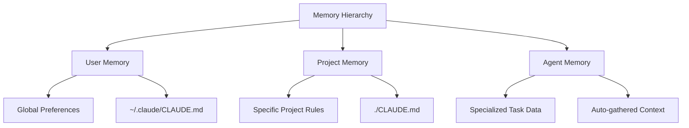
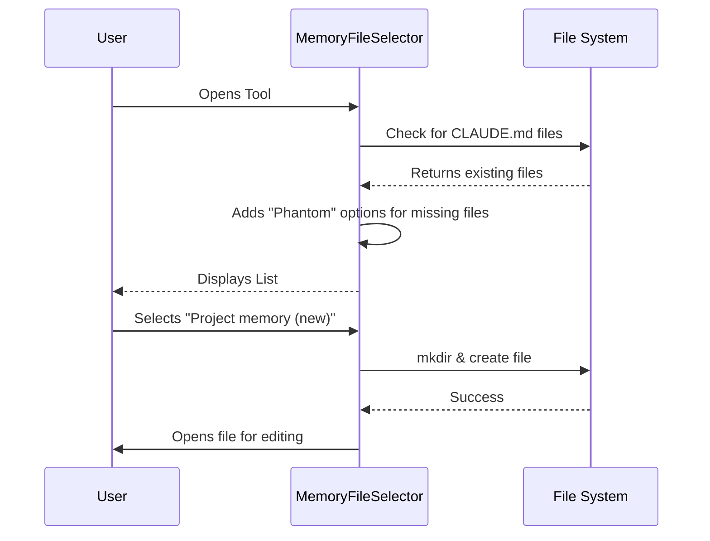

# Chapter 1: Memory Hierarchy Interface

Welcome to the **Memory Hierarchy Interface**, the foundation of how our system remembers things. 

If you have ever worked with AI, you know the frustration: you start a new chat, and the AI forgets your coding style. Or, you switch projects, and the AI applies rules from your old project to the new one.

This chapter introduces the solution: a **Unified Memory Interface**. Think of it as a smart bookshelf that automatically sorts your personal diary (User Memory), your work binders (Project Memory), and specialized notes (Agent Memory) into one easy-to-browse catalog.

## The Problem: Context Chaos

Imagine you are a developer working on two different projects:
1.  **Project A:** A Python backend using Django.
2.  **Project B:** A React frontend using TypeScript.

Without a hierarchy, you have to constantly remind the AI: "Use TypeScript, not Python" or "Remember, I prefer tabs over spaces."

## The Solution: The "Bookshelf" Hierarchy

The Memory Hierarchy Interface scans your computer and presents a unified list of context files. It prioritizes them in a specific order:



1.  **User Memory:** Global rules that apply to *you* everywhere (e.g., "Always use dark mode").
2.  **Project Memory:** Rules specific to the folder you are currently working in.
3.  **Agent Memory:** Temporary or specialized memories created by AI agents for specific tasks.

## How to Use It

The interface is designed to be invisible until you need it. When you open the tool, it runs a specific component called the `MemoryFileSelector`.

**The Scenario:**
You open your terminal in a new folder called `my-new-app`. You haven't created any configuration files yet.

**The Output:**
The interface creates a list that looks like this:

> *   **User memory** (Saved in `~/.claude/CLAUDE.md`)
> *   **Project memory (new)** (Will create `./CLAUDE.md`)
> *   **Open auto-memory folder**

Notice the **(new)** tag? The interface is smart enough to know that even though the file doesn't exist yet, it *should* exist. If you select it, the system creates it for you.

## Code Walkthrough: Building the List

Let's look at how the code constructs this intelligent list. The logic lives in `MemoryFileSelector.tsx`.

### Step 1: Defining the Paths

First, the system needs to know where to look. It calculates the paths for the global user file and the local project file.

```typescript
// Define where the standard memory files should live
const userMemoryPath = join(getClaudeConfigHomeDir(), "CLAUDE.md");
const projectMemoryPath = join(getOriginalCwd(), "CLAUDE.md");
```

**Explanation:**
*   `getClaudeConfigHomeDir()` finds your home folder (Global).
*   `getOriginalCwd()` finds your current working folder (Local).
*   We look for a file named `CLAUDE.md` in both places.

### Step 2: Checking Existence

Next, we check if these files actually exist on your hard drive.

```typescript
// Check if these files are already in our scanned list
const hasUserMemory = existingMemoryFiles.some(
  f => f.path === userMemoryPath
);
const hasProjectMemory = existingMemoryFiles.some(
  f => f.path === projectMemoryPath
);
```

**Explanation:**
*   `existingMemoryFiles` is a list of files the system actually found on disk.
*   We return `true` if the file exists, `false` if it is missing.

### Step 3: Creating "Phantom" Entries

This is the most important part. If a file is missing, we still add it to the list as a "phantom" entry so the user can create it.

```typescript
// Create the final list of options
const allMemoryFiles = [
  ...existingMemoryFiles,
  // If User Memory is missing, add a placeholder
  ...(hasUserMemory ? [] : [{
    path: userMemoryPath,
    type: "User",
    exists: false // Mark as non-existent
  }]),
  // If Project Memory is missing, add a placeholder
  ...(hasProjectMemory ? [] : [{
    path: projectMemoryPath,
    type: "Project",
    exists: false 
  }])
];
```

**Explanation:**
*   We start with the files that exist.
*   If `hasUserMemory` is false, we add a dummy object with `exists: false`.
*   If `hasProjectMemory` is false, we add a dummy object for the project.
*   This ensures the menu always shows options to create these critical files.

## Under the Hood: The Selection Flow

What happens when you actually press a key to select an item? Here is the sequence of events:



## Internal Implementation Deep Dive

The interface doesn't just list files; it adds helpful metadata labels to guide the beginner.

In the file `MemoryFileSelector.tsx`, the code iterates over every file to generate a human-readable label.

```typescript
// Inside the memoryOptions.map loop
const existsLabel = file.exists ? "" : " (new)";
let label;

if (file.type === "User" && file.path === userMemoryPath) {
  label = "User memory";
} else if (file.type === "Project" && file.path === projectMemoryPath) {
  label = "Project memory";
} else {
  // For other files, show their path relative to the root
  label = `${displayPath}${existsLabel}`;
}
```

**Explanation:**
*   It checks `file.type`.
*   If it's the main User or Project file, it gives it a friendly name ("User memory").
*   If it's a regular file or a sub-file, it shows the path.
*   Crucially, it appends ` (new)` if `file.exists` is false. This provides immediate visual feedback to the user about the state of their context.

### Handling Selection

When a user selects an option, we check if it's a folder or a file.

```typescript
const handleSelect = (value) => {
  // If it's a folder (like Auto-Memory), open the directory
  if (value.startsWith(OPEN_FOLDER_PREFIX)) {
    const folderPath = value.slice(OPEN_FOLDER_PREFIX.length);
    openPath(folderPath); // Opens in system file explorer
    return;
  }
  // Otherwise, select the file for editing/context
  onSelect(value);
};
```

This simple logic allows the menu to act as both a **File Selector** (for context) and a **Directory Opener** (for exploring automatically generated memories).

## Summary

In this chapter, we learned:
1.  **Context needs structure:** We separate User (global) from Project (local) memory.
2.  **The Interface acts as a bridge:** It unifies existing files and potential new files into one list.
3.  **Phantom Entries:** The code smartly suggests creating `CLAUDE.md` files if they don't exist, encouraging good documentation habits.

Now that we have our memory files organized, how do we handle memories that change automatically based on what the AI is doing? 

[Next Chapter: Dynamic Agent Scope](02_dynamic_agent_scope.md)

---

Generated by [Code IQ](https://github.com/adityasoni99/Code-IQ)