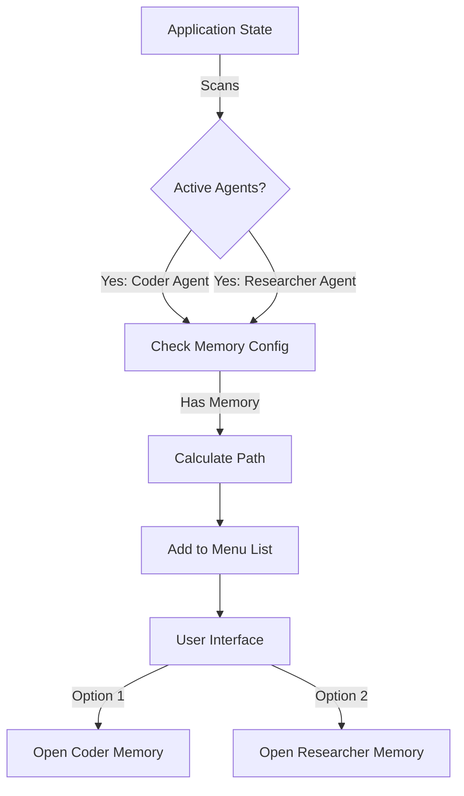
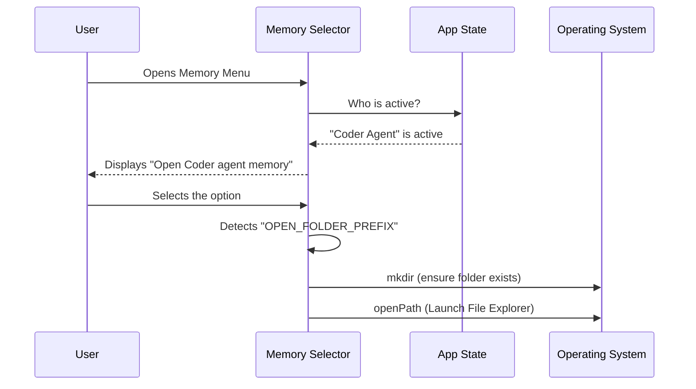

# Chapter 2: Dynamic Agent Scope

In the previous [Memory Hierarchy Interface](01_memory_hierarchy_interface.md), we established the "Bookshelf"—a static place for your global User rules and local Project notes.

But modern AI isn't just a single chatbot anymore. It often involves **Agents**—specialized tools designed for specific tasks (like a "Coder" agent, a "Researcher" agent, or a "Reviewer" agent).

This chapter introduces **Dynamic Agent Scope**. Think of this as a system that magically creates a labeled drawer for every specialist currently working in your office, but hides the drawer when they go home.

## The Problem: The "Crowded Desk"

Imagine you are running a complex task. You have a "Researcher Agent" gathering data and a "Coder Agent" writing functions.

If they both dump their notes into your main `CLAUDE.md` (Project Memory), it becomes a mess.
*   The Coder doesn't care about the Researcher's raw data.
*   The Researcher doesn't care about the Coder's unit tests.

They need their own **Scope**—a private folder to store their context. But since these agents might change from project to project, we can't hard-code these folders. We need to detect them **dynamically**.

## The Solution: Reading the Room

The Dynamic Agent Scope mechanism works by "reading the room" (scanning the Application State).

1.  It checks: **"Which agents are currently active?"**
2.  It asks: **"Do these agents need memory?"**
3.  It generates: **A navigation option** in the menu to open that specific agent's folder.



## How to Use It

As a user, this feature is automatic. You don't configure "Dynamic Scopes" manually. You simply define an agent in your system, and the interface adapts.

**The Scenario:**
You start a session with a specialized `security-audit` agent.

**The Output:**
When you open the Memory Interface, you will see a new entry at the bottom:

> *   User memory
> *   Project memory
> *   Open auto-memory folder
> *   **Open security-audit agent memory**

If you stop using that agent, this option disappears. This keeps your interface clean, showing you only the drawers relevant to your current team.

## Code Walkthrough: The "Roll Call"

Let's look at `MemoryFileSelector.tsx` to see how the system performs this "roll call" of agents.

### Step 1: Accessing the State

First, the component hooks into the global application state to find out who is working.

```typescript
// Connect to the App State to get definitions
const agentDefinitions = useAppState(s => s.agentDefinitions);
```

**Explanation:**
*   `useAppState` is a hook that lets the UI "listen" to the brain of the application.
*   We specifically ask for `agentDefinitions`.

### Step 2: Loop Through Active Agents

We don't want to show *every* possible agent (there could be hundreds). We only want the **active** ones.

```typescript
// Iterate over agents currently in use
for (const agent of agentDefinitions.activeAgents) {
  // Only proceed if the agent is configured to have memory
  if (agent.memory) {
     // logic continues...
  }
}
```

**Explanation:**
*   The code loops through `activeAgents`.
*   It checks `if (agent.memory)`. Some simple tools (like a calculator) might not need memory, so we skip them.

### Step 3: calculating the Path

If an agent needs memory, we calculate where that folder lives and add it to our list of options.

```typescript
// Calculate the physical path on the hard drive
const agentDir = getAgentMemoryDir(agent.agentType, agent.memory);

// Add to the menu options
folderOptions.push({
  label: `Open ${chalk.bold(agent.agentType)} agent memory`,
  value: `${OPEN_FOLDER_PREFIX}${agentDir}`,
  description: `${agent.memory} scope`
});
```

**Explanation:**
*   `getAgentMemoryDir` figures out the path (e.g., `./memory/agents/coder`).
*   `chalk.bold` makes the agent name pop out visually.
*   `OPEN_FOLDER_PREFIX` tells the system "This is a folder, not a text file."

## Under the Hood: The Selection Flow

What happens when you click "Open Coder Agent Memory"? Unlike editing the `CLAUDE.md` file (which opens in a text editor), this action usually opens your file explorer (like Finder or Explorer).



## Internal Implementation Deep Dive

The code handles a subtle difference between **Files** (Context) and **Folders** (Scope).

In `MemoryFileSelector.tsx`, inside the selection handler, there is a specific check:

```typescript
const handleSelect = (value) => {
  // Check for the special prefix
  if (value.startsWith(OPEN_FOLDER_PREFIX)) {
    // Extract the real path
    const folderPath = value.slice(OPEN_FOLDER_PREFIX.length);
    
    // Create folder if missing, then open it
    mkdir(folderPath, { recursive: true })
      .then(() => openPath(folderPath));
    return;
  }
  // ... else handle normal file selection
};
```

**Why is this important?**
1.  **Safety:** It uses `mkdir` with `recursive: true`. If the agent's drawer doesn't exist yet, the system builds it the moment you try to open it.
2.  **Context Switching:** It recognizes that viewing an Agent's Scope is an *exploratory* action (viewing many files in a folder), whereas viewing Project Memory is an *editing* action (modifying one file).

## Summary

In this chapter, we explored **Dynamic Agent Scope**.
1.  **Dynamic Adaptation:** The menu changes based on which Agents are active.
2.  **Scope Separation:** Keeps specialized notes separate from general project rules.
3.  **On-Demand Creation:** Folders are created only when accessed or needed.

Now that we have our memory hierarchy (User, Project, and Agents) defined, how do we actually interact with the system to fill these memories?

[Next Chapter: Terminal Interaction Layer](03_terminal_interaction_layer.md)

---

Generated by [Code IQ](https://github.com/adityasoni99/Code-IQ)