# Chapter 3: Terminal Interaction Layer

In the previous chapter, [Dynamic Agent Scope](02_dynamic_agent_scope.md), we learned how the system dynamically creates folders for AI agents. Before that, [Memory Hierarchy Interface](01_memory_hierarchy_interface.md) showed us how files are organized.

But how do you actually *use* all of this?

If you have used a command line before, you are probably used to typing long commands. But for managing memory, we want an interactive dashboard—something that feels like a modern app, but lives inside your text-based terminal.

This chapter introduces the **Terminal Interaction Layer**.

## The Problem: The "Blind" Terminal

Standard terminal programs are "streams." You type a command, hit Enter, and text scrolls by. Once the text is printed, it's dead—you can't click it or change it.

**The Challenge:**
1.  We have a list of memory files (User, Project, Agents).
2.  We have settings (Auto-memory: On/Off).
3.  We need to navigate this list and toggle settings without typing complex commands like `memory --toggle-auto --select-file=./CLAUDE.md`.

## The Solution: A React-based TUI

We solve this using a library called **Ink**. Ink lets us build **TUI**s (Terminal User Interfaces) using **React**.

If you know React for the web (HTML/CSS), this is exactly the same, but:
*   Instead of `<div />`, we use `<Box />`.
*   Instead of `<span />`, we use `<Text />`.
*   Instead of `onClick`, we use **Keybindings** (keyboard shortcuts).

It translates your React components into text that the terminal draws and updates instantly.

## The Goal: The Dashboard

Our goal is to render a screen that looks like this:

```text
  Auto-memory: on
  Auto-dream: off
  
> User memory
  Project memory
  Open auto-memory folder
```

The user can use the **Up/Down Arrows** to move the cursor (`>`) and **Enter** to select.

## Concept 1: The Visual Layout

In `MemoryFileSelector.tsx`, we don't just print text strings. We build a visual tree of components.

The layout is a vertical column containing two main sections:
1.  **The Header:** Contains the toggles (Auto-memory, Auto-dream).
2.  **The List:** Contains the file options (User memory, Project memory, etc.).

### Code Walkthrough: Building the Box

Here is the high-level structure of our component.

```tsx
// MemoryFileSelector.tsx simplified structure
return (
  <Box flexDirection="column" width="100%">
    {/* The Header Section */}
    <Box flexDirection="column" marginBottom={1}>
      <ToggleItem label="Auto-memory" isOn={autoMemoryOn} />
      <ToggleItem label="Auto-dream" isOn={autoDreamOn} />
    </Box>

    {/* The File List Section */}
    <Select 
      options={memoryOptions} 
      onChange={handleSelect} 
    />
  </Box>
);
```

**Explanation:**
*   `<Box>`: Acts like a container (similar to a `<div>`). `flexDirection="column"` stacks items vertically.
*   `marginBottom={1}`: Adds a blank line between the settings and the file list for readability.
*   `<Select>`: A custom component that renders the list of files.

## Concept 2: Keybindings (The Mouse Replacement)

Since we can't click, we rely on the keyboard. We use a custom hook called `useKeybinding`. This listens for specific keystrokes and runs a function when they happen.

### Code Walkthrough: Listening for Keys

We need to listen for the "Enter" key (confirmation) to toggle settings or select files.

```typescript
// Define what happens when the user presses "Enter"
useKeybinding('confirm:yes', () => {
  if (focusedToggle === 0) {
    // If on first line, toggle memory
    handleToggleAutoMemory();
  } else if (focusedToggle === 1) {
    // If on second line, toggle dreaming
    handleToggleAutoDream();
  }
}, { isActive: toggleFocused });
```

**Explanation:**
*   `'confirm:yes'`: This is mapped to the `Enter` key.
*   `focusedToggle`: A state variable (0 or 1) that tracks which setting is currently highlighted.
*   `isActive`: A safety check. We only run this logic if the user is currently focused on the toggle section, not the file list.

## Concept 3: Interaction Flow

How does the system know whether you are toggling a setting or selecting a file?

The UI has two "modes" or sections:
1.  **Toggle Mode:** The cursor is on the top settings.
2.  **Select Mode:** The cursor is on the file list.

We manage this with simple state logic. When you press the **Down Arrow**, we check: "Are we at the bottom of the toggle list? If yes, move focus to the file list."

```mermaid
sequenceDiagram
    participant User
    participant AppState as React State
    participant UI as Terminal View

    User->>UI: Press Down Arrow
    UI->>AppState: Update focusedToggle (0 -> 1)
    AppState-->>UI: Re-render (Highlight 2nd line)
    
    User->>UI: Press Down Arrow (Again)
    UI->>AppState: Set focusedToggle = null
    UI->>AppState: Focus moves to <Select> list
    AppState-->>UI: Re-render (Highlight File List)
```



## Internal Implementation: The Code

Let's look at `MemoryFileSelector.tsx` to see how we handle the "Auto-memory" toggle logic.

### State Management

We use React's `useState` to keep track of the setting locally so the UI updates instantly.

```typescript
// Initialize state with current system setting
const [autoMemoryOn, setAutoMemoryOn] = useState(isAutoMemoryEnabled);

function handleToggleAutoMemory() {
  const newValue = !autoMemoryOn;
  // 1. Save to disk (persistent settings)
  updateSettingsForSource("userSettings", {
    autoMemoryEnabled: newValue
  });
  // 2. Update UI instantly
  setAutoMemoryOn(newValue);
}
```

**Explanation:**
*   We read the initial value from `isAutoMemoryEnabled`.
*   When toggled, we update the backend (`updateSettingsForSource`) *and* the frontend state (`setAutoMemoryOn`). This ensures the text changes from "off" to "on" immediately.

### Rendering the Toggle Item

We use conditional rendering to change the color of the text based on focus.

```tsx
// Inside the render return
<ListItem isFocused={focusedToggle === 0}>
  <Text>
    Auto-memory: {autoMemoryOn ? "on" : "off"}
  </Text>
</ListItem>
```

**Explanation:**
*   `isFocused`: A prop that tells the `ListItem` to draw a cursor (`>`) or highlight the background.
*   If `focusedToggle` is `0` (the first index), this item is highlighted.

## Bonus: Notifications

Sometimes the system updates memory in the background (like an agent finishing a task). We need to tell the user without breaking their current screen.

We use a small component called `MemoryUpdateNotification`.

```typescript
// MemoryUpdateNotification.tsx
export function MemoryUpdateNotification({ memoryPath }) {
  // Convert full path to readable short path (e.g. "./CLAUDE.md")
  const displayPath = getRelativeMemoryPath(memoryPath);

  return (
    <Box flexDirection="column">
      <Text color="text">
        Memory updated in {displayPath} · /memory to edit
      </Text>
    </Box>
  );
}
```

This simply renders a text message. Because it is a React component, `ink` handles inserting it into the terminal output stream cleanly.

## Summary

In this chapter, we learned:
1.  **Ink:** The library that brings React components to the terminal.
2.  **Keybindings:** Using keyboard shortcuts instead of mouse clicks for navigation.
3.  **State Management:** How we track cursor position and toggle settings instantly.

We have a beautiful interface to select files. But when we open a file, how does the AI know *where* that file is relative to everything else?

[Next Chapter: Path Contextualization](04_path_contextualization.md)

---

Generated by [Code IQ](https://github.com/adityasoni99/Code-IQ)