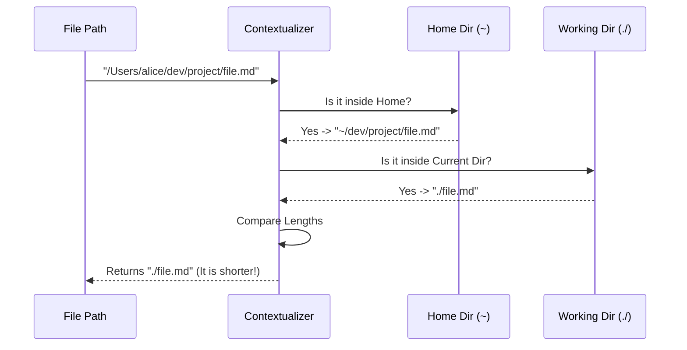

# Chapter 4: Path Contextualization

In the previous chapter, [Terminal Interaction Layer](03_terminal_interaction_layer.md), we built a slick dashboard to view our memory files.

However, we have a visual problem. Computers identify files using **Absolute Paths**—long, rigid addresses that tell the operating system exactly where a file lives.

This chapter covers **Path Contextualization**, a utility logic that translates these robotic coordinates into human-readable locations.

## The Problem: The "GPS vs. Address" Dilemma

Imagine you are inviting a friend to your house.
*   **The Robotic Way:** "Meet me at Latitude 40.7128° N, Longitude 74.0060° W."
*   **The Human Way:** "Meet me at my house" or "Meet me down the street."

When you are working in a terminal, seeing full paths is exhausting.

**The Scenario:**
You are working on a project located at `/Users/developer/code/projects/super-app`.
You update the memory file. The system wants to notify you.

**Without Contextualization:**
> Memory updated in `/Users/developer/code/projects/super-app/CLAUDE.md`

**With Contextualization:**
> Memory updated in `./CLAUDE.md`

The second one is cleaner, faster to read, and feels like it belongs to the project you are working on.

## The Solution: The "Shortest Path" Logic

We solve this with a utility function called `getRelativeMemoryPath`. Its job is to look at a file path and figure out the shortest way to describe it based on where you are currently standing.

It considers two reference points:
1.  **Home (`~`):** Your global home folder (e.g., `/Users/alice`).
2.  **Current Working Directory (`./`):** The folder your terminal is currently open in.

It calculates the path relative to *both* and picks the winner (the shortest one).

## How to Use It

This logic is encapsulated in `MemoryUpdateNotification.tsx`. You can use it whenever you need to display a file path to the user.

```typescript
import { getRelativeMemoryPath } from './MemoryUpdateNotification';

// The "Robotic" absolute path
const uglyPath = "/Users/alice/dev/my-project/CLAUDE.md";

// The "Human" contextual path
const prettyPath = getRelativeMemoryPath(uglyPath);

console.log(prettyPath); 
// Output: "./CLAUDE.md"
```

## Internal Implementation: The Logic Flow

Before looking at the code, let's visualize the decision-making process.



## Internal Implementation Deep Dive

Let's walk through the code in `MemoryUpdateNotification.tsx`. This function performs the "contest" between the two path styles.

### Step 1: Establish Reference Points

First, we need to know where "Home" is and where "Here" is.

```typescript
import { homedir } from 'os';
import { getCwd } from '../../utils/cwd.js';

export function getRelativeMemoryPath(path: string): string {
  const homeDir = homedir(); // e.g., "/Users/alice"
  const cwd = getCwd();      // e.g., "/Users/alice/dev/project"
```

**Explanation:**
*   `homedir()`: A standard Node.js function to get the user's home folder.
*   `getCwd()`: A helper to get the Current Working Directory.

### Step 2: Calculate Candidates

Now we try to format the path in two different ways.

```typescript
  // Option A: Relative to Home (starts with ~)
  const relativeToHome = path.startsWith(homeDir) 
    ? '~' + path.slice(homeDir.length) 
    : null;

  // Option B: Relative to Current Directory (starts with ./)
  const relativeToCwd = path.startsWith(cwd) 
    ? './' + relative(cwd, path) 
    : null;
```

**Explanation:**
*   `relativeToHome`: If the file is in your user folder, we chop off the `/Users/alice` part and add `~`.
*   `relativeToCwd`: We use the `relative` function (from the `path` library) to calculate the steps from "here" to the file, and add `./`.

### Step 3: The Contest

Finally, we compare the two options. We want to show the user the shortest possible string.

```typescript
  // If both options exist, pick the shorter one
  if (relativeToHome && relativeToCwd) {
    return relativeToHome.length <= relativeToCwd.length 
      ? relativeToHome 
      : relativeToCwd;
  }

  // Fallback: Return whatever exists, or the original full path
  return relativeToHome || relativeToCwd || path;
}
```

**Why compare lengths?**
Sometimes `~` is shorter.
*   File: `/Users/alice/notes.txt`
*   CWD: `/Users/alice/dev/project`
*   `./`: `../../notes.txt` (15 chars)
*   `~`: `~/notes.txt` (11 chars) -> **Winner!**

Sometimes `./` is shorter.
*   File: `/Users/alice/dev/project/CLAUDE.md`
*   CWD: `/Users/alice/dev/project`
*   `~`: `~/dev/project/CLAUDE.md` (23 chars)
*   `./`: `./CLAUDE.md` (11 chars) -> **Winner!**

## Visualizing the Result

This logic is used inside the `MemoryUpdateNotification` component to keep the UI clean.

```tsx
export function MemoryUpdateNotification({ memoryPath }) {
  // Convert path before rendering
  const displayPath = getRelativeMemoryPath(memoryPath);

  return (
    <Box flexDirection="column">
      <Text color="text">
        Memory updated in {displayPath}
      </Text>
    </Box>
  );
}
```

By doing this, the user never sees technical jargon like `/var/www/html/users/...`. They only see what is relevant to their current context.

## Summary

In this chapter, we learned:
1.  **Context Matters:** Absolute paths are precise but noisy. Relative paths are human-friendly.
2.  **Dual Reference Points:** We check against both the Home directory and the Working directory.
3.  **Optimization:** We programmatically select the shortest string to save screen space.

Now that our system can intelligently display *where* things are, we need to look at *how* the system manages the content of those files automatically.

[Next Chapter: Auto-Dreaming Controls](05_auto_dreaming_controls.md)

---

Generated by [Code IQ](https://github.com/adityasoni99/Code-IQ)