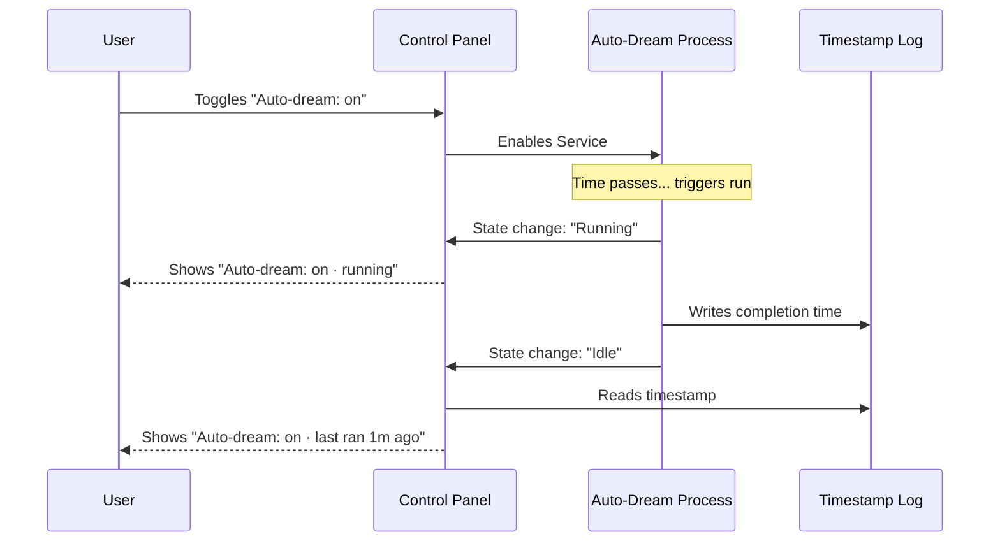

# Chapter 5: Auto-Dreaming Controls

Welcome to the final chapter of our memory system tutorial!

In the previous chapter, [Path Contextualization](04_path_contextualization.md), we learned how to make file paths look friendly and readable.

Now, we tackle the most advanced concept: **Auto-Dreaming**.

In our system, "Dreaming" is a background process. Just as humans consolidate memories while they sleep, our AI consolidates scattered notes into organized documentation when it is idle.

This chapter explains how we build the **Control Panel** for this robotic process.

## The Problem: The Invisible Worker

Imagine you have hired a robotic archivist to clean your office at night.
1.  **The Switch:** You need a way to tell it *not* to clean (maybe you are working late).
2.  **The Status:** You need to know if it is currently cleaning (so you don't trip over it).
3.  **The Log:** You want to know when it last finished cleaning.

Without a UI, this process happens invisibly in the background. You wouldn't know if it was working, broken, or turned off.

## The Solution: The Status Dashboard

We add a specific line to our [Terminal Interaction Layer](03_terminal_interaction_layer.md) that acts as a comprehensive dashboard.

It looks like this:

> Auto-dream: **on** · running
> *or*
> Auto-dream: **on** · last ran 5 mins ago

It combines **Control** (toggling on/off) with **Feedback** (running state and history).

## Concept 1: The Dependency

First, we need to understand a rule: **You can't dream if you don't have memory.**

The Auto-Dream controls only appear if the main "Auto-memory" system is enabled. In the code, we manage this visibility state.

```typescript
// MemoryFileSelector.tsx
// Only show the dream row if memory is enabled
const [showDreamRow] = useState(isAutoMemoryEnabled);

// Later in the render...
{showDreamRow && (
  <ListItem>...</ListItem>
)}
```

**Explanation:**
*   `useState`: Stores whether the row should be visible.
*   `isAutoMemoryEnabled`: The initial check. If this is false, the user never sees the dream controls, keeping the interface simple.

## Concept 2: Listening for the "Heartbeat"

How does the UI know if the background process is running? It needs to listen to the application's "brain" (the State).

We use a hook to check the list of active tasks.

```typescript
// subscribe to the global state
const isDreamRunning = useAppState(state =>
  // Look through all tasks
  Object.values(state.tasks).some(
    // Is there a task of type 'dream' running?
    t => t.type === 'dream' && t.status === 'running'
  )
);
```

**Explanation:**
*   `useAppState`: This connects our UI component to the global app state.
*   `Object.values(state.tasks)`: Gets a list of everything the AI is currently doing.
*   `.some(...)`: Returns `true` if it finds even one task matching our criteria.

If `isDreamRunning` becomes `true`, the UI instantly re-renders to show "running".

## Concept 3: The History Timestamp

If the robot isn't working *now*, when did it finish last? We read a timestamp from a special "lock file" or log.

```typescript
// State to hold the timestamp
const [lastDreamAt, setLastDreamAt] = useState<number | null>(null);

useEffect(() => {
  if (!showDreamRow) return;
  
  // Asynchronously read the file from disk
  readLastConsolidatedAt().then(setLastDreamAt);
}, [showDreamRow, isDreamRunning]);
```

**Explanation:**
*   `readLastConsolidatedAt()`: A helper function that reads a file on your hard drive where the last run time was saved.
*   `useEffect`: This runs whenever the component loads or when `isDreamRunning` changes (so if it finishes running, we update the time immediately).

## Interaction Flow: The Lifecycle of a Dream

Let's visualize how the user interacts with this system and how the system responds.



## Internal Implementation: Rendering the Status Line

Now we combine the Switch, the Heartbeat, and the History into one visual line of text using **Ink** components.

This logic resides in `MemoryFileSelector.tsx`.

### The Status Logic

We calculate a simple text string (`dreamStatus`) based on the complex state.

```typescript
const dreamStatus = isDreamRunning
  ? "running" // Priority 1: It is happening now
  : lastDreamAt === null
    ? ""      // Priority 2: We don't know yet
    : `last ran ${formatRelativeTimeAgo(new Date(lastDreamAt))}`;
```

**Explanation:**
*   This is a "ternary operator" chain (nested if/else).
*   It prioritizes "Running" over history.
*   `formatRelativeTimeAgo`: Converts a robotic timestamp (16788822) into human text ("5 mins ago").

### The Visual Output

Finally, we render the line. We use conditional coloring to help the user focus.

```tsx
<ListItem isFocused={focusedToggle === 1}>
  <Text color={focusedToggle === 1 ? "suggestion" : undefined}>
    Auto-dream: {autoDreamOn ? "on" : "off"}
    
    {/* The status text we calculated above */}
    {dreamStatus && (
      <Text dimColor={true}> · {dreamStatus}</Text>
    )}
  </Text>
</ListItem>
```

**Explanation:**
*   `dimColor={true}`: We make the status text grey/dim. The important part is "Auto-dream: on"; the status is secondary information.
*   ` · `: A simple visual separator.

## Putting it all together

By combining these elements, we have created a "Living Interface."

1.  **Passive:** It shows you the history ("last ran 1 hour ago").
2.  **Active:** It shows you current activity ("running").
3.  **Interactive:** You can toggle it on/off.

This completes the loop of Trust. The user trusts the automatic memory system because they can *see* it working and *control* it when necessary.

## Series Conclusion

Congratulations! You have completed the **Memory System Tutorial**.

Let's review what we have built:
1.  **[Memory Hierarchy Interface](01_memory_hierarchy_interface.md):** We structured our files (User vs. Project).
2.  **[Dynamic Agent Scope](02_dynamic_agent_scope.md):** We created magic folders for AI agents.
3.  **[Terminal Interaction Layer](03_terminal_interaction_layer.md):** We built a keyboard-driven dashboard.
4.  **[Path Contextualization](04_path_contextualization.md):** We made file paths human-readable.
5.  **[Auto-Dreaming Controls](05_auto_dreaming_controls.md):** We added visibility to background processes.

You now understand the architecture behind a modern, interactive AI memory system. You have moved from static text files to a dynamic, living application that manages context intelligently.

Happy coding!

---

Generated by [Code IQ](https://github.com/adityasoni99/Code-IQ)