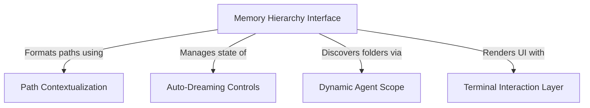

# Tutorial: memory

This project is a **terminal-based memory management system** designed to help an AI organize and access context files across different scopes like *User*, *Project*, and specialized *Agents*. It features a unified dashboard that formats complex file paths into **human-readable text**, dynamically creates storage folders for active tools, and allows the user to control background maintenance tasks like "Auto-Dreaming" directly from the command line.

## Chapters

1. [Memory Hierarchy Interface](01_memory_hierarchy_interface.md)
2. [Dynamic Agent Scope](02_dynamic_agent_scope.md)
3. [Terminal Interaction Layer](03_terminal_interaction_layer.md)
4. [Path Contextualization](04_path_contextualization.md)
5. [Auto-Dreaming Controls](05_auto_dreaming_controls.md)

---

Generated by [Code IQ](https://github.com/adityasoni99/Code-IQ)