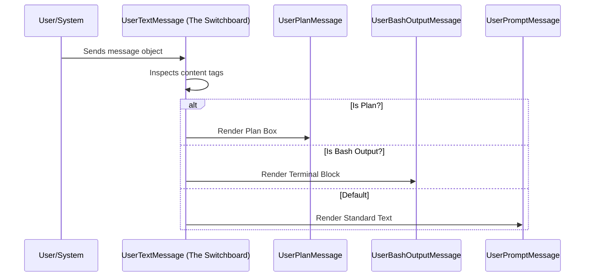

# Chapter 1: User Message Routing

Welcome to the first chapter of the **Messages** project tutorial!

In this series, we will explore how an advanced AI interface handles communication between you (the user) and the system. We start with the most fundamental concept: **how the system decides what to display when you send a message.**

## The Problem: Not All Messages Are Text

When you chat with an AI, you might think everything is just a simple text bubble. But in a complex system like `messages`, a "User Message" can be many things:
1.  **A simple question:** "How do I run this code?"
2.  **A file upload:** You attaching an image.
3.  **System Output:** The result of a command (like `ls` or `git status`) running in the background.
4.  **A Plan:** A structured "thinking" block before the AI acts.

If we treated all of these as plain text, your screen would look like a mess of raw code and XML tags. We need a way to organize this.

## The Solution: The "Switchboard" Analogy

Imagine a busy office building with a receptionist at the front desk.
1.  Mail comes in.
2.  The receptionist looks at the **label** on the package.
3.  If it's a bill, it goes to Accounting.
4.  If it's a blueprint, it goes to Engineering.
5.  If it's a regular letter, it goes to the General Inbox.

In our project, the **User Message Routing** abstraction (specifically the component `UserTextMessage`) acts as this receptionist.

### Central Use Case: Handling Bash Output

Let's look at a concrete example. The system runs a command, and the output looks like this raw text:

```xml
<bash-stdout>
  file1.txt
  file2.js
</bash-stdout>
```

We don't want to show those ugly tags (`<bash-stdout>`) to the user. We want to route this to a special component that knows how to render terminal output beautifully.

## High-Level Visualization

Here is how the Routing system decides what to do with a message.



## Step-by-Step Implementation

The core logic lives in `UserTextMessage.tsx`. Let's break down how it acts as a router.

### 1. The Entry Point
The component receives a `param` (which contains the text) and other details like `planContent`.

```tsx
// UserTextMessage.tsx
export function UserTextMessage({
  param,        // The raw text object
  planContent,  // Optional structured plan
  addMargin,    // Styling prop
  verbose       // Detailed mode toggle
}) {
  // Logic starts here...
}
```

### 2. Checking for Plans
The router first checks if the message is actually a "Plan" (a special mode where the AI outlines its next steps). If `planContent` exists, it delegates the work to the `UserPlanMessage` component.

```tsx
  // Priority 1: Is this a Plan?
  if (planContent) {
    return (
      <UserPlanMessage 
        addMargin={addMargin} 
        planContent={planContent} 
      />
    );
  }
```

*Explanation:* If the variable `planContent` is present, we immediately stop and render the `<UserPlanMessage />`. The router doesn't need to look any further.

### 3. Checking for Bash Output
Next, the router checks if the text contains specific "tags" indicating it is output from a shell command.

```tsx
  // Priority 2: Is this Bash Output?
  if (
    param.text.startsWith('<bash-stdout') || 
    param.text.startsWith('<bash-stderr')
  ) {
    return (
      <UserBashOutputMessage 
        content={param.text} 
        verbose={verbose} 
      />
    );
  }
```

*Explanation:* We peek at the start of the string. If we see `<bash-stdout`, we know this isn't a human talking; it's the computer. We pass it to `<UserBashOutputMessage />`, which knows how to clean up the tags and color-code the output.

### 4. The Default: Standard Text
If the message isn't a plan, command output, or any other special type, the router treats it as a standard user prompt.

```tsx
  // Priority 3 (Default): It's just a normal message
  return (
    <UserPromptMessage 
      addMargin={addMargin} 
      param={param} 
    />
  );
```

*Explanation:* `<UserPromptMessage />` is the component that renders the standard chat bubbles you see when you type to the AI.

## A Look Under the Hood: The Sub-Components

The router's job is to delegate. Let's briefly look at one of the specialists it delegates to.

### The Bash Output Handler
When `UserBashOutputMessage` receives the content, it extracts the meaningful text from inside the tags.

```tsx
// UserBashOutputMessage.tsx
export function UserBashOutputMessage({ content, verbose }) {
  // Extract text between <bash-stdout> tags
  const rawStdout = extractTag(content, 'bash-stdout') ?? "";
  
  // Unwrap internal persistence tags if they exist
  const stdout = extractTag(rawStdout, 'persisted-output') ?? rawStdout;

  // ... Render Logic ...
}
```

*Explanation:* This component is a specialist. It knows that the raw message contains XML tags. It uses a utility `extractTag` to throw away the wrapper and keep the actual command output.

## Summary

In this chapter, we learned about **User Message Routing**.

*   **The Concept:** A central "Switchboard" component (`UserTextMessage`) inspects every message.
*   **The Mechanism:** It uses conditional logic (`if` statements) to check for data types (Plans, Bash Output) or text tags.
*   **The Result:** Users see formatted command logs, styled plans, or clean text bubbles, instead of raw data.

Now that our system can identify *what* kind of message it has received, the next step is to understand how we can condense large amounts of this information to save space and context.

[Next Chapter: Data Summarization & Context](02_data_summarization___context.md)

---

Generated by [Code IQ](https://github.com/adityasoni99/Code-IQ)