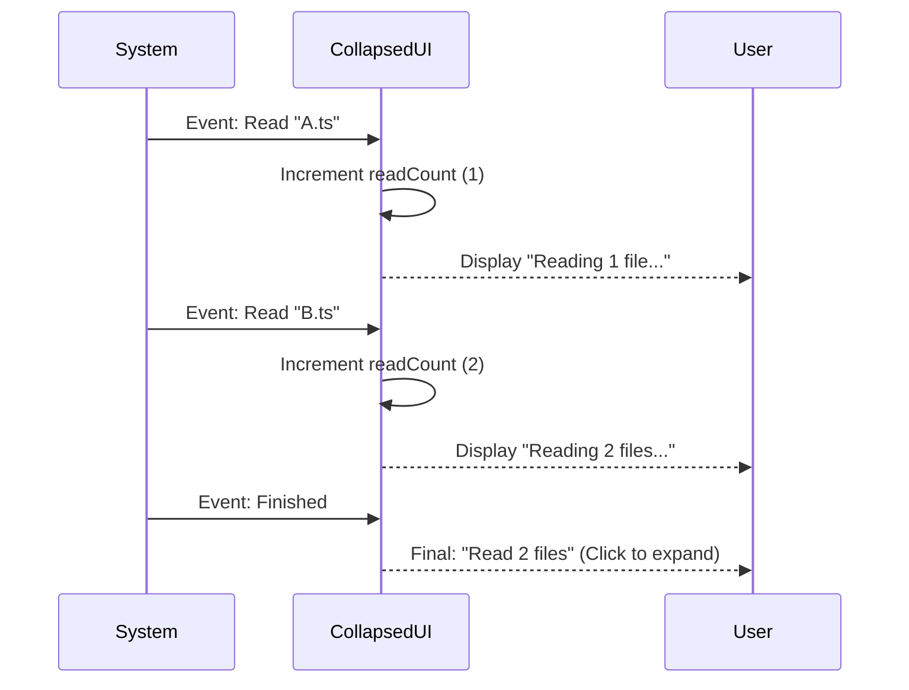

# Chapter 2: Data Summarization & Context

Welcome back! In [Chapter 1: User Message Routing](01_user_message_routing.md), we built our "Switchboard" to decide *which* component handles a message.

Now, we face a new problem: **Information Overload.**

## The Problem: The Wall of Text

Imagine you ask the AI to "Find all references to `User` in the codebase."
To do this, the AI might:
1.  Run a search command (returns 50 results).
2.  Read File A (500 lines).
3.  Read File B (200 lines).
4.  Read File C (1000 lines).

If we displayed all this raw data in the chat, you would have to scroll for minutes just to find the AI's final answer. The chat becomes unusable.

## The Solution: The "Compression Layer"

We need a way to **summarize** data. Instead of showing the raw content of 50 files, we want to show a single line:

> **"Read 3 files, searched for 'User'"**

This concept is handled by two main components in our project:
1.  **Attachments:** For single, static items (like one file or one image).
2.  **Collapsed Groups:** For sequences of actions (like a loop of searching and reading).

### Central Use Case: The "Read File" Event

Let's look at a concrete example. The AI reads a file named `utils.ts`.
*   **Raw Data:** 500 lines of TypeScript code.
*   **Desired Output:** A single line saying `Read utils.ts (500 lines)`.

## High-Level Visualization

Here is how the system processes high-volume data into a summary.



## Part 1: Handling Single Attachments

The component `AttachmentMessage.tsx` handles discrete pieces of data. It takes a raw data object and turns it into a readable one-liner.

### The "Switch" Logic
Just like our Router in Chapter 1, this component looks at the `type` of the data.

```tsx
// AttachmentMessage.tsx
export function AttachmentMessage({ attachment }) {
  // Check what kind of data this is
  switch (attachment.type) {
    case 'directory':
      return <Line>Listed directory {attachment.displayPath}</Line>;
      
    case 'file':
       // ... logic for files ...
    
    // ... other cases ...
  }
}
```

*Explanation:* The component is a simple list of instructions. If the data is a directory listing, print "Listed directory".

### Summarizing a File
If the attachment is a file, we don't show the code. We calculate metadata (like line counts or file size) and display that instead.

```tsx
    case 'file':
      return (
        <Line>
          Read <Text bold>{attachment.displayPath}</Text> (
          {attachment.content.type === 'text' 
            ? `${attachment.content.file.numLines} lines` 
            : formatFileSize(attachment.content.file.originalSize)}
          )
        </Line>
      );
```

*Explanation:*
1.  We display the filename (`displayPath`) in **bold**.
2.  We check if it's text.
3.  If yes, we show the number of lines (`numLines`).
4.  If no (binary file), we show the file size (e.g., "2MB").

## Part 2: The Collapsed Group

Sometimes, actions happen in a batch. The component `CollapsedReadSearchContent.tsx` is responsible for aggregating these counters.

### Collecting the Counts
Instead of rendering text immediately, this component receives a `message` object that contains **counters** (integers) for different activities.

```tsx
// CollapsedReadSearchContent.tsx
export function CollapsedReadSearchContent({ message }) {
  // Destructure the raw counts from the message object
  const {
    searchCount,
    readCount,
    listCount,
    bashCount
  } = message;
  
  // ... Logic to build the summary string ...
}
```

*Explanation:* The system has already done the counting for us. We just need to grab variables like `readCount` (e.g., equals 5) and `searchCount` (e.g., equals 1).

### Building the Summary Sentence
We want to construct a natural English sentence like "Searched for 'foo', read 2 files". We do this by building an array of text parts.

```tsx
  const parts = []; // We will push text fragments here

  if (searchCount > 0) {
    parts.push(
      <Text>Searched {searchCount} patterns</Text>
    );
  }

  if (readCount > 0) {
    // Add a comma if we already have parts
    if (parts.length > 0) parts.push(<Text>, </Text>);
    
    parts.push(
      <Text>Read {readCount} files</Text>
    );
  }
```

*Explanation:*
1.  We check if `searchCount` is greater than 0. If so, add "Searched X patterns".
2.  We check `readCount`. If we already added search text, we add a comma `, ` first for grammar.
3.  Then we add "Read X files".

### The Result
The final render simply joins these parts together.

```tsx
  return (
    <Box flexDirection="row">
      <Text dimColor>
        {parts}
        {/* Visual cue that this can be opened */}
        <Text> … </Text> 
        <CtrlOToExpand />
      </Text>
    </Box>
  );
```

*Explanation:*
*   `parts`: Our constructed sentence ("Searched 1 pattern, read 2 files").
*   `…`: Indicates there is more content hidden.
*   `<CtrlOToExpand />`: A helper component telling the user they can press `Ctrl+O` to see the full raw logs if they really need to.

## Summary

In this chapter, we covered **Data Summarization**:

*   **The Problem:** Too much raw data clutters the chat.
*   **AttachmentMessage:** Converts single data items (files, images) into metadata summaries (line counts, file sizes).
*   **CollapsedReadSearchContent:** Aggregates counters (`readCount`, `searchCount`) into a readable, natural language sentence.

By acting as a "Compression Layer," we ensure the user sees the *flow* of the AI's work without drowning in the *details*.

However, simply summarizing text isn't always enough. Sometimes, the AI is "thinking" or planning complex tasks. In the next chapter, we will see how we represent the AI's internal thought process.

[Next Chapter: Cognitive Visualization](03_cognitive_visualization.md)

---

Generated by [Code IQ](https://github.com/adityasoni99/Code-IQ)