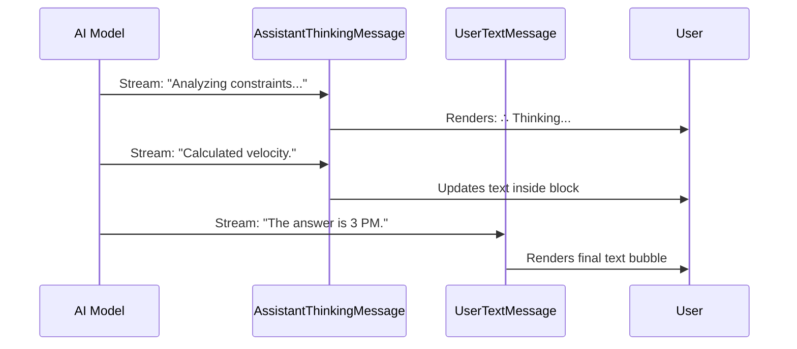

# Chapter 3: Cognitive Visualization

Welcome back! In [Chapter 2: Data Summarization & Context](02_data_summarization___context.md), we learned how to compress large logs into readable summaries.

Now, we move from the **actions** the AI takes to the **thoughts** the AI has.

## The Problem: The "Black Box" of Silence

When you ask an AI a complex question (like "Solve this logic puzzle" or "Refactor this entire database"), there is often a delay.
1.  **The User waits.**
2.  **The Screen is static.**
3.  **The User wonders:** "Is it stuck? Did it crash? Is it hallucinating?"

If the AI simply waits until it has the perfect final answer, the user feels disconnected. We need to show the "work in progress."

## The Solution: The "Glass Box" (Cognitive Visualization)

**Cognitive Visualization** is the concept of rendering the AI's internal monologue—its "Chain of Thought" (CoT)—separately from its final answer.

Think of it like a math student taking a test:
*   **The Scratch Paper:** The student works out the logic, crosses things out, and calculates. (This is **Cognitive Visualization**).
*   **The Answer Box:** The student writes "X = 42". (This is the standard **User Message**).

By separating these, we can show the user that the AI is working *without* cluttering the final result.

### Central Use Case: The Logic Puzzle

**User:** "If a train leaves Chicago at 60mph..."
**AI (Internal Thought):** "I need to calculate distance relative to time. Let's set up the equation..."
**AI (Final Output):** "The trains will meet at 3:00 PM."

We want to display that internal thought in a distinct, styled block so the user can follow the logic if they want to.

## High-Level Visualization

Here is how the system handles the "Thinking" stream versus the "Speaking" stream.



## Step-by-Step Implementation

We manage this visualization primarily through the component `AssistantThinkingMessage.tsx`.

### 1. The Container
This component receives a `param` object. This object holds the raw text of what the AI is currently "thinking."

```tsx
// AssistantThinkingMessage.tsx
export function AssistantThinkingMessage({ 
  param,              // The thought object
  isTranscriptMode,   // Are we looking at history?
  verbose             // Do we want full details?
}) {
  const { thinking } = param;

  // If there are no thoughts, render nothing.
  if (!thinking) {
    return null;
  }
  
  // ... continue logic ...
}
```
*Explanation:* First, safety checks. If the AI isn't thinking (the `thinking` string is empty), we draw nothing.

### 2. The "Condensed" View
Sometimes, especially in history/transcript mode, we don't want to see pages of old thoughts. We just want a small indicator that thinking happened.

```tsx
  // If we shouldn't show full details...
  if (!shouldShowFullThinking) {
    return (
      <Box marginTop={addMargin ? 1 : 0}>
        <Text dimColor italic>
           ∴ Thinking <CtrlOToExpand />
        </Text>
      </Box>
    );
  }
```
*Explanation:* We render a simple line of text: "∴ Thinking". We also add a helper hint `<CtrlOToExpand />` so the user knows they can press a key to see the full brain dump if they really want to.

### 3. The "Live" View (Full Markdown)
When the AI is thinking *right now*, we want to see the thoughts stream in. We wrap this in a container with specific padding to distinguish it from the final answer.

```tsx
  return (
    <Box flexDirection="column" gap={1} width="100%">
      <Text dimColor italic>
        {label}…
      </Text>
      <Box paddingLeft={2}>
        <Markdown dimColor>{thinking}</Markdown>
      </Box>
    </Box>
  );
```
*Explanation:*
1.  We print the label "Thinking…"
2.  We create a `Box` with `paddingLeft={2}`. This indentation visually pushes the text inward, signaling "this is internal/subordinate."
3.  We use `<Markdown dimColor>` so the text is greyed out (dim), reinforcing that this is *not* the final answer.

## Advanced Concept: "Rainbow" Thinking

Sometimes, the AI enters a state of deep reasoning (often called "Ultra-thinking"). To make this visually distinct and exciting for the user, we use `HighlightedThinkingText.tsx`.

This component paints the text with a rainbow gradient to represent "intense" processing.

### The Rainbow Loop
Instead of rendering plain text, we break the string into characters and color them individually.

```tsx
// HighlightedThinkingText.tsx
// ... inside the loop ...
for (let i = t.start; i < t.end; i++) {
  parts.push(
    <Text 
      key={`rb-${i}`} 
      color={getRainbowColor(i - t.start)}
    >
      {text[i]}
    </Text>
  );
}
```
*Explanation:*
1.  We loop through the characters of the text.
2.  `getRainbowColor` calculates a color based on the position (creating a gradient).
3.  We push a `<Text>` component for that single character into our `parts` array.

## A Look Under the Hood: The Redacted View

There is a third component: `AssistantRedactedThinkingMessage.tsx`.

This is used when the system explicitly wants to hide the content of the thought (perhaps for security, or because the mode is set to "minimal").

```tsx
// AssistantRedactedThinkingMessage.tsx
export function AssistantRedactedThinkingMessage({ addMargin }) {
  return (
    <Box marginTop={addMargin ? 1 : 0}>
      <Text dimColor italic>
         ✻ Thinking…
      </Text>
    </Box>
  );
}
```
*Explanation:* It is purely cosmetic. It ignores the actual text content and simply tells the user "Processing is happening." This relies on the "Switchboard" logic we learned in [Chapter 1: User Message Routing](01_user_message_routing.md) to decide *when* to use this component vs. the full thinking component.

## Summary

In this chapter, we explored **Cognitive Visualization**:

*   **The Concept:** Separating "Scratch Paper" (Thoughts) from "The Exam Answer" (Output).
*   **AssistantThinkingMessage:** The main component that renders thoughts. It uses indentation and dim colors to distinguish thoughts from speech.
*   **Visual Flair:** We use "Rainbow" text for intense thinking and "Redacted" states for minimal views.

Now that we can route messages (Chapter 1), summarize data (Chapter 2), and visualize the AI's thinking (Chapter 3), it is time to look at how the AI actually *does* things.

[Next Chapter: Tool Execution Lifecycle](04_tool_execution_lifecycle.md)

---

Generated by [Code IQ](https://github.com/adityasoni99/Code-IQ)