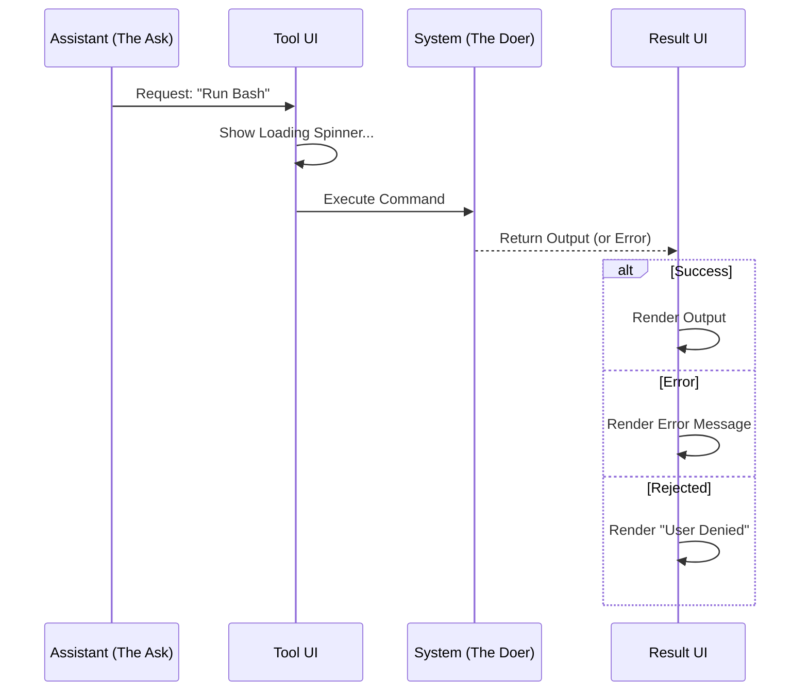
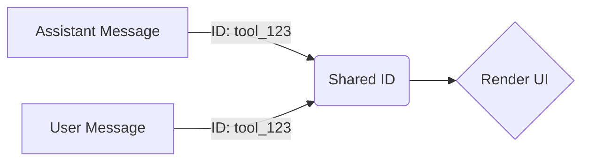

# Chapter 4: Tool Execution Lifecycle

Welcome to Chapter 4! In the previous chapter, [Chapter 3: Cognitive Visualization](03_cognitive_visualization.md), we learned how to visualize the AI's internal thoughts.

Now, we move from **thinking** to **doing**.

## The Problem: The "Chef and Sous-Chef" Dynamic

The AI model (Claude) cannot actually touch your computer's hard drive or run commands directly. It is like a Head Chef trapped in a glass room. It can *think* about a recipe, but it needs a Sous-Chef (our System) to actually chop the onions.

This creates a two-step communication loop:
1.  **The Ask (Assistant):** "Please run `ls` to list files."
2.  **The Result (User/System):** "Here is the list: `[file1.txt, file2.js]`."

If we didn't handle this lifecycle carefully, the chat would look like a disjointed mess of JSON requests. We need a UI that connects the **Ask** with the **Result** visually.

## The Solution: The Execution Cycle

The **Tool Execution Lifecycle** manages this handshake. It provides:
1.  **A Request UI:** Shows what tool is being called (and a spinner while it runs).
2.  **A Result Router:** Decides if the execution was a success, a failure, or was rejected by the user.

### Central Use Case: Running a Command

Let's say the AI wants to list files in the current directory.
*   **Action:** AI sends a `tool_use` block with `name: "bash"`.
*   **UI:** Shows "Bash" with a loading spinner.
*   **Outcome:** System runs the command.
*   **UI:** Updates to show the file list or an error.

## High-Level Visualization

Here is the lifecycle of a single tool interaction.



## Part 1: The Request (AssistantToolUseMessage)

The component `AssistantToolUseMessage.tsx` is responsible for the "Ask." It visualizes the AI requesting a tool.

### Visualizing the Intent
This component needs to look up the tool definition (to get its name) and display it.

```tsx
// AssistantToolUseMessage.tsx
export function AssistantToolUseMessage({ param, tools }) {
  // 1. Find the tool definition
  const tool = findToolByName(tools, param.name);
  
  if (!tool) return null; // Safety check

  // 2. Render the Tool Name (e.g., "Bash", "Edit File")
  return (
    <Box flexDirection="row">
       <Text bold>{tool.userFacingName(param.input)}</Text>
       {/* Logic for loading dots or completion checks goes here */}
    </Box>
  );
}
```

*Explanation:* We take the raw tool ID (like `bash_2024`) and convert it into a human-readable label (like **Bash**).

### Handling Loading States
Crucially, this component handles the "pending" state. If the system hasn't finished the task yet, it shows a spinner or a dot.

```tsx
  // Check if the tool is currently running or queued
  const isQueued = !inProgressToolUseIDs.has(param.id) && !isResolved;

  if (shouldShowDot) {
    return (
      <Box>
         {isQueued ? <LoadingSpinner /> : <CompletedDot />}
      </Box>
    );
  }
```

## Part 2: The Outcome (UserToolResultMessage)

Once the system finishes the task, it sends a message back to the AI. This is handled by `UserToolResultMessage.tsx`.

This component acts as a **Router** (similar to what we saw in [Chapter 1: User Message Routing](01_user_message_routing.md)). It checks *how* the tool execution finished.

### Routing the Result
The result isn't always success. The user might have clicked "Cancel," or the command might have crashed.

```tsx
// UserToolResultMessage.tsx
export function UserToolResultMessage({ param }) {
  // Case 1: Did the user cancel it?
  if (param.content.startsWith(CANCEL_MESSAGE)) {
    return <UserToolCanceledMessage />;
  }

  // Case 2: Did the tool crash?
  if (param.is_error) {
    return <UserToolErrorMessage param={param} />;
  }

  // Case 3 (Default): Success!
  return <UserToolSuccessMessage param={param} />;
}
```

*Explanation:* This acts as a traffic cop. It inspects the result object to send the data to the correct visualizer.

## Part 3: Handling Success & Errors

Let's look at the two most common destinations for our traffic cop.

### The Success State
If the tool worked, `UserToolSuccessMessage.tsx` takes over. It doesn't know *how* to render every tool. Instead, it asks the Tool definition itself to do the rendering.

```tsx
// UserToolSuccessMessage.tsx
export function UserToolSuccessMessage({ tool, message }) {
  // Delegate rendering to the specific Tool implementation
  const renderedContent = tool.renderToolResultMessage(
    message.toolUseResult
  );

  return (
    <Box flexDirection="column">
      {renderedContent}
      <Text color="green">✔ Auto-approved</Text>
    </Box>
  );
}
```

*Explanation:* This is a powerful pattern. The generic UI frame doesn't need to know how `ls` output looks vs. `grep` output. It just tells the Bash Tool: "Here is your data, draw yourself."

### The Error State
If the command failed (e.g., `File not found`), `UserToolErrorMessage.tsx` displays the problem.

```tsx
// UserToolErrorMessage.tsx
export function UserToolErrorMessage({ param }) {
  // param.content contains the error string
  return (
    <Box borderColor="red">
       <Text color="red">Error: {param.content}</Text>
       <FallbackToolUseErrorMessage />
    </Box>
  );
}
```

*Explanation:* We wrap the error in a way that highlights it (often in red) so the user sees exactly why the plan failed.

## Internal Implementation Details

To connect the "Ask" (Part 1) with the "Outcome" (Part 2), the system uses IDs.

1.  **AI generates Tool Use:** ID = `tool_123`
2.  **System generates Result:** ID = `tool_123`

The React components use `lookups` to find these pairs. When rendering the **Result**, we look up the original **Ask** to know context (like what file we were trying to read).



## Summary

In this chapter, we covered the **Tool Execution Lifecycle**:

*   **The Concept:** Separating the "Ask" (Assistant) from the "Result" (User).
*   **AssistantToolUseMessage:** Displays the intent and loading states.
*   **UserToolResultMessage:** Acts as a router to handle Success, Error, Cancel, or Reject states.
*   **Delegation:** The generic UI asks specific Tools to render their own results (keeping the core code clean).

We now have a system that can Listen (Chapter 1), Summarize (Chapter 2), Think (Chapter 3), and Act (Chapter 4).

But how do we know if the system *as a whole* is healthy? How do we track token usage or context limits?

[Next Chapter: System Observability](05_system_observability.md)

---

Generated by [Code IQ](https://github.com/adityasoni99/Code-IQ)