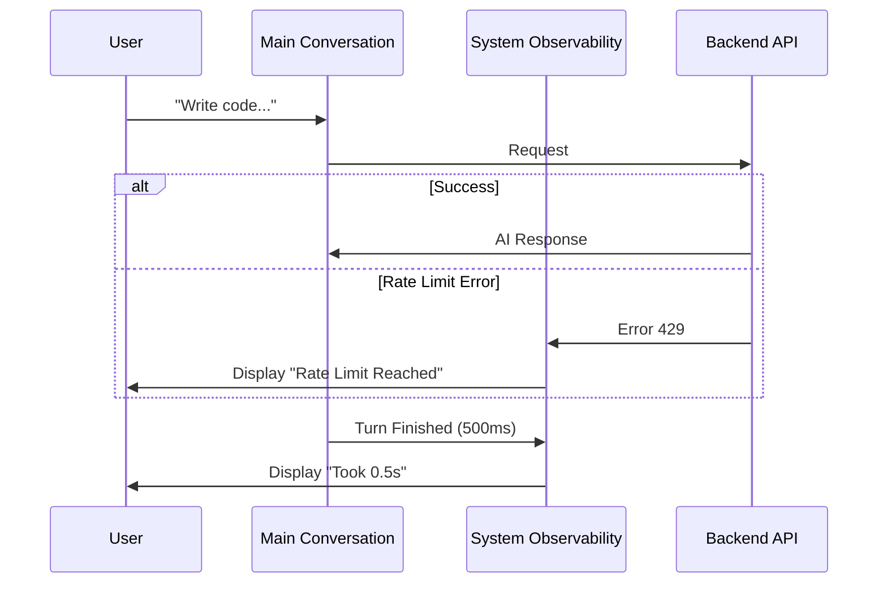

# Chapter 5: System Observability

Welcome back! In [Chapter 4: Tool Execution Lifecycle](04_tool_execution_lifecycle.md), we watched the AI (the "Chef") and the System (the "Sous-Chef") work together to run commands.

But what happens when the kitchen runs out of ingredients? Or the lights go out?

## The Problem: The "Silent" Failure

Imagine you are chatting with the AI, and suddenly it stops responding.
1.  Is it thinking really hard?
2.  Did your internet disconnect?
3.  Did you run out of API credits (Rate Limit)?
4.  Is a background security check blocking it?

The AI itself cannot tell you these things because the AI is the one having the problem. We need a **System Channel**—a feedback loop that comes from the application itself, not the intelligent agent.

## The Solution: The "Heads-Up Display" (HUD)

In a video game, you have a HUD showing your health, ammo, and map. In our project, **System Observability** acts as this HUD.

It renders meta-information distinct from the chat bubbles. It uses specific components to handle:
*   **Health:** API Errors and Rate Limits.
*   **Stats:** How long a turn took or how much memory was used.
*   **Background Noise:** Progress of internal middleware (Hooks).

### Central Use Case: The Rate Limit

The most common system event is hitting a usage limit. The AI tries to reply, but the API provider says "Stop."

*   **Raw Reality:** A JSON error `429 Too Many Requests`.
*   **Desired Experience:** A helpful message saying "You hit your limit. Resets in 5 seconds," optionally offering an upgrade path.

## High-Level Visualization

Here is how the system injects these messages alongside the chat.



## Part 1: The General System Message

The component `SystemTextMessage.tsx` is the "Town Crier." It handles a wide variety of system notifications.

Just like our Routing in Chapter 1, this component acts as a dispatcher based on the `subtype` of the message.

### The Dispatcher Logic
It looks at the `message.subtype` to decide what component to render.

```tsx
// SystemTextMessage.tsx
export function SystemTextMessage({ message, addMargin }) {
  // Case 1: Time taken for the AI to reply
  if (message.subtype === "turn_duration") {
    return <TurnDurationMessage message={message} />;
  }

  // Case 2: Information saved to long-term memory
  if (message.subtype === "memory_saved") {
    return <MemorySavedMessage message={message} />;
  }
  
  // ... continue checks ...
}
```
*Explanation:* If the system sends a message about "time," we use the `TurnDurationMessage`. If it's about "memory," we use `MemorySavedMessage`.

### Visualizing Stats (Turn Duration)
We often want to know how "heavy" a request was. This component renders a small, grey line of text.

```tsx
// Inside TurnDurationMessage sub-component
function TurnDurationMessage({ message }) {
  const duration = formatDuration(message.durationMs);
  
  // Output: "· Worked for 2.5s"
  return (
    <Box flexDirection="row">
      <Text dimColor>
        {TEARDROP_ASTERISK} Worked for {duration}
      </Text>
    </Box>
  );
}
```
*Explanation:* We use `dimColor` (grey) because this is meta-data. It shouldn't distract the user from the actual conversation.

## Part 2: Monitoring Background Hooks

Before the AI runs a tool (like `bash`), the system might run "Hooks" (middleware) to check permissions or log data. Users usually don't care about this, unless it gets stuck.

The component `HookProgressMessage.tsx` handles this "Background Noise."

### Counting the Hooks
We track how many hooks are running versus how many finished.

```tsx
// HookProgressMessage.tsx
export function HookProgressMessage({ lookups, toolUseID }) {
  // Get counts from our lookup table
  const inProgress = lookups.inProgressHookCounts.get(toolUseID) ?? 0;
  const resolved = lookups.resolvedHookCounts.get(toolUseID) ?? 0;

  // If everything is done, show nothing (disappear)
  if (resolved === inProgress) {
    return null;
  }
  
  // Otherwise render...
}
```
*Explanation:* If 5 hooks started and 5 finished, the component returns `null` (invisible). It only appears when work is *actively* happening.

### Rendering the Status
If hooks are running, we show a subtle indicator.

```tsx
  return (
    <Box flexDirection="row">
      <Text dimColor>Running </Text>
      <Text dimColor bold>PreToolUse</Text>
      <Text dimColor> hooks…</Text>
    </Box>
  );
```
*Explanation:* This renders as **"Running PreToolUse hooks…"**. It lets the user know: "The AI isn't frozen, the system is just doing safety checks."

## Part 3: Critical Errors (Rate Limits)

When things go wrong, we need to be loud. The `RateLimitMessage.tsx` component handles API rejections.

### Analyzing the User's Tier
We check if the user is on a free plan or a paid plan to customize the error message (Upselling).

```tsx
// RateLimitMessage.tsx
export function RateLimitMessage({ text }) {
  const tier = getRateLimitTier(); // e.g., "free" or "pro"
  const isMax20x = tier === "default_claude_max_20x";
  
  // Decide what help text to show
  const upsell = isMax20x 
    ? "/extra-usage to finish work" 
    : "/upgrade to increase limit";

  // ... render logic ...
}
```

### The Interactive Error
We don't just show the error; we show it in red and offer the solution.

```tsx
  return (
    <Box flexDirection="column">
      {/* The Error from the API */}
      <Text color="error">{text}</Text>
      
      {/* The Solution */}
      <Text dimColor>{upsell}</Text>
    </Box>
  );
```
*Explanation:* `color="error"` usually renders as red. This visually separates a system failure from a standard AI text bubble.

## Part 4: API Error Countdown

Sometimes the API is just down or busy. `SystemAPIErrorMessage.tsx` handles the "Retry" logic.

### The Countdown State
It uses a local state to count down the seconds until the system tries again.

```tsx
// SystemAPIErrorMessage.tsx
export function SystemAPIErrorMessage({ message }) {
  const { retryInMs } = message;
  const [countdownMs, setCountdownMs] = useState(0);

  // Tick every 1 second
  useInterval(() => {
    setCountdownMs((prev) => prev + 1000);
  }, 1000);

  // ... render ...
}
```

### Rendering the Retry
It calculates how many seconds are left.

```tsx
  const secondsLeft = Math.round((retryInMs - countdownMs) / 1000);

  return (
    <Text dimColor>
       Retrying in {secondsLeft} seconds...
    </Text>
  );
```
*Explanation:* This provides immediate feedback. The user doesn't have to guess when the system will unfreeze.

## Summary

In this chapter, we covered **System Observability**:

*   **The Concept:** A feedback channel separate from the AI agent.
*   **SystemTextMessage:** The main dispatcher for meta-data like turn duration and memory saves.
*   **HookProgressMessage:** A subtle "loading" indicator for background middleware.
*   **RateLimitMessage:** Critical UI that explains errors and offers solutions (upgrades/retries).

By implementing these components, we ensure the user is never left in the dark, distinguishing between "The AI is thinking" and "The System is broken."

Now that our system is robust and observable, we are ready for the final frontier: Managing multiple agents working together.

[Next Chapter: Agent Swarm Coordination](06_agent_swarm_coordination.md)

---

Generated by [Code IQ](https://github.com/adityasoni99/Code-IQ)