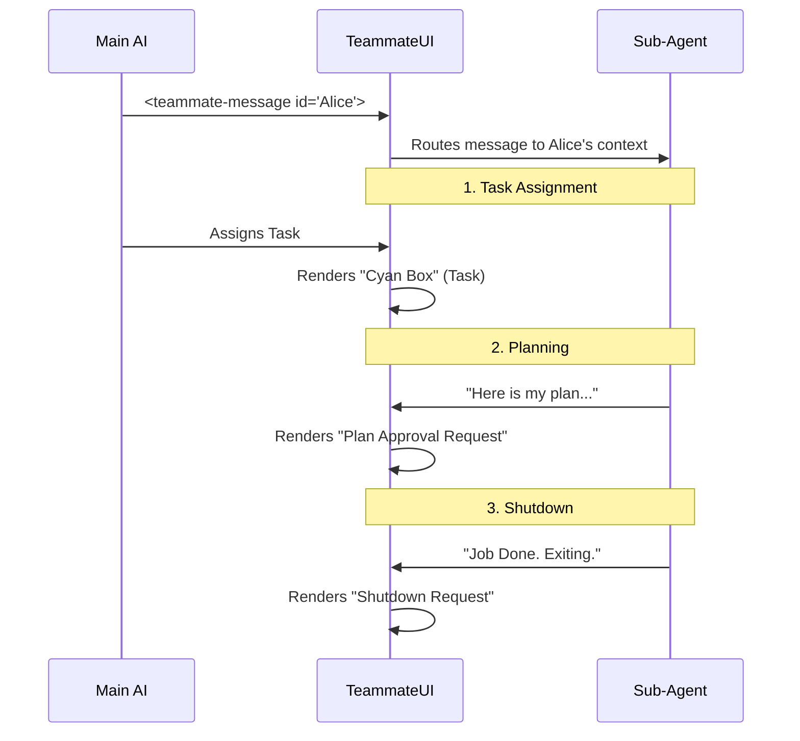

# Chapter 6: Agent Swarm Coordination

Welcome to the final chapter of the **Messages** project tutorial! 

In [Chapter 5: System Observability](05_system_observability.md), we learned how to monitor the "engine" of the application (APIs, Rate Limits, and Hooks). Now, we are going to look at how multiple AI agents communicate with each other.

## The Problem: Who is Talking to Whom?

In a standard chat, it is just **You** vs. **The AI**.

But in a **Swarm** system, the Main AI (the Leader) can hire "Sub-Agents" (teammates) to do specific jobs. 
*   **Alice** might fix database bugs.
*   **Bob** might write documentation.

If everyone talks in the same text stream, it becomes chaos. You wouldn't know if the Leader is talking to *you* or giving an order to *Alice*. We need a visual protocol to distinguish **Team Communication** from **User Communication**.

## The Solution: The "Inter-Office Mail" System

We visualize Swarm interactions as structured "Memos" or "Mail." 

Instead of plain text bubbles, we use specific components that look different based on the type of message:
1.  **Task Assignment:** A formal work order.
2.  **Plan Approval:** A request for permission to write code.
3.  **Shutdown:** A request to "clock out" and leave the conversation.

These are handled by the master component: `UserTeammateMessage.tsx`.

## High-Level Visualization

Here is the flow of a Multi-Agent interaction. Notice how the messages are structured events, not just chat.



## Step-by-Step Implementation

The component `UserTeammateMessage.tsx` acts as the coordinator. It reads raw XML messages and converts them into beautiful UI blocks.

### 1. The Container
First, we look for a special XML tag: `<teammate-message>`. This tells us that this content isn't for the user, but for another agent.

```tsx
// UserTeammateMessage.tsx
export function UserTeammateMessage({ param }) {
  // Parse XML like: <teammate-message teammate_id="alice">
  const messages = parseTeammateMessages(param.text);

  if (messages.length === 0) {
    return null;
  }
  
  // Render the list of messages...
  return (
    <Box flexDirection="column">
       {messages.map(renderSpecificMessageType)}
    </Box>
  );
}
```

### 2. The Task Assignment
When a Leader tells a Sub-Agent what to do, it sends a specific JSON structure. We use `TaskAssignmentMessage.tsx` to render this as a "Work Order" with a cyan border.

```tsx
// TaskAssignmentMessage.tsx
export function TaskAssignmentDisplay({ assignment }) {
  return (
    <Box borderStyle="round" borderColor="cyan_FOR_SUBAGENTS_ONLY">
       {/* Who assigned it? */}
       <Text bold>Task #{assignment.taskId} from {assignment.assignedBy}</Text>
       
       {/* What is the job? */}
       <Text>{assignment.subject}</Text>
    </Box>
  );
}
```
*Explanation:* This visual distinction (Cyan color) helps the user immediately see: "Ah, this isn't a chat message; this is a new job starting."

### 3. The Plan Approval ("The Permission Slip")
Before a sub-agent acts (like writing to a file), it usually asks for permission. This is critical for safety. We use `PlanApprovalMessage.tsx`.

```tsx
// PlanApprovalMessage.tsx
export function tryRenderPlanApprovalMessage(content) {
  // Check if the text matches the "Approval Request" pattern
  const request = isPlanApprovalRequest(content);
  
  if (request) {
    return (
       <PlanApprovalRequestDisplay request={request} />
    );
  }
  
  // ... check for responses (Approved/Rejected) ...
}
```
*Explanation:* If the message is a request, we show the Plan content inside a box. If it's a response (e.g., "Plan Approved"), we show a Green checkmark. If rejected, a Red X.

### 4. The Shutdown ("Clocking Out")
When the sub-agent finishes its job, it shouldn't just vanish. It sends a formal "Shutdown Request."

```tsx
// ShutdownMessage.tsx
export function ShutdownRequestDisplay({ request }) {
  return (
    <Box borderColor="warning">
       <Text color="warning">
         Shutdown request from {request.from}
       </Text>
       <Text>Reason: {request.reason}</Text>
    </Box>
  );
}
```
*Explanation:* We use a "warning" color (usually yellow/orange) to alert the user: "Hey, this agent is trying to leave the chat. Is that okay?"

## Under the Hood: The Parser

How does `UserTeammateMessage` know which of the above components to use? It tries them one by one.

This is a **Chain of Responsibility** pattern.

```tsx
// Inside UserTeammateMessage.tsx loop:

// 1. Is it a Plan Approval?
const planUI = tryRenderPlanApprovalMessage(msg.content);
if (planUI) return planUI;

// 2. Is it a Shutdown Request?
const shutdownUI = tryRenderShutdownMessage(msg.content);
if (shutdownUI) return shutdownUI;

// 3. Is it a Task Assignment?
const taskUI = tryRenderTaskAssignmentMessage(msg.content);
if (taskUI) return taskUI;

// 4. Fallback: Just render the text (Standard DM)
return <TeammateMessageContent content={msg.content} />;
```

*Explanation:*
1.  We grab the content string.
2.  We pass it to specific helper functions (imported from other files).
3.  If a helper returns a React Component, we render it and stop.
4.  If not, we move to the next type.

## Central Use Case: The Full Lifecycle

Let's put it all together. Here is what the User sees in their terminal when the Swarm is working.

1.  **Leader:** "I need a graph drawn." -> *Routes to TaskAssignment (Cyan Box)*
2.  **Sub-Agent (Grapher):** "I will use Python to draw it." -> *Routes to PlanApprovalRequest (Box with Markdown)*
3.  **Leader:** "Go ahead." -> *Routes to PlanApprovalResponse (Green Checkmark)*
4.  **Sub-Agent:** "I'm done." -> *Routes to ShutdownRequest (Yellow Box)*

By using these specialized components, the user can scan the history and instantly understand the state of the team.

## Tutorial Conclusion

Congratulations! You have completed the **Messages** project tutorial.

Let's review what we built:
1.  **[Routing](01_user_message_routing.md):** We built a "Switchboard" to sort text from data.
2.  **[Summarization](02_data_summarization___context.md):** We compressed huge logs into readable one-liners.
3.  **[Thinking](03_cognitive_visualization.md):** We visualized the AI's internal scratchpad.
4.  **[Acting](04_tool_execution_lifecycle.md):** We connected the AI's "Ask" with the System's "Result."
5.  **[Observability](05_system_observability.md):** We created a HUD for system health.
6.  **Coordination (This Chapter):** We visualized the complex dance of multi-agent teams.

You now have a deep understanding of how to build a rich, interactive Command Line Interface (CLI) for advanced AI systems. Instead of a simple text stream, you have a structured, visual, and intelligent application.

Happy Coding!

---

Generated by [Code IQ](https://github.com/adityasoni99/Code-IQ)