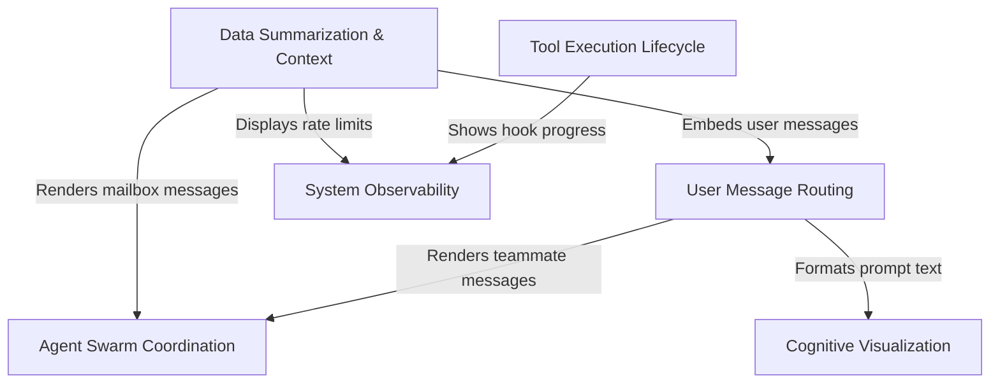

# Tutorial: messages

This project controls how an AI assistant's conversation is displayed in a terminal interface. It manages a variety of message types, ranging from standard **chat** and **file attachments** to complex **tool executions** and **multi-agent interactions** (swarms). The system prioritizes user experience by **summarizing** dense data, visualizing the AI's **internal thinking**, and providing real-time **system status** updates without cluttering the main conversation flow.

## Chapters

1. [User Message Routing](01_user_message_routing.md)
2. [Data Summarization & Context](02_data_summarization___context.md)
3. [Cognitive Visualization](03_cognitive_visualization.md)
4. [Tool Execution Lifecycle](04_tool_execution_lifecycle.md)
5. [System Observability](05_system_observability.md)
6. [Agent Swarm Coordination](06_agent_swarm_coordination.md)

---

Generated by [Code IQ](https://github.com/adityasoni99/Code-IQ)