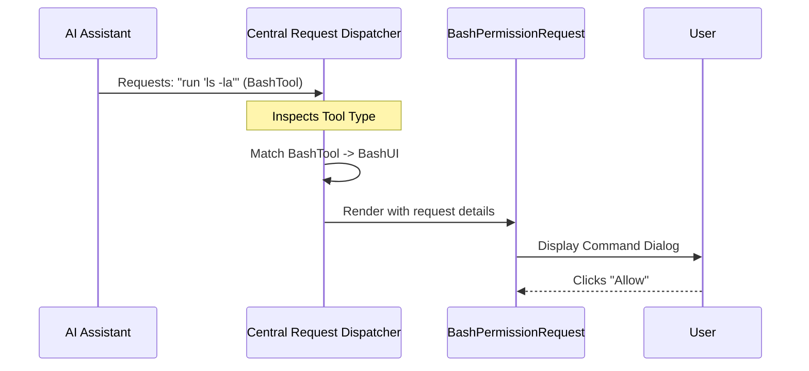

# Chapter 1: Central Request Dispatcher

Welcome to the first chapter of the **Permissions** tutorial! 

Before an AI assistant can modify your code, run a terminal command, or browse the web, it needs permission. But different actions require different types of approval. You wouldn't check a file edit the same way you check a command to delete a folder.

This brings us to our first core concept: the **Central Request Dispatcher**.

## 1. The "Receptionist" Analogy

Imagine a large corporate building. You can't just walk straight into the Server Room or the CEO's office. You first stop at the front desk.

The **Receptionist** (Dispatcher) asks: *"What is the purpose of your visit?"*

*   If you say "I'm here to fix the plumbing," the Receptionist directs you to **Facilities**.
*   If you say "I need to sign a contract," the Receptionist directs you to **Legal**.
*   If you say "I'm updating the servers," the Receptionist directs you to **IT Security**.

In our project, the **Central Request Dispatcher** (`PermissionRequest`) acts exactly like this receptionist. It acts as the single entry point for *all* permission requests, identifies the tool being used, and routes it to the correct department (Component).

## 2. Motivation: Why do we need this?

Without a dispatcher, our code would be messy. Imagine if every time the AI wanted to do something, we had to write a new `if/else` check in the main application logic:

*   "If it's a file edit, show the file edit popup."
*   "If it's a terminal command, show the terminal popup."
*   "If it's a browser request, show the browser popup."

This creates "spaghetti code." The **Central Request Dispatcher** solves this by separating the **"What"** (the tool being used) from the **"How"** (how we show the confirmation UI).

## 3. Central Use Case

Let's look at a concrete example we will follow throughout this chapter.

**The Scenario:**
The AI Assistant wants to run a terminal command: `npm install lodash`.

**The Problem:**
We don't want to show a generic "Allow?" box. We want to show a specialized "Shell Command" box that highlights safety risks.

**The Solution:**
1. The system calls the **Central Request Dispatcher**.
2. The Dispatcher sees the tool is `BashTool`.
3. The Dispatcher loads the specific `BashPermissionRequest` component.

## 4. How it Works: The "Switch" Logic

The heart of the dispatcher is a simple decision-making process. It looks at the `tool` object provided in the request and switches based on its type.

Here is the simplified logic inside `PermissionRequest.tsx`:

```typescript
// Inside PermissionRequest.tsx

function permissionComponentForTool(tool: Tool) {
  switch (tool) {
    case FileEditTool:
      // If editing a file, return the File Editor UI
      return FileEditPermissionRequest; 
    case BashTool:
      // If running a command, return the Terminal UI
      return BashPermissionRequest;
    default:
      // If we don't know the tool, use a generic fallback
      return FallbackPermissionRequest;
  }
}
```

### Explanation
*   **Input:** The `tool` (e.g., `FileEditTool`, `BashTool`).
*   **Logic:** A standard `switch` statement checks what the tool is.
*   **Output:** It returns a **React Component** (e.g., `FileEditPermissionRequest`). It does not render it yet; it just selects the *blueprint* to use.

## 5. Sequence of Events

To understand how the data flows, let's look at a diagram of a request coming in.



1.  The **AI** triggers a request.
2.  The **Dispatcher** inspects the request.
3.  The Dispatcher selects the **BashUI**.
4.  The **User** sees the specific UI for bash commands.

## 6. Internal Implementation

Now let's look at the main component that orchestrates this. This is the entry point in `PermissionRequest.tsx`.

### The Main Component

```typescript
// PermissionRequest.tsx

export function PermissionRequest({ toolUseConfirm, ...props }) {
  // 1. Determine which component to use based on the tool
  const PermissionComponent = permissionComponentForTool(toolUseConfirm.tool);

  // 2. Render that specific component, passing down all data
  return (
    <PermissionComponent 
      toolUseConfirm={toolUseConfirm} 
      {...props} 
    />
  );
}
```

### Explanation
1.  **`toolUseConfirm`**: This object contains all the details about what the AI wants to do (the "input").
2.  **`PermissionComponent`**: This variable now holds the specific React component we selected (like the one in the Switch Logic section above).
3.  **`return <PermissionComponent ... />`**: This is where the magic happens. React renders the specific UI we selected, passing along the context needed for the user to make a decision.

## 7. Example Scenarios

Here is how the Dispatcher handles different inputs:

| Input (Tool Used) | Dispatcher Decision | Output (Component Rendered) |
| :--- | :--- | :--- |
| **`BashTool`** | Identifies as Shell Command | `BashPermissionRequest` |
| **`FileEditTool`** | Identifies as Text Editor | `FileEditPermissionRequest` |
| **`WebFetchTool`** | Identifies as Browser | `WebFetchPermissionRequest` |
| **`UnknownTool`** | No match found | `FallbackPermissionRequest` |

## Conclusion

The **Central Request Dispatcher** is the traffic controller of our permissions system. It ensures that every request is met with the correct interface, keeping our code organized and our user experience consistent.

Now that the request has been routed to the correct department, what does the user actually see? How do we present the information clearly?

In the next chapter, we will explore the **Unified Dialog Interface**, which defines the standard look and feel for these requests.

[Next Chapter: Unified Dialog Interface](02_unified_dialog_interface.md)

---

Generated by [Code IQ](https://github.com/adityasoni99/Code-IQ)