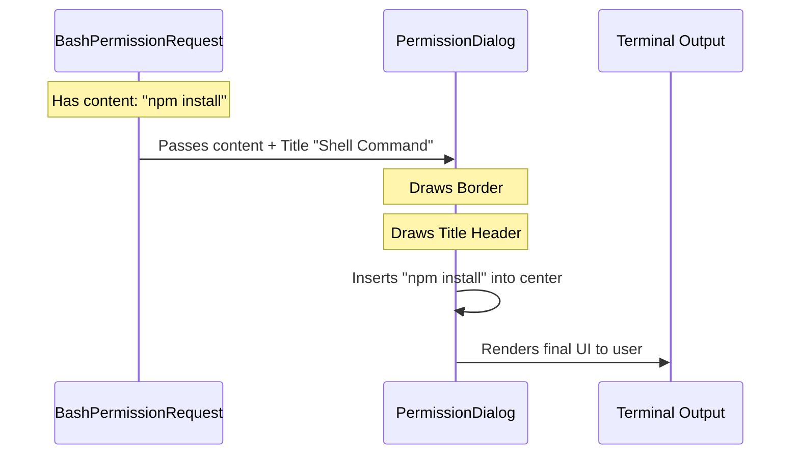

# Chapter 2: Unified Dialog Interface

In the previous chapter, [Central Request Dispatcher](01_central_request_dispatcher.md), we learned how the system acts like a receptionist, identifying what tool the AI wants to use and routing it to the correct department.

But imagine if the "Legal Department" sent you a handwritten note on a napkin, while "IT Security" sent a formal typed letter. It would look unprofessional and confusing.

In this chapter, we explore the **Unified Dialog Interface**. This is the standard "company letterhead" or "form template" that ensures every permission request—whether it's for a file edit or a shell command—looks consistent and professional.

## 1. The "Picture Frame" Analogy

Think of an art gallery. Every painting is different:
*   One might be a landscape (File Edit).
*   One might be a portrait (Shell Command).

However, to make the gallery look cohesive, every painting is placed inside the **exact same frame**.

In our project, the **Unified Dialog Interface** (`PermissionDialog`) is that frame.
*   **The Frame:** Handles the rounded borders, the color coding, the title, and the metadata badge.
*   **The Art:** The specific content passed inside (the command to run, or the code to change).

## 2. Motivation: Why use a shared shell?

We need this abstraction to solve two main problems:

1.  **Consistency:** We don't want to re-write the code for drawing borders and titles for every single tool.
2.  **Focus:** The developers building the "Shell Command" UI shouldn't worry about margins or theme colors. They should just focus on displaying the command.

## 3. Central Use Case

Let's continue with our example: **The AI wants to run `npm install lodash`.**

The Dispatcher has already selected the `BashPermissionRequest` component. Now, that component needs to render the screen. Instead of drawing lines and boxes manually, it simply asks the **Unified Dialog Interface** to wrap its content.

## 4. How to Use It

The Unified Dialog is built as a React component called `PermissionDialog`. It uses a powerful pattern called **Composition** (using `children`).

Here is the simplified interface:

```typescript
// How a specific tool uses the dialog
return (
  <PermissionDialog title="Shell Command">
    {/* The specific content goes here */}
    <Text>npm install lodash</Text>
  </PermissionDialog>
);
```

### Explanation
1.  **`title`**: We pass a string (e.g., "Shell Command") to be displayed at the top.
2.  **`children`**: Anything we put *inside* the tags becomes the content inside the box.

## 5. Sequence of Events

Here is what happens when a specific tool requests to be displayed:



1.  The **BashUI** prepares the specific text (`npm install`).
2.  It passes that text to the **Dialog**.
3.  The **Dialog** draws the "frame" (borders) and places the text inside.
4.  The user sees one cohesive box.

## 6. Internal Implementation

Let's look under the hood of `PermissionDialog.tsx`. This component uses a library called `ink` to render UI elements in the terminal.

### The Container (The Border)

The outer layer is a `Box` that handles the styling.

```typescript
// PermissionDialog.tsx (Simplified)

export function PermissionDialog({ title, color, children }) {
  return (
    <Box 
      borderStyle="round" 
      borderColor={color || "blue"} 
      flexDirection="column"
    >
      {/* Header and Content go here */}
    </Box>
  );
}
```
*   **`borderStyle="round"`**: This draws the nice curved lines around the request.
*   **`borderColor`**: Allows different tools to have different warning colors (e.g., Red for dangerous commands).

### The Header (The Title)

Inside the box, we first render the header.

```typescript
// Inside PermissionDialog.tsx

<Box justifyContent="space-between">
  <PermissionRequestTitle title={title} />
  {/* Optional badges or icons go here */}
</Box>
```
*   This ensures the title is always at the top left.

### The Content (The Children)

Finally, we render the specific tool content.

```typescript
// Inside PermissionDialog.tsx

<Box paddingX={1}>
  {children}
</Box>
```
*   **`{children}`**: This is a special React prop. It represents whatever was nested inside the `<PermissionDialog>...</PermissionDialog>` tags. This is how the "File Edit" UI or "Shell" UI gets injected into the frame.

## 7. A Concrete Example: Fallback Request

To see this in action within the actual codebase, let's look at `FallbackPermissionRequest.tsx`. This is a generic component used when we don't have a specialized UI for a tool.

It effectively wraps the raw description in our Dialog.

```typescript
// FallbackPermissionRequest.tsx (Simplified)

return (
  <PermissionDialog 
    title="Tool Use" 
    workerBadge={workerBadge}
  >
    <Box flexDirection="column" paddingX={2}>
       <Text>The AI wants to use a tool.</Text>
       {/* More specific details... */}
    </Box>
  </PermissionDialog>
)
```

Because `FallbackPermissionRequest` uses `PermissionDialog`, it instantly looks consistent with the rest of the application, without having to define its own borders or colors.

## Conclusion

The **Unified Dialog Interface** acts as the visual backbone of our permissions system. By separating the **Frame** (PermissionDialog) from the **Picture** (Specific Tool UI), we ensure that the application remains maintainable and visually consistent.

Now that we have a nice looking box on the screen, the user needs a way to interact with it. They need to say "Yes", "No", or "Always Allow".

In the next chapter, we will look at the **Interactive Decision Prompt**, which handles the user's input.

[Next Chapter: Interactive Decision Prompt](03_interactive_decision_prompt.md)

---

Generated by [Code IQ](https://github.com/adityasoni99/Code-IQ)