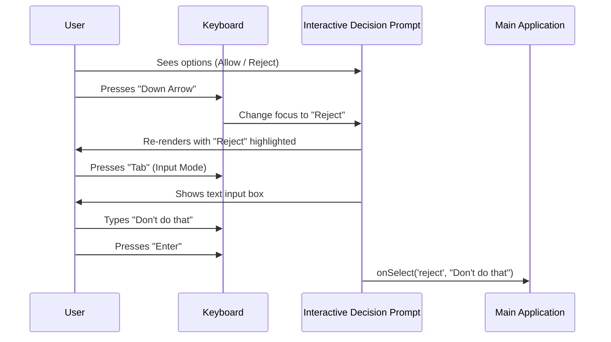

# Chapter 3: Interactive Decision Prompt

In the previous chapter, the [Unified Dialog Interface](02_unified_dialog_interface.md), we learned how to draw a consistent "frame" around our permission requests. We made the UI look professional with borders, titles, and colors.

However, a pretty box is useless if the user can't interact with it. A contract isn't valid until someone signs it.

This chapter introduces the **Interactive Decision Prompt**. This is the component responsible for handling the "Yes," "No," and "Always Allow" buttons, managing keyboard navigation, and capturing optional text feedback (like "No, do this instead").

## 1. The "Signature Block" Analogy

Imagine you are at a checkout terminal in a store. You swipe your card, and the screen asks: **"Is the amount $50.00 correct?"**

You have two physical buttons:
1.  **Green Button:** "Yes" (Accept).
2.  **Red Button:** "No" (Reject).

Sometimes, if you press "No," a keyboard pops up asking **"Why?"** or **"Enter Correct Amount."**

In our project, the **Interactive Decision Prompt** (`PermissionPrompt`) is that terminal.
*   It displays the options.
*   It listens for your button presses (Keyboard arrows and Enter).
*   It captures your written feedback if you disagree.

## 2. Motivation: Why do we need this?

Why can't we just let the user type `y` or `n` in the console?

1.  **Rich Interaction:** We want to support "Always Allow" rules, which are more complex than a simple Yes/No.
2.  **Feedback Loop:** Sometimes the AI is *almost* right, but needs a tweak. Instead of just blocking it, the user should be able to say: *"Reject, but try using `yarn` instead of `npm`."*
3.  **Safety:** We need to prevent accidental clicks. We want a distinct UI that demands attention before executing dangerous commands.

## 3. Central Use Case

**The Scenario:**
The AI wants to run `npm install lodash`.

**The Interaction:**
1.  The User sees the command in the Dialog (from Chapter 2).
2.  Below the command, they see a menu:
    *   `> Allow` (Selected)
    *   `  Reject`
3.  The User presses the **Down Arrow** to highlight `Reject`.
4.  The User presses **Tab** to add a note: *"Use pnpm instead"*.
5.  The User presses **Enter** to confirm.

## 4. Key Concepts

To make this work, the component handles three main jobs:

### A. The Option List
This is the data structure defining what choices the user has. It usually includes:
*   **Value:** The internal ID (e.g., `'allow'`, `'block'`).
*   **Label:** What the user sees (e.g., "Allow this time").
*   **Feedback Config:** Does this option allow the user to type a message?

### B. Input Mode
This is a "state" (a switch) inside the component.
*   **Normal Mode:** Arrow keys move the selection up and down.
*   **Input Mode:** The keyboard keys type text into a feedback box.

### C. The Callback
When the user hits "Enter", the component calls a function (`onSelect`) to tell the main application what happened.

## 5. How to Use It

The `PermissionPrompt` component is designed to be plugged into any request. Here is how we use it conceptually.

```typescript
// Inside a specific tool request (e.g., BashPermissionRequest)

return (
  <PermissionPrompt
    question="Do you want to run this command?"
    options={[
       { value: 'allow', label: 'Allow' },
       { value: 'reject', label: 'Reject' }
    ]}
    onSelect={(decision, feedback) => {
       // Send the result back to the system
       handleDecision(decision, feedback);
    }}
  />
);
```

### Explanation
*   **`options`**: We pass the list of choices.
*   **`onSelect`**: This function runs when the user makes a final choice. It receives the `decision` (e.g., 'reject') and any `feedback` (e.g., "Use pnpm").

## 6. Sequence of Events

Let's visualize the flow of data when a user interacts with the prompt.



## 7. Internal Implementation

Let's look at `PermissionPrompt.tsx` to see how it manages this logic.

### State Management
The component needs to remember what is happening *right now*.

```typescript
// PermissionPrompt.tsx

export function PermissionPrompt({ options, onSelect }) {
  // 1. Store the text the user types
  const [acceptFeedback, setAcceptFeedback] = useState('');
  const [rejectFeedback, setRejectFeedback] = useState('');
  
  // 2. Store if the user is currently typing
  const [acceptInputMode, setAcceptInputMode] = useState(false);
  
  // ... render logic
}
```

### Handling Navigation (Keybindings)
We use a custom hook `useKeybindings` (which we will assume handles the raw key events) to map keys to actions.

```typescript
// PermissionPrompt.tsx (Simplified)

const keybindingHandlers = {
  // When 'Enter' is pressed on a specific option
  'Select': () => handleSelect(focusedValue),
  
  // When 'Esc' is pressed
  'Cancel': () => onCancel(),
};

useKeybindings(keybindingHandlers);
```

### The Selection Logic
When the user makes a choice, we need to bundle the decision type (Accept/Reject) with their text message.

```typescript
// PermissionPrompt.tsx

const handleSelect = (value) => {
  // Find which option was selected
  const option = options.find(opt => opt.value === value);
  
  // specific logic to grab the correct text buffer
  let feedback = undefined;
  if (option.type === 'accept') feedback = acceptFeedback;
  if (option.type === 'reject') feedback = rejectFeedback;

  // Finalize the decision
  onSelect(value, feedback);
};
```

### Rendering the List
The actual visual list is delegated to a sub-component called `Select`. This keeps the main logic clean.

```typescript
// PermissionPrompt.tsx

return (
  <Box flexDirection="column">
    <Text>{question}</Text>
    
    <Select 
      options={options} 
      onChange={handleSelect}
      // Pass the feedback state down so the inputs work
      onInputModeToggle={handleInputModeToggle}
    />
    
    <Text dimColor>Esc to cancel</Text>
  </Box>
);
```

## 8. Analytics and Logging

You might notice imports from `hooks.ts` or `analytics`. The `PermissionPrompt` isn't just a dumb UI; it's also responsible for recording *how* the user decided.

When `handleSelect` is called, it triggers `logEvent`. This helps developers understand:
1.  How often do users reject commands?
2.  Do users often type feedback?
3.  Are users using the "Always Allow" feature?

(This logic is encapsulated in `hooks.ts` to keep the UI component cleaner).

## Conclusion

The **Interactive Decision Prompt** is the bridge between the AI's request and the user's authority. It transforms a static notification into a two-way conversation, allowing the user to guide the AI with feedback rather than just blocking it.

So far, we have:
1.  Routed the request ([Central Request Dispatcher](01_central_request_dispatcher.md)).
2.  Framed it visually ([Unified Dialog Interface](02_unified_dialog_interface.md)).
3.  Collected the user's signature (This Chapter).

But what happens after the user says "Yes"? If the request was to edit a file, who actually writes to the disk?

In the next chapter, we dive into the engine room to see how file changes are actually executed.

[Next Chapter: File Operations Subsystem](04_file_operations_subsystem.md)

---

Generated by [Code IQ](https://github.com/adityasoni99/Code-IQ)