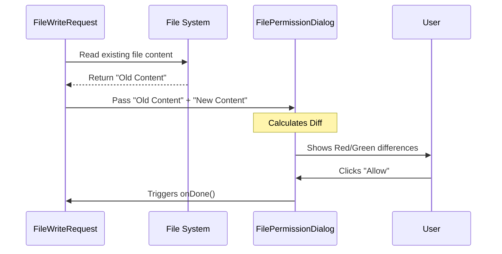

# Chapter 4: File Operations Subsystem

In the previous chapter, the [Interactive Decision Prompt](03_interactive_decision_prompt.md), we gave the user the power to say "Yes," "No," or providing feedback.

However, saying "Yes" to a file change is very different from saying "Yes" to a simple question. If an AI asks to "Update your code," you shouldn't agree until you see **exactly** what lines are changing.

This brings us to the **File Operations Subsystem**.

## 1. The "Records Department" Analogy

Imagine a general manager approves most requests in an office.
*   "Can I take a lunch break?" -> **Approved.**
*   "Can I use the printer?" -> **Approved.**

But if you want to change a legal contract, the general manager sends you to the **Records Department**.
*   The Records Department doesn't just stamp "Approved."
*   They pull the **old file** from the cabinet.
*   They place it next to the **new file**.
*   They highlight the **differences** in red and green ink.
*   Only *then* do they ask for a signature.

In our project, the **File Operations Subsystem** is that department. It is a specialized layer built on top of the generic [Unified Dialog Interface](02_unified_dialog_interface.md) specifically designed to handle the complexity of reading, writing, and comparing files.

## 2. Motivation: Why do we need this?

Why not just use the generic dialog for everything?

1.  **Safety:** We need to ensure the AI isn't editing a file outside the allowed directory (handling "symlinks").
2.  **Context:** The user needs to see a **Diff** (Difference) view. Seeing "Edit file.js" isn't enough; seeing `+ const x = 1;` is necessary.
3.  **IDE Integration:** Sometimes a file is too big for the terminal. This system allows opening the diff in your actual code editor (VS Code, JetBrains, etc.).

## 3. Central Use Case

**The Scenario:**
The AI wants to edit `package.json` to add a new library.

**The Problem:**
If we just show a text box saying "AI wants to write to package.json," the user might accidentally overwrite the whole file with empty text.

**The Solution:**
The File Operations Subsystem:
1.  Reads the *current* `package.json` from the disk.
2.  Compares it with the AI's *proposed* content.
3.  Generates a visual Diff.
4.  Presents this within the standard Dialog.

## 4. Key Concepts

This subsystem relies on three main components working together.

### A. The Coordinator (`FilePermissionDialog`)
This is a wrapper around the standard generic dialog. It manages file-specific tasks like calculating diffs and checking if the file exists.

### B. The Visualizer (`ToolDiff`)
These are small components (like `FileWriteToolDiff`) that take `Old Content` and `New Content` and render the colorful `+` / `-` lines in the terminal.

### C. The Logic Hook (`useFilePermissionDialog`)
This handles the brainwork: "Is this a read or a write?", "Does this path look safe?", "Should we show this in the IDE instead?"

## 5. How to Use It

Let's look at `FileWritePermissionRequest.tsx`. This component handles requests to create or overwrite files. Notice how it doesn't use the generic `PermissionDialog` directly; it uses the specialized `FilePermissionDialog`.

```typescript
// FileWritePermissionRequest.tsx (Simplified)

return (
  <FilePermissionDialog
    title={fileExists ? 'Overwrite file' : 'Create file'}
    path={file_path}
    // We pass the diff component as the 'content'
    content={
      <FileWriteToolDiff
        file_path={file_path}
        content={newContent}
        oldContent={oldContent}
      />
    }
    // ... other props passing data down
  />
);
```

### Explanation
*   **`path`**: We tell the dialog *which* file is being touched.
*   **`content`**: Instead of just text, we pass a `<FileWriteToolDiff />`. This component knows how to draw the red/green changes.

## 6. Sequence of Events

What happens when the AI tries to write a file?



1.  We **Read** the current state of the world (from Disk).
2.  We **Compare** it to the AI's request.
3.  We **Display** the proof to the user.

## 7. Internal Implementation

Let's look under the hood of `FilePermissionDialog.tsx`. This component does a lot of heavy lifting to ensure safety.

### Safety Check: Symlinks

One of the most critical jobs of this subsystem is ensuring the AI doesn't trick the user. A "symlink" is a shortcut. The AI might try to write to `./shortcut.txt`, which actually points to your system password file `/etc/passwd`.

```typescript
// FilePermissionDialog.tsx (Simplified Logic)

const symlinkTarget = useMemo(() => {
  // 1. Resolve the real path
  const { isSymlink, resolvedPath } = safeResolvePath(fs, path);
  
  // 2. If it is a symlink, warn the user!
  if (isSymlink) {
    return resolvedPath; 
  }
  return null;
}, [path]);
```

If `symlinkTarget` exists, the UI renders a bright yellow warning box: *"This will modify /etc/passwd via a symlink"*.

### Integration: The Hook

The logic is separated into `useFilePermissionDialog.ts`. This hook prepares the options specifically for files.

```typescript
// useFilePermissionDialog.ts

export function useFilePermissionDialog({ filePath, ...props }) {
  // Get generic state from global app state
  const toolPermissionContext = useAppState(s => s.toolPermissionContext);

  // Generate specific file options (Read/Write/Block)
  const options = useMemo(() => 
    getFilePermissionOptions({
      filePath, 
      operationType: 'write',
      // ...
    }), 
    [filePath]
  );

  return { options, ... };
}
```

This ensures that every file operation allows the user to say things like "Allow all reads for this file" or "Block writes to this folder," which are specific to filesystems and not relevant for web browsing.

### Visualization: The Diff

Finally, let's look at how the diff is actually drawn in `FileWriteToolDiff.tsx`. It uses a utility to compute the "patch."

```typescript
// FileWriteToolDiff.tsx

// 1. Calculate the difference
const patch = getPatchForDisplay({
  fileContents: oldContent,
  edits: [{ old_string: oldContent, new_string: newContent }]
});

// 2. Render the visual diff
return (
  <Box borderStyle="dashed" borderColor="subtle">
    <StructuredDiff patch={patch} />
  </Box>
);
```
*   **`getPatchForDisplay`**: Compares the strings.
*   **`StructuredDiff`**: A UI component that renders the lines with green (`+`) and red (`-`) colors.

## Conclusion

The **File Operations Subsystem** is a specialized layer of bureaucracy—but the good kind! It ensures that when files are modified, the user has total visibility into the changes and complete safety against path manipulation. It turns a generic "Yes/No" decision into an informed code review.

Now that we can safely edit files, what about running commands? Commands like `rm -rf` are even more dangerous than file edits.

In the next chapter, we will look at **Shell Command Governance**, where we learn how to restrict and monitor terminal operations.

[Next Chapter: Shell Command Governance](05_shell_command_governance.md)

---

Generated by [Code IQ](https://github.com/adityasoni99/Code-IQ)