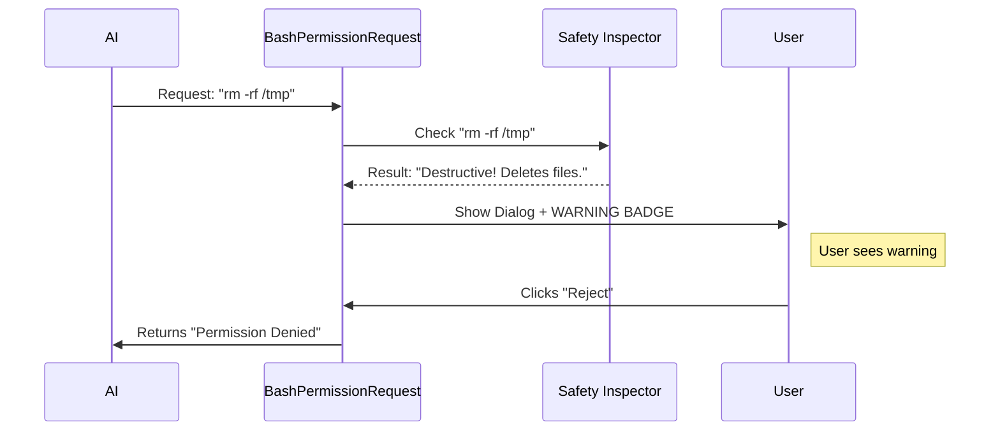

# Chapter 5: Shell Command Governance

In the previous chapter, [File Operations Subsystem](04_file_operations_subsystem.md), we learned how to safely manage changes to your files. We acted like a Records Department, carefully checking every document edit.

But editing a file is relatively safe compared to the raw power of a terminal. A single shell command like `rm -rf /` can wipe an entire machine in seconds.

This brings us to **Shell Command Governance**.

## 1. The "Heavy Machinery" Analogy

Think of your operating system as a construction site.
*   **File Edits** are like painting a wall or changing a lightbulb. You check the work, but it's rarely life-threatening.
*   **Shell Commands** are like operating a wrecking ball or a crane.

The **Shell Command Governance** system acts as the **Safety Officer** on the site.
1.  **Safety Check:** Is this machine (command) dangerous? (e.g., `rm`, `mkfs`).
2.  **Licensing:** Does the operator have a standing license (rule) to use this machine?
3.  **Sign-off:** If it's new or dangerous, the foreman (User) must sign off on it explicitly.

## 2. Motivation: Why do we need this?

Why not just treat commands like text strings?

1.  **Risk Assessment:** We need to warn the user if a command is destructive. "Running tests" is safe; "Deleting a folder" requires a warning label.
2.  **Rule Generation:** Users get annoyed approving `npm test` fifty times a day. We need a system that can suggest: *"Always allow `npm test`?"*
3.  **Readability:** Commands can be long and complex. We need to format them so humans can read them quickly.

## 3. Central Use Case

**The Scenario:**
The AI wants to run `rm -rf ./temp_cache`.

**The Governance Process:**
1.  The system identifies this as a **Bash** command.
2.  The **Safety Inspector** flags `rm` as a **Destructive Command**.
3.  The UI displays a **Warning Badge**.
4.  The User is given options: "Allow once" or "Reject".

Conversely, if the command was `npm run build`, the system might offer: *"Allow, and don't ask again for `npm run *`"*.

## 4. Key Concepts

This system is built on three pillars:

### A. The Inspector (Safety Checks)
Before showing the dialog, we parse the command. If it contains words like `rm`, `mv`, or `dd`, we prepare a warning message.

### B. The Suggester (Rule Generation)
This logic looks at the command and figures out a "wildcard" rule.
*   Input: `npm run build`
*   Suggestion: `npm run *`
*   Benefit: The user creates a reusable permission rule instead of a one-time approval.

### C. The Formatter
Terminal commands can be cryptic. The formatter ensures lists of files or long arguments are displayed neatly.

## 5. How to Use It

The main entry point for this logic is the `BashPermissionRequest` component. It uses the [Unified Dialog Interface](02_unified_dialog_interface.md) but adds specific logic for shells.

Here is a simplified view of how the component decides what to show:

```typescript
// BashPermissionRequest.tsx (Simplified)

export function BashPermissionRequest({ toolUseConfirm }) {
  // 1. Parse the input to get the command string
  const { command } = BashTool.inputSchema.parse(toolUseConfirm.input);

  // 2. Run the Safety Check
  const destructiveWarning = getDestructiveCommandWarning(command);

  // 3. Render the Dialog with warnings (if any)
  return (
    <PermissionDialog 
      title="Bash command"
      // If dangerous, show a warning color
      color={destructiveWarning ? "orange" : "blue"} 
    >
       <Text>{command}</Text>
       
       {/* Show the warning text if it exists */}
       {destructiveWarning && (
         <Text color="warning">{destructiveWarning}</Text>
       )}
    </PermissionDialog>
  );
}
```

### Explanation
*   **`getDestructiveCommandWarning`**: This function analyzes the string. If it sees `rm`, it returns a string like "This command will delete files."
*   **Conditional Rendering**: We only show the warning box if a threat is detected.

## 6. Sequence of Events

Let's trace a "Dangerous" command request.



## 7. Internal Implementation

Let's look deeper into how we generate the "Always Allow" options. This logic lives in `bashToolUseOptions.tsx`.

### The Options Logic

We want to give the user smart choices. We don't just want "Yes". We want "Yes, and learn this pattern."

```typescript
// bashToolUseOptions.tsx (Simplified)

export function bashToolUseOptions({ suggestions, editablePrefix }) {
  const options = [];

  // 1. Standard "Yes"
  options.push({ label: 'Yes', value: 'yes' });

  // 2. Smart "Always Allow" Logic
  if (editablePrefix) {
    // If we detected a pattern (like "npm run:*"), offer it
    options.push({
      label: 'Yes, and don’t ask again for',
      value: 'yes-prefix-edited',
      initialValue: editablePrefix, // e.g., "npm run:*"
      type: 'input'
    });
  }

  // 3. Standard "No"
  options.push({ label: 'No', value: 'no' });

  return options;
}
```

### Formatting the Output

When a command affects multiple files or is very long, we use helpers in `shellPermissionHelpers.tsx` to make it readable.

```typescript
// shellPermissionHelpers.tsx

function commandListDisplay(commands: string[]) {
  // If there is only one command, make it bold
  if (commands.length === 1) {
    return <Text bold>{commands[0]}</Text>;
  }

  // If there are many, join them nicely
  return (
    <Text>
      <Text bold>{commands[0]}</Text> and {commands.length - 1} more
    </Text>
  );
}
```

This helper ensures that if the AI tries to run 50 commands at once, the Permission Dialog doesn't explode with text. It keeps the [Unified Dialog Interface](02_unified_dialog_interface.md) clean.

## 8. Integration with Prompting

Once the user selects an option (like "Always Allow"), we capture that decision in the [Interactive Decision Prompt](03_interactive_decision_prompt.md).

If the user selects `yes-prefix-edited`, the system:
1.  Reads the pattern the user typed (e.g., `npm run:*`).
2.  Saves this rule to the **Rule Persistence Manager**.
3.  Allows the command to run.

Next time the AI runs `npm run test`, the **Central Request Dispatcher** won't even ask the user—it will see the rule and auto-approve it.

## Conclusion

**Shell Command Governance** is the security checkpoint of our system. It combines:
1.  **Safety Checks** to catch dangerous mistakes.
2.  **Smart Suggestions** to reduce decision fatigue.
3.  **Clean Formatting** to make technical commands readable.

It ensures that the "Heavy Machinery" of the terminal is used safely and efficiently.

But wait—how does the user know *why* a permission was requested? Or if something goes wrong, how do we find out why a rule didn't match?

In the next chapter, we will explore **Permission Explainer & Debugging**, the tools we use to inspect the decision-making process itself.

[Next Chapter: Permission Explainer & Debugging](06_permission_explainer___debugging.md)

---

Generated by [Code IQ](https://github.com/adityasoni99/Code-IQ)