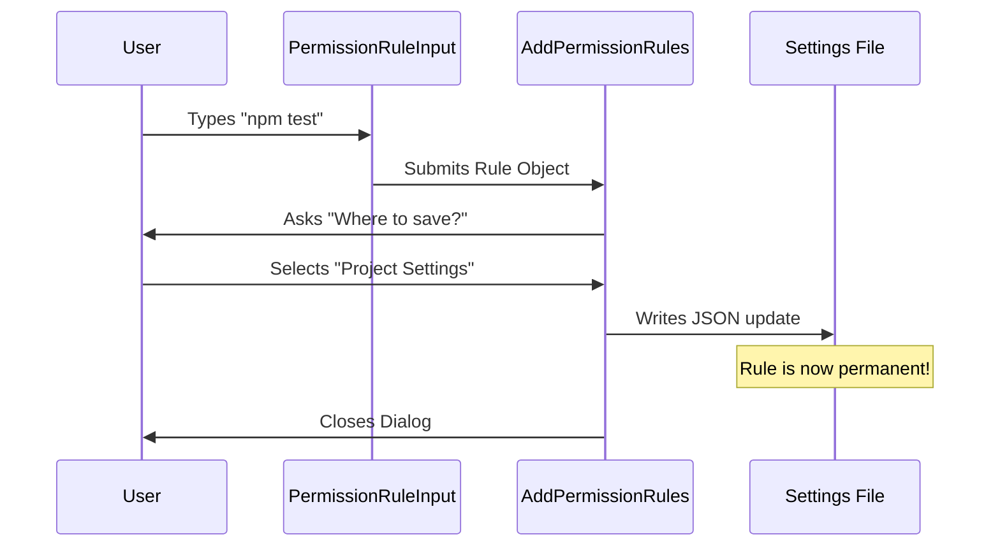

# Chapter 7: Rule Persistence Manager

Welcome to the final chapter of the **Permissions** tutorial!

In the previous chapter, [Permission Explainer & Debugging](06_permission_explainer___debugging.md), we learned how to analyze commands and understand why the system made a specific decision.

However, up until now, our system has suffered from **Amnesia**. If you approve `npm test` today, and then restart the application, the system forgets you approved it. Tomorrow, it will ask you again. This leads to "Click Fatigue."

This chapter introduces the **Rule Persistence Manager**. This component allows users to turn a one-time "Yes" into a permanent "Always Allow," and decides where that memory should be stored.

## 1. The "Security Badge" Analogy

Imagine entering a high-security office building.

*   **Without Persistence:** Every single morning, you have to go to the front desk, show your ID, sign the guest book, and get a temporary sticker. It’s secure, but incredibly annoying for daily employees.
*   **With Persistence:** The security team issues you a **Security Badge**. Now, you just tap your badge at the turnstile and walk in. The system remembers that you are authorized.

In our project, the **Rule Persistence Manager** is the machine that prints these badges. It takes a temporary approval and writes it down permanently.

## 2. Motivation: Why do we need this?

1.  **Efficiency:** Developers run the same commands hundreds of times (e.g., `git status`, `npm start`). Asking for permission every time makes the AI unusable.
2.  **Scope Control:** Sometimes you want to allow a command for *this specific project* (like a work project) but not globally (for personal projects). We need a way to choose where the rule lives.

## 3. Central Use Case

**The Scenario:**
You are working on a web app. You want the AI to be able to run `npm run test` anytime it wants, without interrupting you.

**The Solution:**
1.  You open the "Add Rule" interface.
2.  You type the pattern: `npm run test`.
3.  The system asks: *"Where should we save this?"*
4.  You select: **"Project Settings (Local)"**.
5.  The system writes this rule to a file on your disk.

## 4. Key Concepts

### A. The Input (`PermissionRuleInput`)
This is the form where the user defines the scope of the badge. It might be an exact match (`npm test`) or a wildcard pattern (`npm run *`).

### B. The Destination Selector
Rules can be stored in different places:
*   **Local Settings:** Only for this specific folder (good for team-specific scripts).
*   **User Settings:** Applies to everything you do on this computer (good for generic tools like `ls` or `git`).

### C. The Persister
This is the logic that actually writes the JSON to the settings file (`.claude/settings.json` or `.vscode/settings.json`).

## 5. Capturing the Rule (The Input)

First, we need to let the user type in what they want to allow. We use the component `PermissionRuleInput`.

It validates the text and converts it into a logical "Rule Value".

```typescript
// PermissionRuleInput.tsx (Simplified)

const handleSubmit = (value: string) => {
  const trimmed = value.trim();
  
  // Convert string "npm test" into a Rule Object
  const ruleValue = permissionRuleValueFromString(trimmed);
  
  // Pass it up to the parent component
  onSubmit(ruleValue, ruleBehavior);
};
```

### Explanation
*   **`permissionRuleValueFromString`**: This helper function parses the text. If you type `npm run *`, it creates an object saying "Allow tool `BashTool` where command starts with `npm run `".

## 6. Choosing Where to Save (The Manager)

Once the user types a rule, we show them the **Add Permission Rules** dialog. This component (`AddPermissionRules.tsx`) asks the user where to store the rule.

We present options based on available configuration files.

```typescript
// AddPermissionRules.tsx (Simplified)

switch (saveDestination) {
  case 'localSettings':
    return {
      label: 'Project settings (local)',
      description: 'Saved in .vscode/settings.json',
      value: saveDestination
    };
  // ... cases for global user settings
}
```

This logic ensures the user knows exactly where the permission file is located physically on their disk.

## 7. Sequence of Events

Here is what happens when a user decides to create a permanent rule.



## 8. Internal Implementation: Saving the Rule

When the user makes the final selection, the `AddPermissionRules` component triggers the save. It does two things: updates the *current* running app, and writes to the *disk*.

```typescript
// AddPermissionRules.tsx (Logic inside onSelect)

const destination = selectedValue as EditableSettingSource;

// 1. Save to the physical file system (The Disk)
persistPermissionUpdate({
  type: "addRules",
  rules: ruleValues,
  destination
});

// 2. Update the live application state (The Memory)
setToolPermissionContext(updatedContext);
```

### Explanation
1.  **`persistPermissionUpdate`**: This function interacts with the [File Operations Subsystem](04_file_operations_subsystem.md) logic to write the JSON file safely.
2.  **`setToolPermissionContext`**: This updates the [Central Request Dispatcher](01_central_request_dispatcher.md) immediately, so the user doesn't have to restart the app for the rule to take effect.

## 9. Visualizing the Rules

Finally, when a user lists their rules, we need to convert the technical data back into English. We use `PermissionRuleDescription`.

```typescript
// PermissionRuleDescription.tsx

if (ruleValue.ruleContent.endsWith(":*")) {
  // Example: "npm:*"
  return (
    <Text>
      Any Bash command starting with <Text bold>{prefix}</Text>
    </Text>
  );
}
```

This ensures that even if the saved rule is cryptic (like `bash:ls:*`), the user sees a friendly description: **"Any Bash command starting with ls"**.

## Conclusion

The **Rule Persistence Manager** completes the circle of our permissions system.
1.  We route requests ([Chapter 1](01_central_request_dispatcher.md)).
2.  We show beautiful dialogs ([Chapter 2](02_unified_dialog_interface.md)).
3.  We handle user decisions ([Chapter 3](03_interactive_decision_prompt.md)).
4.  We safely execute actions ([Chapter 4](04_file_operations_subsystem.md) & [Chapter 5](05_shell_command_governance.md)).
5.  We explain what happened ([Chapter 6](06_permission_explainer___debugging.md)).
6.  And now, **we remember those decisions forever** ([Chapter 7](07_rule_persistence_manager.md)).

Congratulations! You have navigated the entire architecture of the Permissions project. You now understand how a secure, user-friendly, and persistent AI permission system is built from the ground up.

---

Generated by [Code IQ](https://github.com/adityasoni99/Code-IQ)