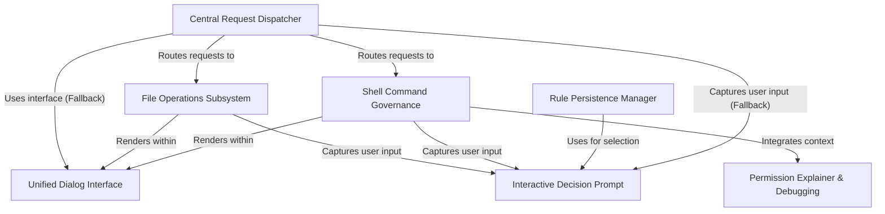

# Tutorial: permissions

This project implements a comprehensive **permission management system** for a CLI tool. A **Central Request Dispatcher** intercepts sensitive actions—such as **Shell Commands** or **File Operations**—and routes them to specific handlers. These handlers present a consistent **Unified Dialog Interface** where an **Interactive Decision Prompt** allows users to approve or reject actions, often supported by a **Permission Explainer** for context and a **Rule Persistence Manager** for saving long-term preferences.

## Chapters

1. [Central Request Dispatcher](01_central_request_dispatcher.md)
2. [Unified Dialog Interface](02_unified_dialog_interface.md)
3. [Interactive Decision Prompt](03_interactive_decision_prompt.md)
4. [File Operations Subsystem](04_file_operations_subsystem.md)
5. [Shell Command Governance](05_shell_command_governance.md)
6. [Permission Explainer & Debugging](06_permission_explainer___debugging.md)
7. [Rule Persistence Manager](07_rule_persistence_manager.md)

---

Generated by [Code IQ](https://github.com/adityasoni99/Code-IQ)