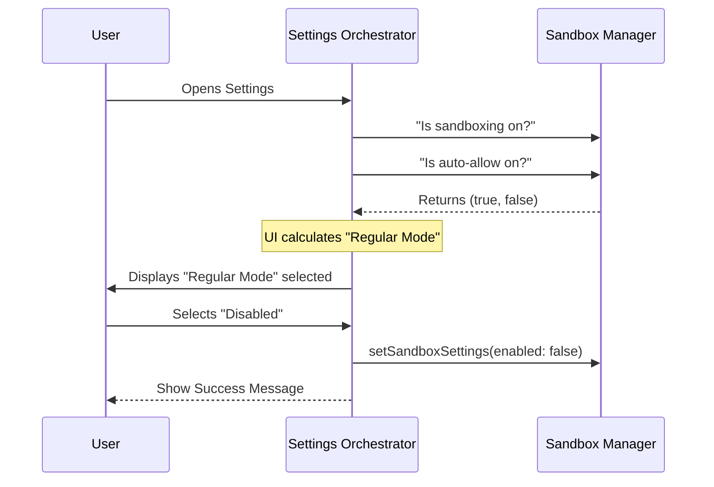

# Chapter 1: Sandbox Settings Orchestrator

Welcome to the **Sandbox** project! In this tutorial series, we will build a secure environment where code can run safely without harming your computer.

We start at the very top: the **Sandbox Settings Orchestrator**.

## What is the Orchestrator?

Imagine the **"Settings" app** on your smartphone. When you want to turn on "Airplane Mode," you don't need to know how to program the radio antenna or disconnect the cellular modem manually. You just flip a simple switch in the UI.

The **Sandbox Settings Orchestrator** is that interface for our project.

### The Problem
We have a complex security system with many moving parts:
1.  Is the sandbox on or off?
2.  Do we trust the user automatically?
3.  Are the necessary system tools installed?

We need **one central place** to visualize this state and let the user change it easily.

### The Solution
The **Orchestrator** (`SandboxSettings.tsx`) is a high-level component that:
1.  **Reads** the current state (is it safe? is it on?).
2.  **Decides** what menu tabs to show (e.g., show error logs if something is broken).
3.  **Translates** user clicks into complex system commands.

---

## Key Concepts

### 1. The Three Modes
Instead of managing dozens of checkboxes, the Orchestrator simplifies the world into three distinct "Modes":

*   **Auto-allow:** The sandbox is ON. It runs commands automatically without pestering the user.
*   **Regular:** The sandbox is ON. It asks for permission before running commands.
*   **Disabled:** The sandbox is OFF. Code runs directly on your machine (risky!).

### 2. Tab Orchestration
The interface isn't static. If your system is missing a security tool (like `bubblewrap`), the Orchestrator notices this via the [Environment Health Diagnostics](04_environment_health_diagnostics.md) and automatically inserts a **"Dependencies"** tab to help you fix it.

---

## Internal Implementation: How it Works

Before looking at code, let's look at the flow of data. The Orchestrator sits between the User and the low-level [Sandbox Data Adapter](05_sandbox_data_adapter.md).



---

## Code Deep Dive

Let's look at how `SandboxSettings.tsx` is built. We will look at simplified versions of the code to understand the logic.

### 1. Determining the Current Mode
The database stores raw boolean flags (`enabled`, `autoAllow`), but the UI needs a friendly string. This function translates raw data into a UI state.

```typescript
// Inside SandboxSettings component
const getCurrentMode = () => {
  if (!currentEnabled) {
    return "disabled";
  }
  if (currentAutoAllow) {
    return "auto-allow";
  }
  return "regular";
};
```
*   **Explanation:** This logic ensures we only ever show **one** active state to the user, even though under the hood it's a combination of settings.

### 2. Defining the Menu Options
We prepare the options for the dropdown menu. We use a helper variable `currentIndicator` to visually mark which option is currently active.

```typescript
const options = [
  {
    label: currentMode === "auto-allow" 
      ? `Sandbox, with auto-allow ${currentIndicator}` 
      : "Sandbox, with auto-allow",
    value: "auto-allow"
  },
  // ... similar blocks for "regular" and "disabled"
];
```
*   **Explanation:** The UI is dynamic. It highlights the active setting so the user knows where they stand immediately.

### 3. Handling User Selection
When the user picks a new mode, the Orchestrator acts as a translator. It converts the simple string (e.g., `"disabled"`) into the specific instructions for the [Sandbox Data Adapter](05_sandbox_data_adapter.md).

```typescript
const handleSelect = async (value: SandboxMode) => {
  switch (value) {
    case "disabled":
      await SandboxManager.setSandboxSettings({
        enabled: false,
        autoAllowBashIfSandboxed: false
      });
      onComplete("Sandbox disabled");
      break;
    // ... other cases
  }
};
```
*   **Explanation:** The `SandboxManager` does the heavy lifting of saving to disk. The UI simply tells it what to do.

### 4. Smart Tab Layout
This is where the "Orchestrator" really shines. It looks at the `depCheck` (Dependency Check) result to decide what tabs to render.

```typescript
// If we have critical errors, ONLY show the Dependencies tab
const tabs = hasErrors
  ? [
      <Tab key="deps" title="Dependencies">
         <SandboxDependenciesTab depCheck={depCheck} />
      </Tab>
    ]
  : [
      modeTab, 
      overridesTab, 
      configTab
    ];
```
*   **Explanation:** If the environment is broken (`hasErrors`), the Orchestrator forces the user to focus on the "Dependencies" tab by hiding the others. This prevents users from trying to configure a broken sandbox.

---

## Summary

We have built the **Control Center**. 

The **Sandbox Settings Orchestrator** doesn't enforce security rules itself. Instead, it provides a friendly face for the user to manage complex configurations. It intelligently adapts the UI based on whether the system is healthy or broken.

But how do we know if the system is healthy? How do we know if the user has the right tools installed?

For that, we need to inspect the system.

**Next Step:** Let's look at how we scan the computer for security tools in the [Security Configuration Inspector](02_security_configuration_inspector.md).

---

Generated by [Code IQ](https://github.com/adityasoni99/Code-IQ)