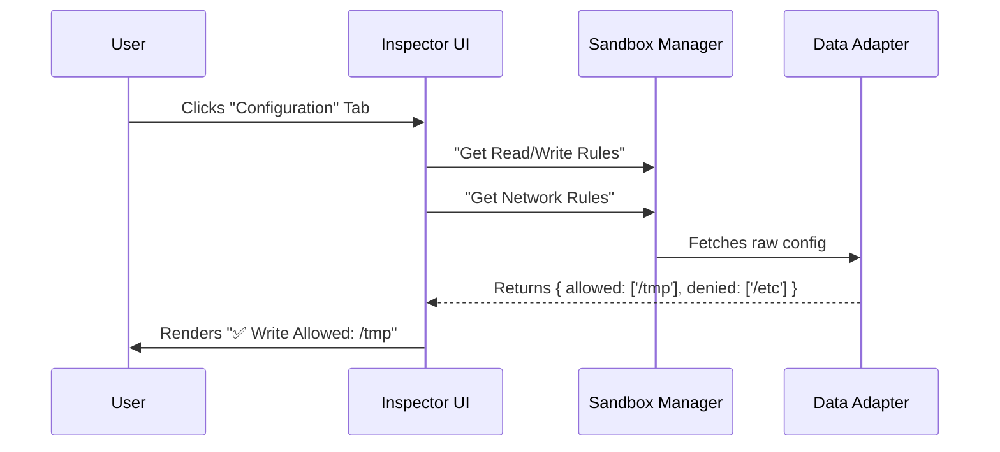

# Chapter 2: Security Configuration Inspector

In the previous chapter, [Sandbox Settings Orchestrator](01_sandbox_settings_orchestrator.md), we built the main control panel to turn the sandbox on and off.

But simply flipping a switch isn't enough. If the sandbox is "On," what does that actually mean? Can the code read my passwords? Can it talk to the internet?

Welcome to the **Security Configuration Inspector**.

## What is the Inspector?

Imagine a **Security Dashboard** for a high-tech building. You don't just want a green light saying "Security Active." You want a screen that tells you:
*   **Front Door:** Locked.
*   **Windows:** Open.
*   **Guest Access:** Allowed for "Alice" only.

The **Security Configuration Inspector** does exactly this for your code. It translates complex, invisible security rules into a simple, human-readable list.

### The Problem
Security rules are usually hidden in deep configuration files (JSON or YAML). If a script crashes because it couldn't write to a file, the user is often left guessing: *"Did the script fail, or did the sandbox stop it?"*

### The Solution
We provide a **visual audit tool** (`SandboxConfigTab.tsx`). It looks at the active policy and displays:
1.  **Filesystem Rules:** Which folders can be read? Which can be written to?
2.  **Network Rules:** Which websites or servers are allowed?
3.  **Platform Warnings:** Are there specific limitations on your operating system (like Linux or macOS)?

---

## Key Concepts

### 1. Read vs. Write Permissions
In the sandbox, seeing a file and changing a file are two very different things.
*   **Read Config:** Defines what the code can *see* (e.g., "You can read the project folder, but not `C:/Windows`").
*   **Write Config:** Defines what the code can *change* (e.g., "You can write to `/tmp`, but nothing else").

The Inspector separates these clearly so you know your important files are safe from being overwritten, even if they can be read.

### 2. The Network Allowlist
By default, a secure sandbox might block *all* internet access. The Inspector shows you the **Allowlist** (Allowed Hosts).
*   If the list says `google.com`, the code can talk to Google.
*   If the list is empty, the code is offline.

---

## Internal Implementation: How it Works

The Inspector is a "Read-Only" component. It doesn't change settings; it only reports what the [Sandbox Data Adapter](05_sandbox_data_adapter.md) is currently enforcing.

Here is the flow of information:



---

## Code Deep Dive

Let's look at how we build this visualization in `SandboxConfigTab.tsx`.

### 1. Fetching the Rules
When the component loads, we ask the Manager for the specific configuration objects. We don't need the raw database file; we need the *processed* rules.

```typescript
// Inside SandboxConfigTab component
const isEnabled = SandboxManager.isSandboxingEnabled();

// Grab the specific rulesets
const fsReadConfig = SandboxManager.getFsReadConfig();
const fsWriteConfig = SandboxManager.getFsWriteConfig();
const networkConfig = SandboxManager.getNetworkRestrictionConfig();
```
*   **Explanation:** We pull three distinct pieces of data. If `isEnabled` is false, we simply show a message saying "Sandbox is OFF" and stop there.

### 2. Visualizing Filesystem Rules
We need to turn an array of strings (e.g., `['/usr/local', '/tmp']`) into a friendly UI list.

```typescript
// If we have denied paths, show them clearly
{fsReadConfig.denyOnly.length > 0 && (
  <Box flexDirection="column">
    <Text bold color="permission">
       Filesystem Read Restrictions:
    </Text>
    <Text dimColor>
       Denied: {fsReadConfig.denyOnly.join(", ")}
    </Text>
  </Box>
)}
```
*   **Explanation:** We check if `denyOnly` has items. If yes, we render a header ("Filesystem Read Restrictions") and join the list of paths with commas. The `dimColor` helps separate the data from the label.

### 3. Visualizing Network Rules
Network rules are critical. A user needs to know instantly if their script can "phone home."

```typescript
// Check if we have an allowlist or denylist
const hasNetworkRules = networkConfig.allowedHosts.length > 0 || 
                        networkConfig.deniedHosts.length > 0;

{hasNetworkRules && (
  <Box flexDirection="column">
    <Text bold color="permission">Network Restrictions:</Text>
    <Text dimColor>
       Allowed: {networkConfig.allowedHosts.join(", ")}
    </Text>
  </Box>
)}
```
*   **Explanation:** This creates a "Firewall Dashboard." If `allowedHosts` contains `['npm.org']`, the user sees exactly that. If the list is empty, the section might disappear or show "None," depending on our logic.

### 4. Handling Platform Warnings
Sometimes, the Operating System (like Linux) has limitations that the user must know about. For example, "glob patterns" (like `*.txt`) might not work perfectly everywhere.

```typescript
const globWarnings = SandboxManager.getLinuxGlobPatternWarnings();

{globWarnings.length > 0 && (
  <Box flexDirection="column">
    <Text bold color="warning">⚠ Warning: Globs not supported</Text>
    <Text dimColor>
      Ignored patterns: {globWarnings.slice(0, 3).join(", ")}
    </Text>
  </Box>
)}
```
*   **Explanation:** This acts as a "Check Engine Light." It warns the user that their configuration might not behave exactly as expected due to technical limitations. We use `.slice(0, 3)` to avoid flooding the screen if there are 50 warnings.

---

## Summary

The **Security Configuration Inspector** is the window into the soul of the sandbox.
1.  It queries the **Manager** for active rules.
2.  It translates technical arrays into human-readable **Text**.
3.  It alerts users about **Platform Warnings**.

By giving the user visibility, we build trust. They don't have to guess why a file access was denied—they can see the rule right on the screen.

But what happens if a script tries to do something that *isn't* on the list? Or what if the configuration fails to load entirely? We need a backup plan.

**Next Step:** Let's explore how the system handles safety nets in the [Fallback Policy Manager](03_fallback_policy_manager.md).

---

Generated by [Code IQ](https://github.com/adityasoni99/Code-IQ)