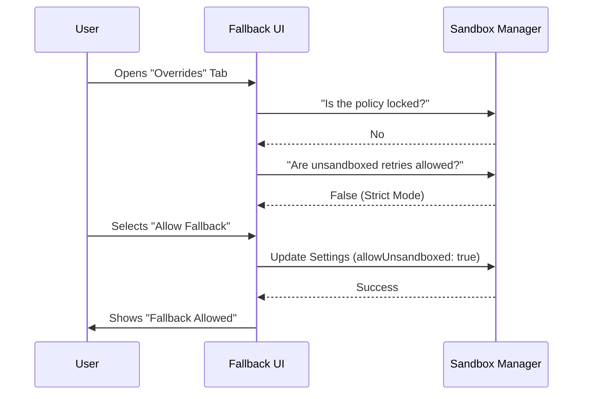

# Chapter 3: Fallback Policy Manager

In the previous chapter, the [Security Configuration Inspector](02_security_configuration_inspector.md), we learned how to visualize the strict rules guarding our computer.

But what happens when those rules are *too* strict?

Imagine you are trying to run a critical script, but the sandbox blocks it because it needs to access a specific system file. You are stuck. The code won't run.

This is where the **Fallback Policy Manager** comes in. It acts as the "Emergency Override" switch for your environment.

## What is the Fallback Policy Manager?

Think of the sandbox like a **Fire Door** in a building.
*   **Strict Mode:** The door is locked tight. It keeps fire (malicious code) contained. If you don't have the key, you cannot pass.
*   **Fallback Mode:** This is the "Emergency Push Bar." If the door is locked and you absolutely *need* to get through to do your job, you can push the bar. The alarm might sound, but the door opens.

The **Fallback Policy Manager** (`SandboxOverridesTab.tsx`) allows you to decide: **Do you want that emergency push bar to exist?**

### The Problem
Security is a trade-off.
1.  **Maximum Security:** Blocks everything unknown. *Risk:* Valid work gets blocked, causing frustration.
2.  **Maximum Flexibility:** Allows everything. *Risk:* Malicious code destroys your files.

### The Solution
We give the user a choice between **Strict Sandbox Mode** and **Unsandboxed Fallback**.

*   **Strict Mode:** If the sandbox blocks a command, the command simply fails.
*   **Unsandboxed Fallback:** If the sandbox blocks a command, the system automatically asks: *"Okay, that failed. Should I try running it again without the sandbox?"*

---

## Key Concepts

### 1. The "Lock" Mechanism
Before the user can change anything, the Manager checks if it's allowed to. In corporate environments, a "Higher Priority Policy" might force Strict Mode on everyone. If the policy is **Locked**, the user cannot use the escape hatch.

### 2. The Trade-off Toggle
This isn't just an On/Off switch; it's a philosophy change.
*   **Open (Fallback Allowed):** Prioritizes *getting things done*. If safety tools fail, we try the unsafe way.
*   **Closed (Strict):** Prioritizes *safety*. If safety tools fail, we stop.

---

## Internal Implementation: How it Works

The Fallback Policy Manager sits between the User and the configuration database. Here is what happens when a user interacts with it:



---

## Code Deep Dive

Let's explore `SandboxOverridesTab.tsx` to see how this logic is implemented.

### 1. Checking for Locks
First, we must respect authority. If a higher-level administrator has locked the settings, we disable the controls.

```typescript
// Inside SandboxOverridesTab
const isLocked = SandboxManager.areSandboxSettingsLockedByPolicy();

if (isLocked) {
  return (
    <Text color="subtle">
      Override settings are managed by a higher-priority configuration.
    </Text>
  );
}
```
*   **Explanation:** Before rendering any buttons, we ask `SandboxManager` if we are locked. If `true`, we render a static text message instead of the interactive menu.

### 2. Reading the Current State
We need to know if the "Emergency Push Bar" is currently active so we can show it to the user.

```typescript
// Get the current boolean value (true/false)
const currentAllowUnsandboxed = SandboxManager.areUnsandboxedCommandsAllowed();

// Convert boolean to a UI mode string
const currentMode = currentAllowUnsandboxed ? "open" : "closed";
```
*   **Explanation:** The database speaks in `true/false`, but our UI logic thinks in terms of modes (`open` vs `closed`). We map the data to the UI state here.

### 3. Displaying the Options
We present the choices to the user. Note how we visually highlight the `(current)` option.

```typescript
const options = [
  {
    label: currentMode === "open" 
      ? "Allow unsandboxed fallback (current)" 
      : "Allow unsandboxed fallback",
    value: "open"
  },
  {
    label: currentMode === "closed" ? "Strict sandbox mode (current)" : "Strict sandbox mode",
    value: "closed"
  }
];
```
*   **Explanation:** This list feeds into a dropdown menu. The user sees clearly which policy is currently active.

### 4. Applying the Change
When the user makes a choice, we don't just update the UI; we persist the security policy to disk.

```typescript
const handleSelect = async (value: string) => {
  const mode = value as OverrideMode;
  
  // Save the new policy preference
  await SandboxManager.setSandboxSettings({
    allowUnsandboxedCommands: mode === "open"
  });

  onComplete("Policy updated successfully");
};
```
*   **Explanation:** This acts as the control lever. It tells the `SandboxManager` to re-write the configuration file. From this moment on, if a command fails, the system checks this setting to decide whether to retry or give up.

---

## Summary

The **Fallback Policy Manager** gives users agency over their security. It recognizes that sometimes, operational needs outweigh strict security rules.

1.  It checks if it has permission to change settings (**Lock Check**).
2.  It allows users to toggle between **Strict** and **Fallback** modes.
3.  It communicates this policy to the core system.

Now that we have our Settings, our Rules, and our Fallback Policy, we need to ensure the system creates a healthy environment to enforce them.

**Next Step:** Let's learn how to detect and fix broken environments in [Environment Health Diagnostics](04_environment_health_diagnostics.md).

---

Generated by [Code IQ](https://github.com/adityasoni99/Code-IQ)