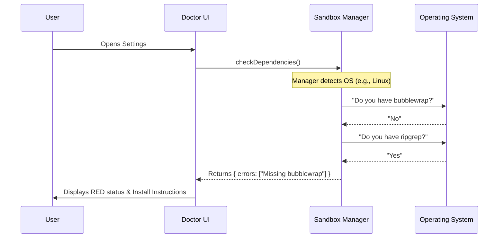

# Chapter 4: Environment Health Diagnostics

In the previous chapter, [Fallback Policy Manager](03_fallback_policy_manager.md), we defined the rules for when to use the sandbox and when to bypass it.

But rules are useless if the system physically *cannot* run the sandbox.

Imagine trying to drive a car. You have the keys (Settings) and you know the traffic laws (Policies), but if the car is missing its wheels, you aren't going anywhere.

Welcome to **Environment Health Diagnostics**.

## What is Environment Health Diagnostics?

This abstraction acts as the **System Doctor**. Before we try to run complex, isolated code, we need to ensure the computer actually has the necessary tools installed to do so.

### The Problem
Sandboxing isn't magic; it relies on specific Operating System tools to create walls around the code.
*   **On Linux:** We need tools like `bubblewrap` to create the container.
*   **On macOS:** We rely on the built-in `seatbelt` mechanism.
*   **Everywhere:** We need `ripgrep` to scan files quickly.

If a user installs our project but forgets to install `bubblewrap`, the sandbox will crash silently or throw a confusing error code.

### The Solution
We build a diagnostic layer that:
1.  **Scans** the host system for required tools.
2.  **Identifies** exactly what is missing.
3.  **Prescribes** the fix (e.g., "Run `apt install bubblewrap`").

---

## Key Concepts

### 1. The Dependency Checklist
Just like a pilot has a pre-flight checklist, our system has a list of requirements.

*   **Critical Errors:** Missing tools that prevent the sandbox from starting (e.g., missing `bubblewrap` on Linux).
*   **Warnings:** Missing tools that reduce security but allow the sandbox to run (e.g., missing `seccomp` filters).

### 2. Platform Awareness
A Mac user shouldn't be told to install Linux tools. The Diagnostics system checks the OS first.
*   **macOS:** Checks for `ripgrep`.
*   **Linux:** Checks for `ripgrep`, `bubblewrap`, and `socat`.

---

## Internal Implementation: How it Works

The Diagnostics system runs a "Health Check" whenever the settings are opened.



---

## Code Deep Dive

Let's look at how we build the UI to report this health status. We will examine `SandboxDoctorSection.tsx` and `SandboxDependenciesTab.tsx`.

### 1. The High-Level Status Check
This component (`SandboxDoctorSection`) sits at the top of the settings menu. It gives a quick "Red Light / Green Light" status.

```typescript
// Inside SandboxDoctorSection
const depCheck = SandboxManager.checkDependencies();
const hasErrors = depCheck.errors.length > 0;

// Choose the color: Red for errors, Yellow for warnings
const statusColor = hasErrors ? "error" : "warning";

// Choose the text
const statusText = hasErrors 
  ? "Missing dependencies" 
  : "Available (with warnings)";
```
*   **Explanation:** We ask the manager for the report. If `errors` has items, we flag the whole system as "Error" (Red). This gives the user immediate feedback that something is wrong.

### 2. Scanning for Specific Tools
If the status is bad, we switch to the "Dependencies" tab to show details. We look for specific keywords in the error list to identify which tool is missing.

```typescript
// Inside SandboxDependenciesTab
// Check if specific tools are mentioned in the error list
const rgMissing = depCheck.errors.some(
  e => e.includes('ripgrep')
);

const bwrapMissing = depCheck.errors.some(
  e => e.includes('bwrap')
);
```
*   **Explanation:** The Manager returns raw error strings. We use `.includes()` to figure out exactly which tool caused the error so we can show the right icon.

### 3. Rendering Actionable Feedback
It is not enough to say "Error." We must tell the user how to fix it.

```typescript
// If ripgrep is missing, show the install command
<Text>
  ripgrep (rg): 
  {rgMissing ? <Text color="error">not found</Text> : <Text color="success">found</Text>}
</Text>

{rgMissing && (
  <Text dimColor>
     · {isMac ? 'brew install ripgrep' : 'apt install ripgrep'}
  </Text>
)}
```
*   **Explanation:**
    1.  We display the tool name.
    2.  We show "not found" in red if it's missing.
    3.  Crucially, we conditionally render the **install command** based on the user's OS (`brew` for Mac, `apt` for Linux).

### 4. Handling Platform Differences
We ensure we don't confuse users by showing irrelevant tools.

```typescript
const isMac = platform === 'macos';

// Only show Linux tools if we are NOT on a Mac
{!isMac && (
  <Box flexDirection="column">
     <Text>bubblewrap (bwrap): ...</Text>
     <Text>socat: ...</Text>
  </Box>
)}
```
*   **Explanation:** Using the `!isMac` check, we hide `bubblewrap` and `socat` from macOS users. This keeps the interface clean and relevant.

---

## Summary

The **Environment Health Diagnostics** ensures our foundation is solid.

1.  It acts as a **Pre-flight Checklist**.
2.  It abstracts away the complexity of checking for installed binaries.
3.  It provides **Platform-Specific** instructions to the user.

Now that we know the settings are correct, the policies are defined, and the tools are installed, we are ready to actually run code.

How does the system take a user's command and send it to these tools?

**Next Step:** Let's look at the engine room in the [Sandbox Data Adapter](05_sandbox_data_adapter.md).

---

Generated by [Code IQ](https://github.com/adityasoni99/Code-IQ)