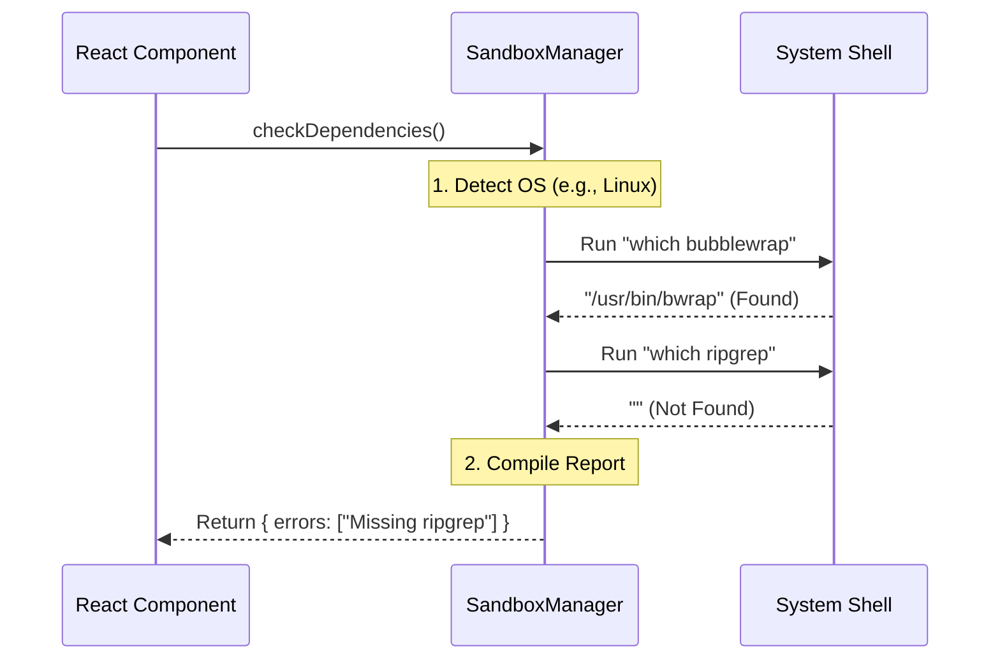

# Chapter 5: Sandbox Data Adapter

In the previous chapter, [Environment Health Diagnostics](04_environment_health_diagnostics.md), we built a system to scan the computer and ensure all necessary security tools (like `bubblewrap` or `ripgrep`) are installed.

But scanning is just one part of the puzzle. Our React UI needs to do many things: read configuration files, check network rules, toggle settings, and run system commands.

We need a central bridge to connect our pretty User Interface to the messy Operating System.

Welcome to the **Sandbox Data Adapter**.

## What is the Data Adapter?

Imagine you are at a restaurant.
*   **The UI:** You (the customer) looking at the menu.
*   **The OS/System:** The kitchen, full of fire, knives, and shouting chefs.

You don't walk into the kitchen to cook your own burger. You talk to the **Waiter**. The waiter takes your polite request ("I'd like the burger"), translates it into kitchen shorthand, hands it to the chef, and brings you back the result.

The **Sandbox Data Adapter** (implemented as `SandboxManager`) is the waiter.

### The Problem
React components are good at rendering buttons and text. They are *bad* at:
1.  Reading files from the hard drive.
2.  Checking if a Linux command exists.
3.  Knowing where configuration files are hidden on macOS vs. Windows.

### The Solution
We create a single class, `SandboxManager`, that abstracts all this complexity. The UI asks simple questions like `isSandboxingEnabled()`, and the Manager handles the hard work of looking up the answer.

---

## Key Concepts

### 1. The Adapter Pattern
This is a classic programming pattern. We "adapt" the complex reality of the operating system into a clean, simple API that our frontend can understand.

### 2. Read vs. Write Operations
The Manager handles two types of traffic:
*   **Getters (Read):** "What is the current mode?" (Used by the [Security Configuration Inspector](02_security_configuration_inspector.md)).
*   **Setters (Write):** "Change the mode to Strict." (Used by the [Sandbox Settings Orchestrator](01_sandbox_settings_orchestrator.md)).

### 3. Platform Abstraction
The UI shouldn't care if it's running on a Mac or Linux. The Manager hides these details. If we ask for "Dependencies," the Manager knows which tools to look for based on the OS.

---

## How to Use It

The `SandboxManager` is designed to be static and easy to call from anywhere in the UI.

### Example 1: Reading Status
This is how the Settings Orchestrator knows which tab to show.

```typescript
import { SandboxManager } from '../../utils/sandbox/sandbox-adapter.js';

// Ask the manager a simple question
const isEnabled = SandboxManager.isSandboxingEnabled();

// Output: true or false
console.log("Is the sandbox on?", isEnabled);
```
**Explanation:** The UI doesn't know *which* JSON file stores this setting. It just asks the Manager.

### Example 2: Saving Settings
When a user clicks a button, we tell the Manager to update the system.

```typescript
// The user wants to enable 'Auto-Allow' mode
await SandboxManager.setSandboxSettings({
  enabled: true,
  autoAllowBashIfSandboxed: true
});
```
**Explanation:** The `setSandboxSettings` function handles opening the config file, updating the JSON, and saving it back to the disk safely.

---

## Internal Implementation: Under the Hood

What happens when we call these functions? Let's trace the flow of data when the [Environment Health Diagnostics](04_environment_health_diagnostics.md) asks for a health check.



### Code Deep Dive

Let's look at simplified versions of the internal logic within the Adapter.

#### 1. Fetching Configuration
The Manager reads the raw settings from the disk and provides helper methods to access specific parts, like the Network config.

```typescript
// Inside SandboxManager implementation
static getNetworkRestrictionConfig() {
  // 1. Read the full settings object
  const settings = this.getSettings();
  
  // 2. Extract only the network portion
  return settings.sandbox?.network || { 
    allowedHosts: [], 
    deniedHosts: [] 
  };
}
```
**Explanation:** This safeguards the UI. Even if the config file is empty or missing, this function ensures we return a valid object (empty arrays) so the UI doesn't crash.

#### 2. calculating Dependencies
This is the logic that powers the "Doctor" section. It aggregates checks into a single report.

```typescript
static checkDependencies() {
  const errors = [];
  
  // Check specifically for 'ripgrep'
  if (!this.hasRipgrep()) {
    errors.push("ripgrep (rg) is missing");
  }

  // Return a clean object the UI can map over
  return { errors, warnings: [] };
}
```
**Explanation:** The UI doesn't need to know *how* we checked for `ripgrep`. It just receives a list of strings to display.

---

## Connecting the Pieces

Now we can see how the **Sandbox Data Adapter** connects all the previous chapters together:

1.  **Chapter 1 (Orchestrator):** Calls `setSandboxSettings` to change modes.
2.  **Chapter 2 (Inspector):** Calls `getFsReadConfig` to show allowed files.
3.  **Chapter 3 (Fallback):** Calls `areUnsandboxedCommandsAllowed` to decide if retries are okay.
4.  **Chapter 4 (Diagnostics):** Calls `checkDependencies` to see if tools are installed.

It is the beating heart of the sandbox application.

---

## Conclusion

We have completed the **Sandbox** tutorial series!

We started with a user interface in the **Settings Orchestrator**, visualized complex rules with the **Security Inspector**, handled errors gracefully with the **Fallback Manager**, diagnosed system health with **Diagnostics**, and finally connected it all to the system with the **Data Adapter**.

By separating our code into these five distinct layers, we've created a security tool that is:
1.  **Safe:** Because rules are enforced by the Adapter.
2.  **User Friendly:** Because the UI abstracts the complexity.
3.  **Robust:** Because diagnostics help users fix their own problems.

You now have a fully functional, secure, and user-friendly sandbox environment!

---

Generated by [Code IQ](https://github.com/adityasoni99/Code-IQ)