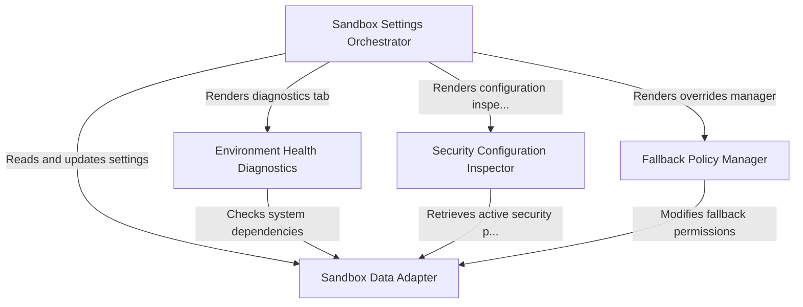

# Tutorial: sandbox

This project implements a **secure sandboxing system** designed to isolate the execution of external commands and tools. It features a central settings interface that allows users to configure *operational modes* (such as strict or auto-allow), audit active **filesystem and network security rules**, and verify that necessary **system dependencies** are installed and healthy.

## Chapters

1. [Sandbox Settings Orchestrator](01_sandbox_settings_orchestrator.md)
2. [Security Configuration Inspector](02_security_configuration_inspector.md)
3. [Fallback Policy Manager](03_fallback_policy_manager.md)
4. [Environment Health Diagnostics](04_environment_health_diagnostics.md)
5. [Sandbox Data Adapter](05_sandbox_data_adapter.md)

---

Generated by [Code IQ](https://github.com/adityasoni99/Code-IQ)